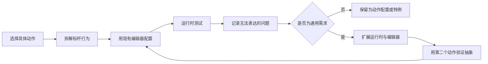

# 3C 编辑器成熟度与后续开发路线

## 1. 文档目的

本文用于回答两个问题：

1. 当前 3C 与技能编辑器已经具备什么能力。
2. 从“基础框架可用”走向“成熟的高规格 ARPG 生产工具”，还需要补充哪些系统。

本文不是要求在制作角色前一次性完成全部功能，而是建立一份长期路线图。后续应以真实角色纵切片为驱动，边配置、边测试、边完善编辑器。

---

## 2. 当前阶段判断

当前项目已经完成了高规格 ARPG 3C 的主要基础骨架：

1. Locomotion 与 Action 分层状态。
2. 状态时间线与统一状态生命周期。
3. 技能 Execute / Recovery 状态。
4. 技能图、连段与状态驱动 MetaSkill。
5. Recovery 的技能取消和移动取消。
6. 状态运动策略、输入移动、Root Motion 与 KCC 基础协作。
7. Animancer 分层动画输出和 DirectionalMixer2D。
8. HitBox、Bullet、效果树与战斗结算基础。
9. HitStop、CameraShake、HitVfx、HitAudio。
10. 独立 VFX 与 Audio 时间线轨道。
11. 角色挂点和武器挂点选择。
12. Camera Only 硬锁定基础。

因此，项目已经不处于“先把底层搭完才能做角色”的阶段，而是进入：

> **使用真实角色纵切片验证生产能力，并由实际问题推动系统成熟。**

成熟度不能只根据功能列表判断。高规格 3C 的真正标准包括：

1. 响应是否稳定。
2. 过渡是否自然。
3. 规则是否可预测。
4. 极端情况下是否可靠。
5. 配置效率是否足够高。
6. 出错时是否容易定位。
7. 多个角色能否复用相同能力。

---

## 3. 后续开发总原则

### 3.1 先做角色，再扩展工具

后续采用以下循环：



不要因为某个动作需要一个特殊效果，就立即向全局配置增加字段。只有当多个动作或多个角色反复遇到同类问题时，才应提升为通用系统。

### 3.2 明确三层职责

后续扩展继续遵循：

1. **规则层**：状态、门禁、输入请求、取消和抢占。
2. **运动层**：KCC、Root Motion、外力、转向和目标适配。
3. **表现层**：动画、相机、VFX、Audio 和材质反馈。

玩法规则不能依赖某个 VFX 是否播放，运动结果也不应由动画桥直接修改 Transform。

### 3.3 复刻行为，不复制资产和实现

参考商业游戏时只研究公开可观察行为：

1. 输入与动作响应。
2. 帧序和节奏。
3. 位移与转向规律。
4. 镜头和反馈规律。
5. 状态转换和取消关系。

不复制对方代码、资源、动画、音效或受版权保护的数据文件。最终 Demo 使用自有或合法授权素材。

---

## 4. 高优先级待补系统

以下内容最可能在第一个完整角色的开发中成为瓶颈。

## 4.1 统一输入缓冲

高速 ARPG 不能只读取当前帧输入。需要建立正式的输入缓冲模型：

```text
输入发生
→ 写入 Input Buffer
→ 等待状态或技能门禁开放
→ 按优先级选择消费者
→ 成功消费一次
→ 从缓冲移除或标记已消费
```

建议支持：

1. 按输入类型配置缓冲时间。
2. HitStop 期间仍然记录输入。
3. Execute 尾端提前输入下一段。
4. Recovery 开放前提前输入技能或闪避。
5. 同一输入不能重复消费。
6. 区分按下、松开、短按、长按和持续按住。
7. 输入失败后明确决定保留还是丢弃。
8. 支持调试查看当前缓冲队列。

需要重点验证：

- 低帧率下是否丢输入。
- HitStop 前后是否重复触发。
- 长按和短按是否互相污染。
- 连段超时边界是否稳定。

## 4.2 Action Request 仲裁

当前技能、移动和 Recovery 取消已有基础，但未来会同时出现：

- 普攻。
- 技能。
- 闪避。
- 跳跃。
- 防御。
- 交互。
- 受击。
- 死亡。
- 换人或支援。

建议最终形成统一的动作请求模型，至少包含：

1. 请求来源。
2. 请求目标。
3. 优先级。
4. 创建帧与过期时间。
5. 是否可缓冲。
6. 是否已消费。
7. 当前状态拒绝原因。
8. 抢占后是否保留技能链。

建议的高层优先级：

```text
死亡/处决/抓取
> 有效受击
> 精确闪避/防御反击
> 新技能
> 普通攻击
> 移动
> 自然结束
```

具体优先级应由目标游戏的战斗哲学决定，不能在多个运行时中分别硬编码。

## 4.3 攻击朝向与目标辅助

需要为攻击动作补充明确的朝向策略：

1. 保持当前朝向。
2. 起手时面向移动输入。
3. 起手时面向锁定目标。
4. 在指定窗口内持续追踪目标。
5. 每段连击开始时重新选取目标。
6. Root Motion 完全接管旋转。

建议配置：

- 最大修正角度。
- 修正角速度。
- 生效时间窗。
- 目标丢失后的退化规则。
- 是否允许跨越角色背后追踪。
- 无锁定时使用输入方向还是镜头方向。

长期应将攻击目标选择与相机锁定目标分离。相机目标不一定永远等于技能实际目标。

## 4.4 技能运动与轻量 Motion Warping

当前 KCC 和 Root Motion 是正确基础，但高质量近战仍需要：

1. 起手推进。
2. 命中前目标吸附。
3. 与目标保持合理停止距离。
4. 防止穿过目标。
5. 靠墙时裁剪位移。
6. 动画位移与实际距离的缩放。
7. 命中后改变后续位移曲线。
8. 处决或双人动作的位置对齐。

建议逐步增加 `ActionMotionRequest` 或同类结构：

- 平移模式。
- 旋转模式。
- 位移曲线。
- Root Motion 权重。
- 目标位置。
- 最大修正比例。
- 碰撞处理规则。

不要直接在技能逻辑中修改 Transform。

## 4.5 动画过渡策略

不同退出原因通常不应共用同一淡出参数。需要逐步支持：

1. 正常进入和正常结束 Fade。
2. 移动取消 Fade。
3. 技能取消 Fade。
4. 闪避取消 Fade。
5. 受击取消 Fade。
6. 固定时长与固定速度模式。
7. 目标动画起播时间。
8. 连段跳过前置姿势。
9. 动画速度倍率与时间线同步。
10. Root Motion 开关窗口。
11. 动画层权重曲线。

长期可用 `TransitionProfile` 表达“来源状态 + 目标类别 + 取消原因”的表现策略，但第一阶段应保持简单，避免配置矩阵爆炸。

## 4.6 正式受击反应系统

现有项目已有命中消息、伤害、韧性基础和状态机，但还缺少正式受击解析层。

建议结构：

1. `HitReactionIntent`：攻击方声明力度和意图。
2. `UnitHitReceiver`：受击者接收统一命中。
3. `HitReactionResolver`：结合韧性、霸体、状态和标签解析。
4. `HitReactionResult`：输出最终反应。
5. `HitReactionProfile`：单位配置受击状态和动画映射。
6. `HitMotionRequest`：独立提交击退、击飞运动。

逐步实现：

- 无硬直。
- 轻受击。
- 重受击。
- 四方向受击。
- 韧性和霸体。
- 击退。
- 击飞。
- 空中受击。
- 倒地、落地和起身。
- 格挡、招架、破防和死亡。

## 4.7 闪避、防御与精确时机

成熟动作系统通常需要独立表达：

1. 闪避无敌帧。
2. 闪避可取消窗口。
3. 精确闪避判定。
4. 防御方向与防御角度。
5. 精确防御或招架窗口。
6. 成功后的反击资格。
7. 敌方攻击预警。

这些能力应尽量使用状态时间线窗口、标签和结构化请求，不应写死在单个角色脚本中。

---

## 5. 中期高级系统

## 5.1 空中状态与空中战斗

需要补充：

- 起跳、上升、顶点、下落和落地。
- 空中攻击和空中闪避。
- 空中控制权。
- 浮空、追击和坠落。
- 落地派生。
- 空中受身。
- 墙体与地面碰撞反应。

典型链路：

```text
Launch → AirHit/Float → Fall → Land → Knockdown → GetUp
```

## 5.2 锁定与攻击目标选择

Camera Only 硬锁定完成后，还需逐步验证：

- 多目标切换。
- 大型目标锁定点。
- 高低差。
- 遮挡与丢失。
- 攻击目标软选择。
- 相机目标与技能目标解耦。
- 近距离目标穿越角色后的处理。

## 5.3 高级相机

需要根据实战补充：

1. 锁定进入和退出过渡。
2. 玩家与目标双主体构图。
3. 距离和 FOV 自适应。
4. 墙体遮挡与狭窄空间。
5. 大型 Boss 构图。
6. 冲刺、攻击和终结技镜头。
7. Shake 叠加、限幅和优先级。
8. HitStop 期间镜头更新策略。
9. 时间线 Camera Track。
10. 演出镜头与玩法镜头控制权切换。

## 5.4 多武器和动画集覆盖

长期需要支持：

- 相同状态逻辑绑定不同武器动画集。
- 武器挂点和攻击盒模板。
- 双持、轻重武器和远程武器。
- 运行时换武器。
- 动画集继承和覆盖。
- 技能配置复用，避免复制整套 State。

## 5.5 AI 与玩家共享动作框架

应尽量让 AI 和玩家共享：

- StateController。
- StateTimeline。
- SkillRuntime。
- Motion Policy。
- HitReaction。

差异只在请求来源：玩家来自 Input Buffer，AI 来自行为决策。这样才能用敌人和玩家共同验证框架。

---

## 6. 编辑器成熟度建设

## 6.1 配置校验器

成熟工具必须在进入 Play Mode 前发现常见错误。

建议检查：

- StateId 重复或为空。
- 默认状态缺失或层不匹配。
- Execute / Recovery State 缺失。
- 动画资源失效。
- Timeline Duration 小于最后一个有效块。
- Interrupt 目标不存在。
- 技能图节点不可达。
- 技能图错误循环。
- 挂点不存在。
- VFX、Audio、Mixer 路径失效。
- Root Motion 状态没有有效动画。
- Recovery 没有合法后继。
- DirectionalMixer 槽位缺失。

结果分级：

- `Error`：不能可靠运行。
- `Warning`：能运行但大概率表现错误。
- `Info`：优化建议。

## 6.2 运行时调试器

建议实时显示：

- 各层当前 State。
- State ElapsedTime。
- Execute / Recovery 阶段。
- 当前 Skill、Layer、Node 和 MetaSkill。
- Input Buffer。
- 最近状态请求与拒绝原因。
- Recovery 取消来源。
- 当前 Movement Policy。
- Root Motion 输入与最终位移。
- 动画层、状态、权重和 Fade。
- 当前锁定目标和攻击目标。
- 活动 HitBox、VFX 和单位事件。
- 最近命中解析结果。

建议保留最近若干秒的事件时间轴，而不是只显示当前值。

## 6.3 预览与运行时一致性

需要长期验证：

- 动画起播时间一致。
- Fade 一致。
- 动画速度和 Timeline 同步。
- Root Motion 预览一致。
- HitBox 世界位置一致。
- VFX 挂点一致。
- Audio 触发一致。
- 循环与中断窗口一致。
- 低帧率跨触发点时不漏事件。

## 6.4 编辑效率

真实角色制作中重点观察：

- 创建一个攻击需要多少操作。
- 复制 State、轨道和时间块是否方便。
- 是否支持批量修改。
- Undo / Redo 是否完整。
- 多选、框选、吸附、缩放是否稳定。
- 是否能保存攻击、反馈和运动模板。
- 是否能一键定位资源和运行时对象。
- 是否能比较两个技能配置差异。

## 6.5 数据演化能力

随着编辑器不断改造，需要补充：

- Schema 版本。
- 自动迁移。
- 旧字段兼容期限。
- 构建时合法性检查。
- Runtime Catalog 自动重建。
- 资源重命名后的引用修复。
- 配置差异和回滚能力。

---

## 7. 测试与质量保障

## 7.1 固定 Benchmark 场景

建议建立专用测试场景，包含：

- 平地。
- 墙角。
- 狭窄通道。
- 斜坡。
- 台阶。
- 高低平台。
- 静止木桩。
- 移动木桩。
- 小型敌人。
- 大型 Boss 体积目标。
- 多目标环境。

## 7.2 固定输入用例

至少覆盖：

- 静止完整连段。
- 移动取消后继续连段。
- 技能取消后继续连段。
- 同帧移动与技能竞争。
- HitStop 期间输入。
- 低帧率输入。
- 冷却或资源不足。
- 靠墙攻击。
- 目标突然移动或死亡。
- 锁定目标切换。
- 动作自然结束与取消同帧发生。

## 7.3 自动化回归方向

能脱离画面验证的部分应逐渐自动化：

- 状态切换结果。
- 同帧请求优先级。
- 连段节点推进。
- Recovery 取消不破坏连段。
- 输入缓冲消费一次。
- Timeline 跨帧触发。
- HitBox 单目标去重。
- 配置校验结果。

视觉质量仍需人工观察和录屏对比。

---

## 8. 推荐实施阶段

### 阶段 A：角色纵切片

目标：

- 完整 Locomotion。
- 三段普通攻击。
- 重攻击。
- 闪避。
- 一个突进技能。
- 锁定与攻击朝向。
- 完整基础命中反馈。

主要补齐：

- 输入缓冲。
- 取消优先级。
- 动画过渡。
- 攻击运动。
- 调试信息。

### 阶段 B：敌我战斗闭环

加入：

- 轻重受击。
- 韧性和霸体。
- 击退。
- 死亡。
- 基础敌人 AI。
- 精确闪避或格挡。

### 阶段 C：高级操作品质

加入：

- Motion Warping。
- 更完整目标辅助。
- 高级相机。
- 空中动作基础。
- 多武器动画覆盖。

### 阶段 D：生产工具化

加入：

- 完整校验器。
- Runtime Debugger。
- Timeline Profiler。
- 模板与批量操作。
- 数据迁移和自动化回归。

### 阶段 E：高级战斗系统

加入：

- 空中连段。
- 击飞、倒地、起身。
- 招架和处决。
- 双角色同步动画。
- 换人、支援和连携技。
- Boss 特殊镜头与机制。

---

## 9. 成熟度验收标准

### 9.1 角色制作能力

- 能只通过配置完成一个基础角色主要动作。
- 新动作不要求修改通用运行时代码。
- 第二个角色可以复用大部分通用系统。

### 9.2 操作稳定性

- 输入不会随机丢失或重复。
- 同帧竞争结果固定。
- 取消规则和连段结果可预测。
- 低帧率与 HitStop 下仍保持正确。

### 9.3 表现质量

- 动画无明显错误闪帧。
- 位移不穿墙、不穿目标。
- 锁定和攻击朝向自然。
- 反馈强度有层级且不会无限叠加。

### 9.4 工具可靠性

- 主要配置错误可提前发现。
- 运行时拒绝原因可观察。
- 预览与实机基本一致。
- Undo、复制和批量操作可靠。

### 9.5 可维护性

- 规则、运动和表现职责清楚。
- 不依赖大量角色专用分支。
- 配置格式能够升级和迁移。
- 核心行为存在回归测试。

---

## 10. 最终建议

当前不应等待上述所有能力完成后才制作角色。正确路线是：

1. 立即选择一个标杆角色。
2. 做最小完整操作纵切片。
3. 使用固定场景和输入序列测试。
4. 记录无法表达、难以配置和难以调试的问题。
5. 先修复阻塞角色制作的问题。
6. 同类问题在第二个动作上再次出现后，再抽象为编辑器通用能力。
7. 每完成一个阶段，都重新评估路线图优先级。

编辑器的成熟不是“预先拥有所有字段”，而是能够稳定、快速、可诊断地生产多个高质量角色。