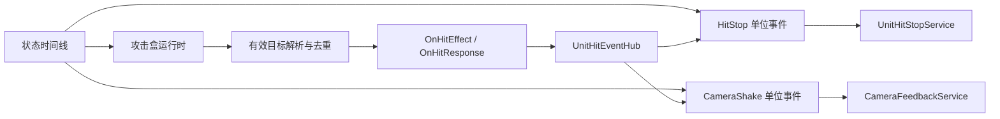

# 3C 手感反馈系统设计

## 1. 本阶段范围

本阶段只实现以下两类战斗反馈：

1. **HitStop（命中停顿）**
2. **Camera Shake（震屏）**

暂不实现：

- 命中特效、受击特效及 VFX 轨道。
- 命中音效、受击音效及 Audio 轨道。
- 材质闪白、描边、残影、伤害数字。
- 击杀慢动作和全局演出时间控制。

设计遵循项目的单位事件优先原则：如果一项能力适合由状态时间线控制生效区间，应优先实现为可热插拔的单位事件，而不是写死在攻击盒或具体技能中。

---

## 2. 核心结论

HitStop 和震屏均实现为独立单位事件：

- `HitStop` 单位事件。
- `CameraShake` 单位事件。

攻击盒不直接保存 HitStop 或震屏参数，只负责：

1. 检测碰撞。
2. 解析有效 `GameUnit`。
3. 完成本次攻击盒的目标去重。
4. 执行 `OnHitEffect`。
5. 应用 `OnHitResponse`。
6. 发布结构化的单位命中消息。

单位事件的时间区间表示**反馈监听窗口**，并不表示一定会产生反馈：

- 事件进入区间时订阅施法者的命中消息。
- 活动区间内收到有效命中消息时请求反馈服务。
- 事件退出或状态被打断时取消订阅。
- 如果攻击挥空，则不产生 HitStop 和震屏。

常规近战攻击的配置方式如下：

| 时间线内容 | 示例区间 | 语义 |
| --- | --- | --- |
| 攻击盒 | `0.20s ~ 0.35s` | 检测并发布有效命中 |
| HitStop 单位事件 | `0.20s ~ 0.35s` | 在区间内监听命中并请求停顿 |
| CameraShake 单位事件 | `0.20s ~ 0.35s` | 在区间内监听命中并请求震屏 |

三者通常配置为相同区间，但运行时不强制要求完全相同。事件区间只需覆盖希望响应的攻击盒命中时段。



---

## 3. 为什么不把反馈配置放进攻击盒

攻击盒属于**检测与结算入口**，HitStop 和震屏属于**表现反馈**。将它们直接耦合会产生以下问题：

- 同一个攻击盒无法方便地组合“只停顿”“只震屏”或多种反馈。
- 多段攻击、派生攻击和特殊状态需要不断扩充攻击盒字段。
- 攻击盒会逐渐依赖相机、动画和时间系统。
- 未来子弹、射线、环境伤害也需要重复实现反馈配置。
- 无法利用单位事件的时间区间、继承、复制和热插拔能力。

因此 `HitBoxConfig.OnHitResponse` 继续只表达玩法响应，例如韧性伤害、硬直时间和硬直标签；HitStop、震屏不进入 `HitBoxHitResponseArgs`。

---

## 4. 统一单位命中消息

### 4.1 消息数据

建议新增不可变的 `UnitHitEvent`：

```csharp
public readonly struct UnitHitEvent
{
	public readonly GameUnit Attacker;
	public readonly GameUnit Defender;
	public readonly string HitBoxId;
	public readonly Vector3 HitPoint;
	public readonly Vector3 HitDirection;
	public readonly bool HasHitPoint;
	public readonly int Frame;
	public readonly SkillContext SkillContext;
	public readonly HitResolutionResult Resolution;
}
```

首版 `Resolution` 可以只包含当前已知结果，后续再补充格挡、招架、免疫和破防：

```csharp
public readonly struct HitResolutionResult
{
	public readonly bool IsValid;
	public readonly bool EffectSucceeded;
	public readonly HitReactionType ReactionType;
}

public enum HitReactionType
{
	Normal,
	Blocked,
	Parried,
	GuardBroken,
	Immune,
}
```

在正式格挡/招架结算完成前，首版统一使用 `Normal`。字段先保留，避免反馈系统以后因战斗结果扩展而重构通信协议。

### 4.2 单位命中事件中心

每个战斗单位拥有一个轻量事件中心：

```csharp
public interface IUnitHitEventSource
{
	event Action<UnitHitEvent> HitConfirmed;
}

public interface IUnitHitEventPublisher
{
	void Publish(in UnitHitEvent hitEvent);
}

public sealed class UnitHitEventHub : MonoBehaviour,
	IUnitHitEventSource,
	IUnitHitEventPublisher
{
	public event Action<UnitHitEvent> HitConfirmed;

	public void Publish(in UnitHitEvent hitEvent)
	{
		HitConfirmed?.Invoke(hitEvent);
	}
}
```

职责约束：

- Hub 不负责停顿、震屏或伤害。
- Hub 不缓存历史消息，也不补发事件。
- 单位事件只在自身活动期间订阅。
- 状态退出、打断和 Runtime Dispose 都必须取消订阅。
- 攻击盒完成目标去重和效果结算后，再发布消息。

### 4.3 发布顺序

单次有效命中的建议顺序：

1. 解析 `GameUnitTargetInfo`。
2. 检查攻击盒本轮目标去重。
3. 临时设置 `SkillContext.PrimaryTarget`。
4. 执行 `OnHitEffect`。
5. 应用 `OnHitResponse`。
6. 生成 `UnitHitEvent`。
7. 通过攻击者的 `UnitHitEventHub` 发布。
8. 恢复原 `PrimaryTarget`。

这样反馈事件能够获得最终受击者、命中点和效果执行结果，而不依赖攻击盒内部实现。

---

## 5. 单位事件通用触发模式

HitStop 和震屏共用以下触发模式：

```csharp
public enum FeedbackTriggerMode
{
	Immediate,
	OnHit,
}
```

### `Immediate`

- 单位事件到达触发时间时立即请求反馈。
- 不依赖攻击盒。
- 适用于落地冲击、蓄力爆发、处决演出等确定时刻。
- `Duration` 不作为监听窗口；事件只触发一次。

### `OnHit`

- 单位事件进入时订阅 `HitConfirmed`。
- 命中发生时触发反馈。
- 单位事件退出时取消订阅。
- `Duration < 0` 表示监听到当前执行轨道结束。
- `Duration = 0` 没有稳定的持续监听窗口，不建议用于 `OnHit`。
- `Duration > 0` 表示有限监听窗口。

编辑器在选择 `OnHit` 且 `Duration = 0` 时应显示警告，并可将默认持续时间设置为 `0.3s`。

---

## 6. HitStop 设计

### 6.1 配置数据

```csharp
[Serializable]
public sealed class HitStopEventArgs
{
	public FeedbackTriggerMode TriggerMode = FeedbackTriggerMode.OnHit;

	public float AttackerDuration = 0.05f;
	public float DefenderDuration = 0.07f;
	public float AttackerTimeScale = 0f;
	public float DefenderTimeScale = 0f;

	public bool AffectAttacker = true;
	public bool AffectDefender = true;
	public bool TriggerOncePerEvent = true;
	public bool MergeSameFrameHits = true;
}
```

字段语义：

- `AttackerDuration`：攻击者局部时间效果的真实持续时间。
- `DefenderDuration`：受击者局部时间效果的真实持续时间。
- `AttackerTimeScale` / `DefenderTimeScale`：局部时间倍率，`0` 为完全冻结。
- `TriggerOncePerEvent`：该单位事件第一次有效触发后不再响应，适合震感明确的单段攻击。
- `MergeSameFrameHits`：同一帧命中多个目标时合并攻击者的重复请求。

`Duration` 是单位事件的监听窗口；`AttackerDuration` 和 `DefenderDuration` 才是命中后实际停顿时长，二者不能混用。

### 6.2 单位事件数据与 Runtime

```csharp
[TimelineEventData(TimelineEventType.HitStop)]
public sealed class HitStop_TimelineEventData : TimelineEventData
{
	public HitStopEventArgs Args = new HitStopEventArgs();
}
```

`HitStop_TimelineEventRuntime` 的职责：

- `OnBegin`：根据触发模式立即触发，或订阅命中事件。
- `OnTick`：不自行推进停顿计时。
- `OnEnd`：取消订阅。
- `Dispose`：兜底取消订阅和释放引用。
- 收到命中后构造 `HitStopRequest` 并提交给服务。

单位事件绝不能用协程直接修改 Animator 后等待恢复，因为：

- 当前动画后端是 Animancer，而不是普通 Animator 播放路径。
- 状态时间线自身可能已被冻结，不能依赖自身时间恢复。
- 多个请求叠加时容易提前恢复速度。
- 状态被打断或单位销毁时难以正确清理。

### 6.3 服务请求

```csharp
public readonly struct HitStopRequest
{
	public readonly GameUnit Unit;
	public readonly float Duration;
	public readonly float TimeScale;
	public readonly int Priority;
	public readonly string SourceId;
	public readonly int Frame;
}

public interface IUnitHitStopService
{
	void Request(in HitStopRequest request);
	float GetEffectiveTimeScale(GameUnit unit);
	bool IsAffected(GameUnit unit);
	void Clear(GameUnit unit);
}
```

### 6.4 局部时间域

HitStop 默认采用**单位局部时间**，不修改 `Time.timeScale`。每个单位拥有独立的有效时间倍率：

$$
\Delta t_{unit}=\Delta t_{game}\times s_{unit}
$$

其中 $s_{unit}$ 是 `IUnitHitStopService` 计算出的当前单位时间倍率。

局部时间倍率影响：

- `StateController.Tick()` 与状态时间线推进。
- `SkillRuntime` 的动作推进。
- Animancer 动画播放速度。
- KCC 动作位移、Root Motion 和技能力的动作部分。
- 受击动作和攻击动作。

局部时间倍率不影响：

- 输入采集与输入缓存。
- UI。
- 相机更新和震屏。
- HitStop 服务自身的恢复计时。
- 必要的对象销毁与系统清理。

服务必须使用 `Time.unscaledDeltaTime` 或绝对真实时间推进恢复，避免完全冻结后无法解除。

### 6.5 请求合并规则

同一单位可能同时收到多个 HitStop 请求。首版采用以下确定性规则：

1. 同一 `SourceId + Frame + Unit` 的重复请求合并。
2. 高优先级请求优先。
3. 同优先级取更低的时间倍率，即更强的停顿。
4. 剩余持续时间取最大值，不累加时长。
5. 新请求结束后重新计算当前全部活动请求，不直接把速度恢复为 `1`。
6. 单位禁用、销毁或离开战斗时清空全部请求。

首版不做全局 HitStop。未来如需处决或 Boss 演出，应增加独立的全局时间演出服务，不能复用普通命中停顿偷偷修改 `Time.timeScale`。

---

## 7. Camera Shake 设计

### 7.1 配置数据

```csharp
[Serializable]
public sealed class CameraShakeEventArgs
{
	public FeedbackTriggerMode TriggerMode = FeedbackTriggerMode.OnHit;

	public float Amplitude = 0.35f;
	public float Frequency = 8f;
	public float ShakeDuration = 0.12f;
	public SkillVector3 Direction = new Vector3(0f, 0f, -1f);

	public bool UseHitDirection = true;
	public bool TriggerOncePerEvent = true;
	public bool MergeSameFrameHits = true;
}
```

字段语义：

- `Amplitude`：震屏强度。
- `Frequency`：震动频率或频率缩放。
- `ShakeDuration`：命中后实际震屏时长。
- `Direction`：无有效命中方向时的默认局部冲击方向。
- `UseHitDirection`：优先使用 `UnitHitEvent.HitDirection`。
- `Duration` 仍然只是单位事件监听窗口。

### 7.2 单位事件数据与 Runtime

```csharp
[TimelineEventData(TimelineEventType.CameraShake)]
public sealed class CameraShake_TimelineEventData : TimelineEventData
{
	public CameraShakeEventArgs Args = new CameraShakeEventArgs();
}
```

`CameraShake_TimelineEventRuntime` 与 HitStop 使用相同订阅生命周期，但只向相机反馈服务提交请求，不直接查找或修改具体虚拟相机。

### 7.3 相机服务

```csharp
public readonly struct CameraShakeRequest
{
	public readonly Vector3 Position;
	public readonly Vector3 Direction;
	public readonly float Amplitude;
	public readonly float Frequency;
	public readonly float Duration;
	public readonly string SourceId;
	public readonly int Frame;
}

public interface ICameraFeedbackService
{
	void RequestShake(in CameraShakeRequest request);
}
```

服务实现原则：

- 首选 Cinemachine Impulse 作为底层表现。
- 不限制 Gameplay VCam 的 Body 类型。
- 单位事件不访问 `CinemachineBasicMultiChannelPerlin`。
- 自由相机和纯视角硬锁定共用同一个反馈入口。
- 相机反馈使用非缩放时间，HitStop 期间仍能正常播放。
- 服务负责访问当前输出相机和 Cinemachine Brain。

### 7.4 多目标与同帧合并

同一攻击盒可能在一帧命中多个目标。若每个目标都独立产生一次相机冲击，会导致震屏强度随目标数量失控。

首版规则：

1. 相同 `SourceId + Frame` 的震屏请求合并为一次。
2. 合并时取最大 `Amplitude`、最大 `Duration`。
3. 方向优先采用距离相机最近或第一条有效命中消息的方向，首版可稳定采用第一条。
4. 不对同帧请求做振幅相加。
5. 不同来源事件允许同时存在，由 Cinemachine Impulse 自然混合。

---

## 8. Runtime 热插拔与服务注入

单位事件不应通过反射或全场景查找服务。需要在 `SkillContext` 增加明确依赖：

```csharp
public IUnitHitEventSource UnitHitEventSource;
public IUnitHitStopService HitStopService;
public ICameraFeedbackService CameraFeedbackService;
```

攻击盒发布端可通过同一 Hub 的发布接口获得：

```csharp
public IUnitHitEventPublisher UnitHitEventPublisher;
```

这些服务在 `SkillPlayerController` / `CharacterStateBuilder` 构建上下文时统一解析和注入。状态时间线和技能注入状态共享同一组单位服务。

热插拔边界：

- 配置层由 `TimelineEventData` 特性注册。
- Runtime 层由 `TimelineEventRuntime` 特性注册。
- 编辑器根据 `TimelineEventType` 创建事件并绘制参数。
- 删除单位事件不会改变攻击盒数据。
- 没有对应服务时，Runtime 安全跳过反馈并发布调试 Trace，不阻断命中结算。

---

## 9. 编辑器支持

### HitStop 面板

- 触发模式。
- 攻击者停顿时长和时间倍率。
- 受击者停顿时长和时间倍率。
- 是否影响攻击者/受击者。
- 单事件仅触发一次。
- 同帧命中合并。

### CameraShake 面板

- 触发模式。
- 振幅。
- 频率。
- 实际震屏时长。
- 默认方向。
- 是否使用命中方向。
- 单事件仅触发一次。
- 同帧命中合并。

### 时间线表现

- 两种事件都显示为普通单位事件片段。
- `OnHit` 模式的片段文案应明确显示“监听命中”。
- Inspector 明确区分“监听区间 Duration”和“反馈持续时间”。
- `OnHit + Duration = 0` 显示警告。
- Scene Gizmo 首版不需要额外实现。

---

## 10. 调试与可观察性

至少增加以下 Trace：

- `UnitHit.Published`
- `HitStopEvent.Subscribed`
- `HitStopEvent.Triggered`
- `HitStopService.Requested`
- `HitStopService.Merged`
- `HitStopService.Released`
- `CameraShakeEvent.Subscribed`
- `CameraShakeEvent.Triggered`
- `CameraShakeService.Requested`
- `CameraShakeService.Merged`

运行时观察字段建议包括：

- 当前单位有效时间倍率。
- 当前活动 HitStop 请求数。
- 最后一次 HitStop 来源和剩余时间。
- 最后一次震屏来源、振幅和持续时间。
- 单位事件当前是否已订阅命中。

---

## 11. 实施顺序

### 第一阶段：统一命中消息

1. 实现 `UnitHitEvent` 和 `UnitHitEventHub`。
2. 将 Hub 注入 `SkillContext`。
3. 攻击盒在有效命中结算后发布消息。
4. 保持现有攻击盒去重行为不变。

### 第二阶段：HitStop

1. 增加 `TimelineEventType.HitStop`，使用显式枚举值避免旧序列化值位移。
2. 实现配置、Data、Runtime 和编辑器面板。
3. 实现 `IUnitHitStopService` 与局部时间请求合并。
4. 接入状态、技能、Animancer 和 KCC 的单位时间倍率。
5. 验证输入在停顿期间仍然采集。

### 第三阶段：震屏

1. 增加 `TimelineEventType.CameraShake`，同样使用显式枚举值。
2. 实现配置、Data、Runtime 和编辑器面板。
3. 实现 `ICameraFeedbackService`。
4. 通过 Cinemachine Impulse 输出。
5. 验证自由视角和硬锁定期间表现一致。

### 第四阶段：测试

测试场景至少覆盖：

- 挥空不触发反馈。
- 单目标命中。
- 同帧多目标命中。
- 持续攻击盒重复命中。
- 状态在监听窗口内被打断。
- HitStop 期间输入缓存。
- 攻击者与受击者使用不同停顿时长。
- 连续两个不同攻击产生重叠 HitStop。
- 硬锁定与自由相机下的震屏。
- 单位禁用或销毁时服务清理。

---

## 12. 最终架构边界

| 模块 | 负责 | 不负责 |
| --- | --- | --- |
| 攻击盒 | 检测、去重、命中结算入口、发布命中 | HitStop 参数、震屏参数、相机表现 |
| `UnitHitEventHub` | 同步分发有效命中消息 | 缓存、伤害、反馈执行 |
| HitStop 单位事件 | 定义监听窗口与停顿配置 | 自行计时、直接修改 Animancer/KCC |
| `UnitHitStopService` | 局部时间、请求合并、真实时间恢复 | 命中检测、相机反馈 |
| CameraShake 单位事件 | 定义监听窗口与震屏配置 | 直接操作具体 VCam |
| `CameraFeedbackService` | Cinemachine 震屏输出与请求合并 | 命中检测、角色时间控制 |

该方案延续 AsiActionEditor 的 `OnHit` 订阅式单位事件设计，同时保持当前项目的状态时间线、KCC 唯一运动出口和轻量相机 Rig 边界。后续加入 VFX 与 Audio 时，可复用同一 `UnitHitEventHub` 和单位事件生命周期，而无需修改攻击盒核心职责。
