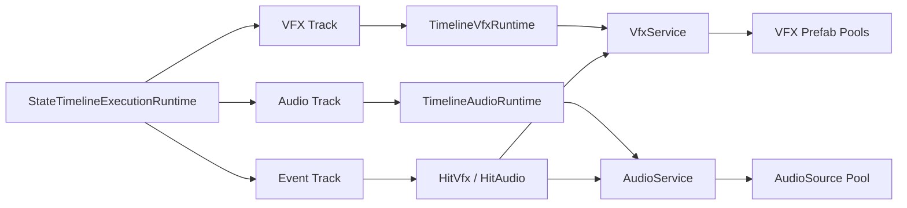

# StateTimeline 特效与音效轨道扩展设计

## 1. 文档目标

本文设计 `StateTimeline` 的专用特效轨道和音效轨道，用于描述动作本身在固定时间点发生的表现，例如：

- 挥刀刀光、拖尾和烟尘。
- 技能蓄力、释放和消散特效。
- 挥砍风声、技能释放声、脚步声和角色喊声。
- 挂在角色或武器挂点上的持续表现。

现有 `HitVfx` 和 `HitAudio` 不会被替代。两类功能的职责不同：

| 类型 | 触发条件 | 典型用途 |
|---|---|---|
| VFX/Audio 专用轨道 | 时间轴到达指定时间 | 挥刀声、拖尾、蓄力和施法表现 |
| `HitVfx` / `HitAudio` | 监听窗口内发生有效命中 | 接触火花、血雾、肉体或金属命中声 |

核心原则：

> 动作表现由时间轴驱动，命中反馈由命中结果驱动；二者共用播放服务和对象池，但不混淆触发语义。

---

## 2. 当前范围

### 2.1 第一阶段实现

1. `StateTimeline` 新增 VFX 和 Audio 两个轨道分组。
2. 两类轨道拥有独立的强类型配置数据。
3. 时间块支持创建、选择、拖动、缩放、删除和复制。
4. VFX 支持角色/武器挂点、偏移、缩放、固定世界位置和持续跟随。
5. VFX 支持 OneShot 和由时间块控制的持续播放。
6. Audio 首版支持 OneShot、2D/3D、挂点定位和 MixerGroup。
7. 继续复用当前 `VfxService`、`AudioService` 和对象池。
8. 状态结束或被打断时正确收口仍由时间线控制的持续 VFX。
9. 支持 VFX 的编辑器时间轴预览。
10. 支持 Audio 在时间线向前播放并跨过触发点时预览。

### 2.2 第一阶段暂不实现

- Audio 循环、Fade In、Fade Out 和时间块裁剪。
- 全局音效字典或 ScriptableObject Definition。
- AudioClip 随机/顺序变体列表。
- VFX Graph 通用适配。
- 音频波形绘制。
- 全局并发限制、优先级、LOD 和预算。
- Addressables 或正式 Player Build 资源收集。
- 对现有 `HitVfx` 生命周期规则做强制重构。

以上能力只有在实际制作中出现明确需求后再扩展。

---

## 3. AsiActionEditor 参考结论

AsiActionEditor 的设计并不是为粒子和音频各实现一套完全独立的底层轨道。其核心方式是：

1. 底层统一使用事件轨道和 `Enter / Update / Exit` 生命周期。
2. 不同轨道组通过“允许的事件类型列表”形成特效、音效等逻辑分类。
3. 特效事件保存资源路径、挂点、偏移、缩放和 `AlwaysFollow`。
4. 持续特效在时间块有效期间不断为池实例续命，时间块结束后留下尾迹再回收。
5. 编辑器使用 `ParticleSystem.Simulate()` 在任意播放头位置预览粒子。
6. 音频通过音效字典和角色上的 AudioSource 槽位播放。

### 3.1 值得借鉴

- 编辑器显示为清晰的专用轨道，但复用统一的时间块交互。
- 特效支持挂点和“只取初始位置/持续跟随”两种语义。
- 时间块持续时间和粒子尾迹不是同一个概念。
- 粒子编辑器预览使用确定性采样，而不是只能进入 Play Mode 观察。
- 音效变体可以减少连续播放同一 Clip 的机械感。

### 3.2 不直接复制

- 不使用数字 AudioSource 索引，避免调整槽位后旧数据失效。
- 不要求每个角色预先维护多个 AudioSource。
- 不使用数字音效字典 ID。
- 不用同一个 AudioSource 反复替换 Clip，避免并发声音互相覆盖。
- 不强制所有特效 Prefab 挂载包装组件。
- 不完全依赖固定倒计时回收循环粒子。

---

## 4. 核心架构



职责划分：

### StateTimeline

- 判断时间块何时开始、更新和结束。
- 在状态退出或被打断时收口活动时间块。
- 解析角色、武器和挂点。
- 把最终播放参数提交给服务。

### VFX/Audio 服务

- 创建或获取池实例。
- 应用最终 Transform 和播放参数。
- 播放、停止和回收。
- 不知道技能、状态、攻击盒或时间线的业务语义。

### HitVfx/HitAudio

- 继续监听 `UnitHitEventHub`。
- 根据命中点和命中法线构造播放参数。
- 与专用轨道共享服务，不共享触发逻辑。

---

## 5. 轨道数据组织

当前 `TimelineTrackConfig` 已经包含 `HitBoxes`、`Bullets` 和 `MetaSkillEvents`。扩展后结构为：

```csharp
[Serializable]
public class TimelineTrackConfig
{
	public string TrackId;
	public TimelineTrackType TrackType;
	public string DisplayName;
	public bool IsEnabled;

	public List<HitBoxConfig> HitBoxes;
	public List<BulletConfig> Bullets;
	public List<TimelineVfxConfig> VfxClips;
	public List<TimelineAudioConfig> AudioClips;
	public List<TimelineEventConfig> MetaSkillEvents;
}
```

使用独立强类型列表，而不是把普通 VFX/Audio 继续塞入 `MetaSkillEvents`，原因是：

1. 它们是常用表现内容，值得在时间线上独立分类。
2. 它们需要挂点、播放空间和预览等专用能力。
3. 编辑器无需在专用轨道中选择事件类型。
4. 数据职责与已有 `HitBoxConfig`、`BulletConfig` 一致。
5. 仍然可以复用统一的时间块绘制和拖动函数。

---

## 6. 通用枚举

### 6.1 VFX 时间块模式

```csharp
public enum TimelineVfxMode
{
	OneShot = 0,
	Controlled = 1,
}
```

#### OneShot

- 到达 `TriggerTime` 时播放一次。
- 不因时间块结束主动停止。
- 由 Prefab 粒子配置和服务回收规则决定结束时间。
- 适合烟尘、闪光、爆炸、挥砍火花。

#### Controlled

- 到达 `TriggerTime` 时播放。
- `Duration` 表示时间线控制期。
- 控制期结束或状态被打断时停止发射或立即清理。
- 适合武器拖尾、蓄力光效和循环特效。

### 6.2 VFX 结束模式

```csharp
public enum TimelineVfxStopMode
{
	StopEmitting = 0,
	StopAndClear = 1,
}
```

#### StopEmitting

停止产生新粒子，但允许已经生成的粒子自然消散。它是持续特效的默认结束方式。

#### StopAndClear

立即停止并清空所有粒子。适合状态被强制打断后不能留下任何表现的情况。

### 6.3 挂点跟随方式

```csharp
public enum TimelineFollowMode
{
	SpawnAtSocket = 0,
	FollowSocket = 1,
}
```

#### SpawnAtSocket

开始时从挂点计算一次世界位置和旋转，播放后不再跟随。

适合：

- 脚底烟尘。
- 地面冲击。
- 挥刀过程中留在原位置的残影。

#### FollowSocket

播放期间持续跟随挂点。

适合：

- 武器拖尾。
- 手部蓄力。
- 附着在身体上的持续粒子。

这对应 AsiActionEditor 的 `AlwaysFollow`，但名称直接表达两种行为。

### 6.4 Audio 播放空间

继续复用现有：

```csharp
public enum AudioPlaySpace
{
	TwoD = 0,
	World = 1,
	FollowTarget = 2,
}
```

对于时间线 Audio：

- `TwoD`：不解析挂点，不做距离衰减。
- `World`：从挂点取得一次世界位置，随后留在原地。
- `FollowTarget`：播放期间跟随挂点。

---

## 7. VFX 数据结构

```csharp
[Serializable]
public sealed class TimelineVfxConfig
{
	public string VfxId = Guid.NewGuid().ToString("N");
	public string DisplayName = "VFX";
	public bool IsEnabled = true;

	public float TriggerTime = 0f;
	public float Duration = 0f;

	public string PrefabPath = string.Empty;

	public SkillSocketSourceType SocketSource = SkillSocketSourceType.Character;
	public string AttachPoint = string.Empty;
	public TimelineFollowMode FollowMode = TimelineFollowMode.SpawnAtSocket;

	public SkillVector3 PositionOffset = Vector3.zero;
	public SkillVector3 RotationOffset = Vector3.zero;
	public SkillVector3 Scale = Vector3.one;

	public TimelineVfxMode Mode = TimelineVfxMode.OneShot;
	public TimelineVfxStopMode StopMode = TimelineVfxStopMode.StopEmitting;
	public float TailTimeout = 2f;
	public bool UseUnscaledTime = true;
}
```

### 7.1 字段说明

| 字段 | 含义 |
|---|---|
| `VfxId` | 时间块唯一 ID，用于运行时去重和活动实例字典 |
| `TriggerTime` | 播放开始时间 |
| `Duration` | `Controlled` 模式的控制期；不是粒子 Prefab 自身寿命 |
| `PrefabPath` | 编辑器拖入 Prefab 后保存的 Asset Path |
| `SocketSource` | 从角色还是武器解析挂点 |
| `AttachPoint` | 挂点名称；为空时回退到对应根节点 |
| `FollowMode` | 只在挂点生成，或持续跟随挂点 |
| `PositionOffset` | 挂点局部位置偏移 |
| `RotationOffset` | 挂点局部旋转偏移 |
| `Scale` | 特效实例缩放 |
| `Mode` | OneShot 或受时间块控制 |
| `StopMode` | 控制期结束时停止发射或立即清空 |
| `TailTimeout` | 停止发射后的最大尾迹保留时间，避免异常循环实例不回收 |
| `UseUnscaledTime` | 是否让粒子使用 Unity 非缩放时间 |

### 7.2 Duration 规则

为了避免再次把时间块时长和 Prefab 生命周期混为一谈：

- `OneShot`：`Duration` 固定为 `0`，只表示瞬时触发。
- `Controlled`：`Duration > 0`，表示时间线控制特效的区间。
- 首版不允许 VFX 轨道使用 `Duration < 0`；需要贯穿整个状态时，把时间块拉到状态结尾。
- Prefab 的 `ParticleSystem.duration`、`startLifetime` 和发射配置仍由 Prefab 自身决定。

### 7.3 TailTimeout 规则

`TailTimeout` 不是正常播放寿命，而是停止发射后的安全回收上限：

1. 时间块结束时调用 `StopEmitting`。
2. 服务等待全部子粒子自然死亡。
3. `ParticleSystem.IsAlive(true) == false` 时立即回收。
4. 如果超过 `TailTimeout` 仍存活，则强制清空并回收。

这样既尊重 Prefab，又避免错误配置的循环粒子永久占用对象池。

---

## 8. Audio 数据结构

```csharp
[Serializable]
public sealed class TimelineAudioConfig
{
	public string AudioId = Guid.NewGuid().ToString("N");
	public string DisplayName = "Audio";
	public bool IsEnabled = true;

	public float TriggerTime = 0f;
	public float Duration = 0f;

	public string AudioClipPath = string.Empty;
	public string AudioMixerPath = string.Empty;
	public string MixerGroupName = string.Empty;

	public SkillSocketSourceType SocketSource = SkillSocketSourceType.Character;
	public string AttachPoint = string.Empty;
	public AudioPlaySpace Space = AudioPlaySpace.World;

	public float Volume = 1f;
	public float Pitch = 1f;
	public float SpatialBlend = 1f;
	public float MinDistance = 1f;
	public float MaxDistance = 30f;
}
```

### 8.1 字段说明

| 字段 | 含义 |
|---|---|
| `AudioId` | 时间块唯一 ID，用于一次触发去重 |
| `TriggerTime` | 音频播放时间 |
| `Duration` | 首版固定为 0，不截断 AudioClip |
| `AudioClipPath` | AudioClip 的 Asset Path |
| `AudioMixerPath` | AudioMixer 资产路径 |
| `MixerGroupName` | Mixer 内的 Group 名称 |
| `SocketSource` | 角色或武器挂点来源 |
| `AttachPoint` | 3D 音效生成/跟随挂点 |
| `Space` | 2D、固定世界位置或跟随挂点 |
| `Volume` | 本次播放音量 |
| `Pitch` | 本次播放音调/速度 |
| `SpatialBlend` | 3D 混合比例 |
| `MinDistance` | 3D 完整音量范围 |
| `MaxDistance` | 3D 最大衰减距离 |

### 8.2 为什么首版 Duration 固定为 0

普通挥刀、脚步、喊声和释放声都是 OneShot。让音频自然播放完可以避免：

- 动作被打断时声音被突兀截断。
- 为了停止单个声音过早引入复杂播放控制。
- 时间块长度与 AudioClip 实际长度不一致。

后续确实需要蓄力循环声时，再扩展：

- `Loop`。
- `FadeIn`。
- `FadeOut`。
- 精确停止本次播放实例。

---

## 9. VFX 服务调整

现有 `IVfxService.Play()` 返回 `void`，并且 `Stop(prefab, followTarget)` 会匹配一组实例。对于 OneShot 命中特效足够，但不能让一个持续时间块只停止自己创建的实例。

专用 VFX 轨道需要最小的运行时播放引用：

```csharp
public interface IVfxPlayback
{
	bool IsAlive { get; }
}

public interface IVfxService
{
	IVfxPlayback Play(in VfxPlayArgs args);
	void Stop(IVfxPlayback playback, VfxStopBehavior behavior, float tailTimeout);
	void Stop(GameObject prefab, Transform followTarget = null);
	void StopAll();
}
```

这里的 `IVfxPlayback`：

- 只存在于运行时内存。
- 不序列化到 JSON。
- 不需要设计师配置。
- 不承担资源 ID 或版本管理职责。
- 只用于“哪个时间块停止哪个池实例”。

现有 `HitVfx` 仍可调用 `Play()` 后忽略返回值，不增加使用复杂度。

### 9.1 VFX 实例状态

池实例至少维护：

```csharp
private sealed class PooledVfx
{
	public PoolEntry Entry;
	public ParticleSystem[] Particles;
	public Transform FollowTarget;
	public VfxPlaybackState State;
	public float TailRemaining;
	public bool UseUnscaledTime;
}
```

状态可定义为：

```csharp
public enum VfxPlaybackState
{
	Playing,
	Stopping,
	Released,
}
```

### 9.2 回收规则

#### OneShot

首阶段可保留当前 `Lifetime` 兼容路径，避免同时重构已验证的 `HitVfx`。新 VFX 轨道优先使用自然存活检查。

#### Controlled + StopEmitting

1. 时间块结束。
2. 对全部子 ParticleSystem 调用 `StopEmitting`。
3. 进入 `Stopping`。
4. 所有粒子死亡后回池。
5. 超过 `TailTimeout` 后强制清理。

#### Controlled + StopAndClear

1. 时间块结束或被打断。
2. 立即停止并清空全部粒子。
3. 当帧归还对象池。

---

## 10. Audio 服务调整

第一阶段继续使用现有接口即可：

```csharp
public interface IAudioService
{
	void Play(in AudioPlayArgs args);
	void Stop(AudioClip clip, Transform followTarget = null);
	void StopAll();
}
```

原因：

- Audio 轨道首版只有 OneShot。
- AudioSource 播放完成后已经可以自动回池。
- 每次播放使用独立池实例，支持多个音效并发。
- `MixerGroup`、音量、Pitch 和空间参数已经满足需求。

时间线负责解析挂点并生成最终 `AudioPlayArgs`，AudioService 不感知角色和武器结构。

未来加入循环音频时，再让 `Play()` 返回仅供运行时使用的 `IAudioPlayback`，不提前实现。

---

## 11. 时间线运行时设计

`StateTimelineExecutionRuntime` 新增：

```csharp
private readonly Dictionary<string, TimelineVfxRuntime> _activeVfxRuntimes;
private readonly HashSet<string> _triggeredVfxIds;
private readonly HashSet<string> _triggeredAudioIds;
```

### 11.1 `TimelineVfxRuntime`

```csharp
internal sealed class TimelineVfxRuntime
{
	private readonly TimelineVfxConfig _config;
	private readonly SkillContext _context;
	private IVfxPlayback _playback;

	public void Begin();
	public void Tick(float deltaTime);
	public void End(bool interrupted);
}
```

职责：

- 加载 VFX Prefab。
- 解析角色或武器挂点。
- 计算世界/局部 Transform。
- 调用服务并保存本次播放引用。
- `FollowSocket` 模式下保持挂点跟随。
- 控制期结束时按配置停止。
- 被打断时保证活动实例收口。

### 11.2 Audio 触发

Audio 首版不需要单独的活动 Runtime：

1. 当前时间跨过 `TriggerTime`。
2. 检查 `AudioId` 尚未触发。
3. 加载 AudioClip 和 MixerGroup。
4. 解析挂点、位置和跟随对象。
5. 调用 `AudioService.Play()`。
6. 写入 `_triggeredAudioIds`。

### 11.3 执行顺序

每帧建议顺序：

1. 更新并触发 `MetaSkillEvents`，使 `HitVfx/HitAudio` 先进入监听状态。
2. 更新 VFX 轨道。
3. 触发 Audio 轨道。
4. 更新 HitBox。
5. 触发 Bullet。

这样既不会丢失攻击盒首帧命中，也能让动作表现按时间正常执行。

### 11.4 时间跳帧

触发判断不能只使用 `elapsedTime == TriggerTime`，而应判断本帧是否跨过触发点：

```text
previousTime < TriggerTime && elapsedTime >= TriggerTime
```

同时保留 ID 去重，避免大帧率波动、暂停恢复或重复 Tick 导致多次播放。

### 11.5 状态结束与中断

| 内容 | 正常结束 | 状态被打断 |
|---|---|---|
| VFX OneShot | 自然播放完 | 默认自然播放完 |
| VFX Controlled / StopEmitting | 停止发射并保留尾迹 | 按配置停止发射并保留尾迹 |
| VFX Controlled / StopAndClear | 立即清理 | 立即清理 |
| Audio OneShot | 自然播放完 | 默认自然播放完 |
| HitVfx/HitAudio 监听 | 取消订阅 | 取消订阅 |

---

## 12. 挂点解析

VFX 和 Audio 复用 HitBox/Bullet 已有挂点语义：

```text
SocketSource = Character
	→ GameUnit.MountPoints
	→ 找不到时回退角色根节点

SocketSource = Weapon
	→ PreviewWeaponConfig.MountPoints
	→ 找不到时回退武器根节点
	→ 武器不存在时回退角色根节点
```

Inspector 使用现有挂点选择 UI，不要求用户手写 Transform 路径。

位置和旋转计算：

```text
worldPosition = socket.TransformPoint(PositionOffset)
worldRotation = socket.rotation * Quaternion.Euler(RotationOffset)
```

VFX Scale 直接应用到池实例根节点。Audio 不使用 Scale。

---

## 13. StateTimeline 编辑器设计

### 13.1 轨道分组

时间线显示顺序：

```text
Animation
HitBox
Bullet
VFX
Audio
Event
Interrupt
```

建议颜色：

| 轨道 | 颜色 |
|---|---|
| HitBox | 青色 |
| Bullet | 橙色 |
| VFX | 紫色 |
| Audio | 绿色 |
| Event | 粉色 |

### 13.2 创建交互

- 点击 VFX 分组右侧 `+`：创建 VFX 轨道。
- 点击 Audio 分组右侧 `+`：创建 Audio 轨道。
- 右键 VFX 轨道：`创建特效`。
- 右键 Audio 轨道：`创建音效`。
- 新时间块放在当前播放头位置。
- VFX 默认 `OneShot + SpawnAtSocket`。
- Audio 默认 `World + Volume 1 + Pitch 1`。

### 13.3 VFX Inspector

显示：

- DisplayName、IsEnabled、TriggerTime。
- 模式。
- Controlled 模式下显示 Duration、结束模式和尾迹超时。
- VFX Prefab ObjectField。
- 挂点来源和挂点。
- 生成/跟随模式。
- 位置、旋转、缩放。
- 使用非缩放时间。

如果 Prefab 内没有任何 `ParticleSystem`，显示警告。

### 13.4 Audio Inspector

显示：

- DisplayName、IsEnabled、TriggerTime。
- AudioClip ObjectField。
- AudioMixerGroup ObjectField。
- 2D/World/FollowTarget。
- 非 2D 模式下显示挂点来源和挂点。
- Volume、Pitch、SpatialBlend、MinDistance、MaxDistance。

### 13.5 数据保存

继续使用现有方式：

- ObjectField 只负责编辑器选择。
- Config 保存 Asset Path 和 MixerGroupName。
- 最外层 `Skill Resources` 窗口负责最终保存 JSON。
- 不新增 ScriptableObject 配置资产。

---

## 14. 编辑器预览

## 14.1 VFX 预览

模仿 AsiActionEditor 的确定性采样方式：

1. 每个 VFX 时间块维护一个仅编辑器使用的预览实例。
2. 预览实例放在独立的临时根节点下。
3. 禁用所有子 ParticleSystem 的自动随机种子。
4. 根据播放头计算局部时间：

$$
t_{local}=\max(0,t_{timeline}-t_{trigger})
$$

5. 对全部子 ParticleSystem 调用 `Simulate(tLocal, true, true, true)`。
6. `SpawnAtSocket` 使用触发时刻的挂点采样姿势。
7. `FollowSocket` 使用当前播放头姿势下的挂点。
8. 切换资源、关闭窗口或停止预览时销毁预览根节点。

注意：编辑器预览实例不进入正式运行时对象池。

## 14.2 Audio 预览

第一阶段采用简单规则：

- 时间线正常向前播放并跨过 TriggerTime 时播放一次。
- 手动拖动播放头不播放，避免来回拖动时反复爆音。
- 停止预览、切换资源或关闭窗口时停止预览 AudioSource。
- 预览使用单独的编辑器 AudioSource，不污染运行时池。

后续如有需要再增加波形和从 Clip 中间采样。

---

## 15. 与现有 HitVfx/HitAudio 的关系

### 共用

- `FeedbackAssetRuntimeCatalog` 资源加载。
- `GameFeedbackServiceHost`。
- VFX 按 Prefab 对象池。
- AudioSource 统一对象池。
- MixerGroup、Volume、Pitch 和空间参数。

### 不共用

- 触发条件。
- 挂点来源。
- 持续时间语义。
- 命中点和命中法线旋转。

`HitVfx` 仍然保留 `HitNormal`、`OppositeHitDirection` 等命中专用旋转模式。普通 VFX 轨道只按照挂点旋转和 RotationOffset，不需要命中法线模式。

---

## 16. 错误处理与调试

建议增加 Trace：

```text
TimelineVfx.Triggered
TimelineVfx.Stopped
TimelineVfx.ResourceMissing
TimelineVfx.SocketMissing
TimelineAudio.Triggered
TimelineAudio.ResourceMissing
TimelineAudio.SocketMissing
```

原则：

- 资源缺失时跳过本次播放，不阻断状态时间线。
- 挂点缺失时记录警告并回退根节点。
- MixerGroup 缺失时允许 AudioClip 使用默认输出播放。
- VFX Prefab 不含 ParticleSystem 时不进入活动列表。
- 状态结束后活动 VFX Runtime 必须全部释放。

---

## 17. 性能与对象池

### VFX

- 按 Prefab 建独立 `ObjectPool`。
- 第一次播放时扫描子 ParticleSystem 并缓存。
- 活动实例只进行必要的存活检查和跟随更新。
- `SpawnAtSocket` 不做每帧 Transform 同步。
- `FollowSocket` 可使用父子关系跟随，避免手写每帧查找挂点。

### Audio

- 继续使用统一 AudioSource 池。
- 每次播放完整覆盖 AudioSource 参数，避免池污染。
- Clip 播放结束后自动回池。
- OneShot 状态被打断后默认不立即停止，保证尾音完整。

---

## 18. 实施顺序

### 阶段一：数据和编辑器

1. 在 `TimelineTrackConfig` 增加 `VfxClips`、`AudioClips`。
2. 新增 `TimelineVfxConfig`、`TimelineAudioConfig` 和相关枚举。
3. 补齐 Clone、Sanitize 和资源收集逻辑。
4. 在 `StateTimelineEditorWindow` 增加两个轨道分组。
5. 增加时间块创建、绘制、拖动、缩放和删除。
6. 在两套 Inspector 中增加配置面板。

### 阶段二：运行时

1. 增加 VFX/Audio 的触发记录。
2. 实现 `TimelineVfxRuntime`。
3. 接入挂点解析。
4. 扩展 VFX 服务，使 `Play()` 返回内部播放引用。
5. 实现精确停止、StopEmitting、尾迹和强制清理。
6. 接入 Audio OneShot 触发。
7. 接入状态正常结束和中断清理。

### 阶段三：预览与验证

1. 实现 VFX `ParticleSystem.Simulate()` 预览。
2. 实现 Audio 跨触发点预览。
3. 验证播放头拖动、停止、资源切换和窗口关闭清理。
4. 完成 Play Mode 功能矩阵测试。

---

## 19. 验收标准

### VFX

- OneShot 在指定时间和挂点播放一次。
- `SpawnAtSocket` 播放后不跟随角色。
- `FollowSocket` 正确跟随角色或武器挂点。
- Controlled 时间块结束时按配置停止。
- StopEmitting 保留已有粒子尾迹。
- StopAndClear 立即清理。
- 状态被打断后无活动 Runtime 泄漏。
- 同一 Prefab 同时播放多个实例时，一个时间块不会停止另一个实例。
- 编辑器拖动播放头能稳定复现粒子状态。

### Audio

- 指定时间只播放一次。
- 2D、固定世界位置和跟随挂点行为正确。
- MixerGroup 路由正确。
- 多个音效可以并发，不互相覆盖。
- 播放完成后 AudioSource 自动回池。
- 状态被打断后 OneShot 尾音可以正常播放完。

### 兼容性

- 现有 HitVfx、HitAudio 行为不变。
- 现有 HitBox、Bullet 和 MetaSkillEvent 数据可正常加载。
- 旧 JSON 没有 VFX/Audio 列表时自动初始化为空列表。
- 不要求修改现有 VFX Prefab 或增加强制包装组件。

---

## 20. 最终设计结论

本次扩展采用：

> 专用强类型数据轨道 + 统一时间块编辑交互 + 复用现有播放服务和对象池。

从 AsiActionEditor 借鉴：

- 轨道表现分类。
- 挂点和持续跟随。
- 时间块控制期与粒子尾迹分离。
- 基于 `ParticleSystem.Simulate()` 的编辑器预览。

保留当前项目更合适的实现：

- AudioClip 和 MixerGroup 直接拖入。
- AudioSource 由统一池自动创建。
- VFX 按 Prefab 建池。
- 不使用数字资源字典和 AudioSource 索引。
- 不引入额外 ScriptableObject 配置资产。

第一阶段目标仍然是快速、可靠地完成动作 VFX/SFX 制作链路，不提前建设大型通用音视频中间件。
