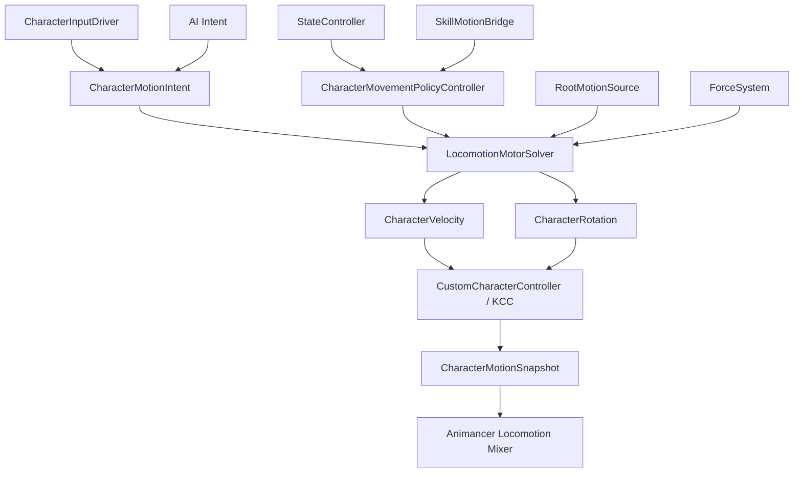

# 角色移动与八方向 Locomotion 设计

## 当前实施状态（基础运动与防滑步）

- 自由移动求解已改为高速动作 ARPG 模式：输入方向与速度标量分离，不再对旧/新速度向量整体 `MoveTowards`。
- 地面方向当帧服从输入；速度大小独立使用起步、停止或变向加速度，普通转向不再产生人为转弯半径。
- 当输入夹角超过 `HardTurnAngle`，清除旧方向和横向速度，只按 `HardTurnSpeedRetention` 保留速度并沿新方向重新加速。默认保留 0，左右折返不会滑行或画小圈。
- `RootMotion + MoveDirection` 不直接使用随角色朝向旋转的世界 Root Motion 轨迹。系统保留动画 Root Motion 的平面速度大小与垂直分量，但将平面方向当帧重定向到输入方向；角色朝向可以独立转动，因此不会因为“前向 Root Motion + 渐进旋转”形成圆弧。
- 状态可通过 `AllowBackwardRootMotion` 控制是否接受角色局部负 Z 位移。Run End 等停止动画通常关闭该项，保留向前制动位移但过滤根骨回弹、脚步调整或混合过渡产生的轻微后退；真正需要后退的动画则保持开启。
- 朝向仅由 KCC 做一次角速度求解；删除输入侧指数 Slerp 和“急转时朝旧实际速度”的双重延迟。急转可通过 `SnapFacingOnHardTurn` 当帧对齐输入。
- `InputMotionSource` 只提交归一化方向和摇杆幅度，KCC 统一计算 `Unit.MaxMoveSpeed × State.InputSpeedMultiplier × InputMagnitude`，避免临时修改组件速度造成配置所有权不清。
- Unit 配置新增 `Locomotion`：最大速度、地面加减速、变向加速度、空中控制、转向、重力和外力衰减统一在 Unit 编辑器配置。
- KCC 的 `StableGroundLayers` 必须包含场景地面层。此前角色预制体将其序列化为 0，导致角色永远进入空中求解并被 `MaxAirSpeed` 限速，表现为最大速度和地面加速度只区分 0/非 0。现在该层掩码由 Unit 配置并对旧 0 值自动迁移。
- State 的 `MovementProfile` 继续只表达运动所有权、状态倍率和状态转向上限，不保存角色基础速度。
- 每个 State 先通过 `AffectsLocomotion` 声明是否参与运动策略仲裁；关闭时完全不提交策略。Action 默认状态应关闭，只有确实要锁移动、使用 Root Motion 或覆盖转向的 Action 状态才开启并配置 `MovementProfile`。
- 非 Root Motion 的 Locomotion 状态可启用 `MatchLocomotionSpeed`：
    - `playbackSpeed = animSpeed × Clamp(locomotionDrivePlanarSpeed / authoredMoveSpeed, min, max)`
    - `locomotionDrivePlanarSpeed` 来自 KCC 碰撞约束前的 Locomotion 求解速度，不包含外力，也不会因撞墙被压成 0。
    - Idle 不启用；移动 Clip 必须填写实际设计速度 `AuthoredMoveSpeed`。
- 无显式默认下一状态的循环 Locomotion 不按 `Timeline.Duration` 自然结束或重播，只由中断条件退出。否则改变播放倍率后，固定秒数的状态重置会与动画循环边界错相，周期性跳回首帧。
- 速度匹配倍率使用 `LocomotionSpeedMatchSharpness` 指数平滑和 `LocomotionSpeedMatchDeadZone` 死区，避免 KCC 速度微小波动直接造成动画频率抖动。
- 格挡 Strafe 使用 `CameraForward` 旋转策略：角色持续面向相机平面正方向，WASD 位移仍使用相机平面基准。相机 yaw 改变时，朝向请求经 `CharacterRotation` 交给 KCC，绝不直接修改角色 Transform。
- 格挡 Directional Mixer 使用 Idle `(0, 0)` 加八方向的九点结构。格挡中无移动输入时保持格挡 Idle；S 沿相机正方向的反方向移动并稳定驱动 Back `(0, -1)`。
- `CameraForward` 状态的 Mixer 参数直接在相机平面基准中计算，而不是等待角色完成转身后再使用当前 Transform 的局部空间。这样从自由移动突然进入格挡时，即使角色原朝向与相机相反，S 也不会短暂误播 Forward。
- 这属于单 Clip 第一版防滑步。最终八方向方案仍应使用 KCC 局部真实速度驱动 Directional Mixer，并为每个方向/步态 Clip 标记各自设计速度。

## 1. 文档目标

本文档定义接下来两个开发阶段：

1. 重整角色移动系统，使代码驱动移动、Root Motion、技能运动和外力能够正确协作。
2. 使用 Animancer Mixer 实现自由移动与锁定模式下的八方向 Locomotion，并通过速度匹配尽量减少滑步。

这两个阶段完成后，角色运动链应满足：

1. `ApplyRootMotion=false` 时，角色仍能由输入或 AI 正常移动。
2. `ApplyRootMotion=true` 时，Root Motion 经过明确策略后进入 KCC，而不是和输入无条件相加。
3. KCC 是唯一真实位移与旋转执行后端。
4. 动画只表现运动结果，不直接成为默认运动来源。
5. Locomotion 动画根据角色局部速度和移动方向持续混合。
6. 动画播放速度在受控范围内匹配真实移动速度。
7. Skill Motion 与 Force 不绕过 KCC，也不直接修改 `Transform`。
8. 状态、运动和动画三者职责分离。

---

## 2. 当前系统审计

## 2.1 当前运动链

当前核心链路是：

```text
CharacterInputDriver
    -> CharacterInputFrame.MoveAxis

InputMotionSource / AIMotionSource / RootMotionSource / SkillMotionBridge
    -> CharacterVelocity + CharacterRotation

ForceSystem
    -> CharacterVelocity

CustomCharacterController
    -> KinematicCharacterMotor
    -> 角色真实位移与旋转
```

总体方向正确：

1. KCC 统一处理碰撞、接地、台阶和最终运动。
2. 输入、AI、Root Motion、技能命令和外力没有直接修改 `Transform`。
3. `CharacterVelocity` 与 `CharacterRotation` 提供统一汇总点。
4. `RootMotionSource` 将动画 Delta 转换成 KCC 可消费的数据。
5. `SkillMotionBridge` 作为技能系统与运动系统的边界是合理的。

因此不推翻 KCC，也不另建第二套角色控制器。

## 2.2 `ApplyRootMotion=false` 后无法移动的直接原因

当前角色预制体挂载了：

1. `CustomCharacterController`
2. `RootMotionSource`
3. `SkillMotionBridge`
4. `ForceSystem`
5. `CharacterInputDriver`

但没有挂载 `InputMotionSource`。

同时，虽然 `CharacterInputDriver` 每帧已经读取：

```csharp
CharacterInputFrame.MoveAxis
```

当前没有任何正式代码把 `MoveAxis` 送给 `InputMotionSource.MoveInput` 或直接送入 KCC 运动链。

所以当前真实情况是：

```text
输入系统读取到 WASD
    -> 只用于状态中断与技能判断
    -> 没有形成输入速度

RootMotion 开启
    -> 动画 Delta 是唯一持续水平位移来源
    -> 角色可以移动

RootMotion 关闭
    -> 唯一持续水平位移来源消失
    -> 角色无法移动
```

这不是 KCC 的问题，而是输入域和运动域尚未接通。

## 2.3 `CustomCharacterController` 的问题

可保留：

1. 作为 KCC 的 `ICharacterController` 实现。
2. 在 `BeforeCharacterUpdate()` 统一采集运动来源。
3. 在 `UpdateVelocity()` 与 `UpdateRotation()` 输出最终结果。
4. 将 KCC 作为唯一执行后端。

需要调整：

1. 当前通过具体类型判断并临时修改 `EnableMove/EnableRotate`，扩展性较差。
2. Input、AI、Root Motion 当前可以无条件叠加，缺少运动所有权。
3. `_sourceBehaviours` 非空时会完全排除未显式列入的来源，容易漏组件。
4. 自动扫描只扫描同一 GameObject，不扫描模型子节点或角色子系统。
5. 当前没有地面切线投影、加减速、空中控制等基础 Locomotion 求解。
6. `AllowInputMove` 等公开布尔值是全局开关，不足以表达状态级策略。
7. 状态系统计算出的控制意图尚未真正驱动这些运动开关。

结论：保留其 KCC 后端职责，将“来源开关和策略裁决”迁移到专门的运动策略控制器。

## 2.4 `InputMotionSource` 的问题

当前实现可以把二维输入转换为相机平面的世界方向，但存在：

1. 没有连接 `CharacterInputDriver.CurrentFrame.MoveAxis`。
2. 当前角色预制体没有挂载该组件。
3. 输入非零时瞬间达到 `MoveSpeed`，输入归零时瞬间停止。
4. 归一化后丢失摇杆幅度，无法表达慢走到奔跑的连续速度。
5. 没有将移动方向投影到稳定地面切平面。
6. 只支持“朝移动方向旋转”，没有锁敌朝向模式。
7. 没有输出动画所需的局部方向、目标速度和实际速度。

结论：保留“输入意图源”概念，但改为读取统一输入快照并输出意图，不直接决定所有最终运动规则。

## 2.5 `RootMotionSource` 的问题

已经完成：

1. `Animator.applyRootMotion=false` 时不再消费动画 Delta。
2. 位移和旋转经过 KCC，而不是直接修改 `Transform`。

仍需增强：

1. 目前只有整体 Position/Rotation Scale。
2. 缺少前向、侧向、垂直分量独立权重。
3. 缺少世界空间与角色局部空间的明确转换规则。
4. 缺少状态级 Root Motion 所有权请求。
5. 缺少动作分阶段启停。
6. Root Motion 与输入当前仍可能简单相加。
7. `Animator.applyRootMotion` 同时被当作“提取开关”和“运动策略”，语义过粗。

结论：继续作为动画 Delta 采集器，但最终是否采用及如何采用，应由运动策略决定。

## 2.6 `SkillMotionBridge` 的问题

合理之处：

1. 技能不直接改 `Transform`。
2. 冲量与持续力委托给 `ForceSystem`。
3. 绝对速度和朝向最终进入统一速度/旋转容器。

需要调整：

1. `_hasAbsoluteVelocity` 等命令只有一帧寿命，依赖调用时序。
2. 所谓 Absolute Velocity 当前仍会继续叠加 Source 与 Force，并非真正绝对。
3. `tag` 参数多数没有进入仲裁和调试系统。
4. 一帧 `SetLookDirection` 不适合表达“技能 0.3 秒内持续面向目标”。
5. 技能运动策略、一次性运动命令和物理外力混在同一桥中。

后续拆分语义：

```text
Movement Policy Request
    持续决定能否移动、由谁移动、由谁转向

Motion Command
    一次性设置速度、冲量、朝向或位移请求

Force Request
    具有生命周期的重力、击退、牵引等外力
```

`SkillMotionBridge` 可保留为技能侧门面，但内部转发给上述不同系统。

## 2.7 `ForceSystem` 的问题

目前冲量的单次输出方向基本合理，但持续力和重力并没有形成完整速度积分。

当前每帧：

```text
frameDelta = gravity * deltaTime
CharacterVelocity 下一帧 ResetFrame
```

这意味着重力只产生单帧 $g\Delta t$，没有累积垂直速度：

$$
v_{t+1}=v_t+g\Delta t
$$

当前缺少其中的 $v_t$ 持久状态。因此持续下落、终端速度、落地清零等行为都不完整。

还存在：

1. `Constant` 与 `Directional` 当前实现几乎相同。
2. `GetVelocityDelta(deltaTime)` 参数未参与计算。
3. 持续力结束后是否保留已有动量没有明确定义。
4. 击退与输入速度默认相加，没有动作策略和控制权规则。
5. 接地时重力由控制器临时禁用，但没有稳定的垂直速度状态机。

结论：ForceSystem 不删除，但需要明确区分：

1. 瞬时速度变化（Impulse）。
2. 加速度（Force/Gravity）。
3. 持续目标速度（Drive）。
4. 位移曲线（Motion Curve）。

重力和持续力必须在持久速度状态中积分。

## 2.8 `CharacterVelocity` 与 `CharacterRotation` 的问题

它们适合作为最终结果容器，但当前合成规则过于简单。

当前速度：

```text
Absolute + Source + Force
```

其中 Absolute 只替代基础零值，并没有覆盖其他来源。

当前旋转：

```text
Absolute -> LookDirection -> RotationDelta
```

多个 LookDirection 请求时，最后写入者隐式获胜，结果依赖组件扫描顺序。

后续需要：

1. 明确基础驱动速度只有一个 Owner。
2. 外力作为独立通道叠加。
3. 明确旋转 Owner。
4. 请求带来源、优先级和版本。
5. 调试信息显示最终为何选择某个来源。

---

## 3. 目标运动架构

## 3.1 总体结构



关键原则：

1. 输入提供意图，不直接拥有最终速度。
2. 状态提供策略，不直接移动角色。
3. Root Motion 提供 Delta，不自动拥有控制权。
4. Force 提供外力，不决定基础 Locomotion。
5. KCC 产生真实运动结果。
6. 动画读取真实运动结果，而不是只读取原始输入。

## 3.2 运动意图

建议增加只读运行时数据：

```csharp
public struct CharacterMotionIntent
{
    public Vector2 MoveAxis;
    public Vector3 DesiredWorldDirection;
    public float InputMagnitude;
    public Vector3 DesiredFacingDirection;
    public bool HasMoveInput;
}
```

来源：

```text
CharacterInputDriver.CurrentFrame.MoveAxis
```

相机相对方向转换只做一次，避免输入系统、运动系统和动画系统各算一遍。

## 3.3 运动策略

建议每个状态拥有 `StateMovementProfile`：

```csharp
public enum TranslationMode
{
    Input = 0,
    RootMotion = 1,
    Hybrid = 2,
    Locked = 3,
}

public enum RotationMode
{
    MoveDirection = 0,
    TargetDirection = 1,
    RootMotion = 2,
    Locked = 3,
    LimitedTargetDirection = 4,
}

[Serializable]
public sealed class StateMovementProfile
{
    public TranslationMode TranslationMode = TranslationMode.Input;
    public RotationMode RotationMode = RotationMode.MoveDirection;
    public float InputSpeedMultiplier = 1f;
    public float AccelerationMultiplier = 1f;
    public float DecelerationMultiplier = 1f;
    public float RootMotionForwardWeight = 1f;
    public float RootMotionSideWeight = 1f;
    public float RootMotionVerticalWeight;
    public float RootMotionRotationWeight = 1f;
    public float MaxTurnSpeed = 720f;
    public bool AllowGravity = true;
    public float AirControl = 1f;
}
```

推荐初始策略：

| 行为 | 平移 | 旋转 | Root Motion |
|---|---|---|---|
| 普通自由移动 | Input | MoveDirection | 关闭 |
| 锁敌八方向移动 | Input | TargetDirection | 关闭 |
| 跑动格挡 | Input | MoveDirection/TargetDirection | 关闭 |
| 站桩攻击 | Locked | LimitedTargetDirection | 关闭 |
| 突刺 | RootMotion | LimitedTargetDirection/RootMotion | 开启 XZ |
| 翻滚 | RootMotion | RootMotion | 开启 XZ + Rotation |
| 击飞/击退 | Locked | Locked | ForceSystem |

## 3.4 策略仲裁

状态层仍独立运行，但运动策略需要唯一结果：

1. Action 层有活动策略时优先。
2. Action 没有活动策略时使用 Locomotion 层策略。
3. Buff/控制效果可以提交更高优先级覆盖请求。
4. 外力不抢占基础速度 Owner，但可根据策略决定是否叠加。
5. 请求退出后重新求值，不手工恢复旧布尔值。

推荐句柄：

```csharp
public readonly struct MovementPolicyHandle
{
    public readonly int Version;
    public readonly string OwnerStateId;
}
```

防止旧状态退出时清除新状态的运动策略。

---

## 4. 第一阶段：把角色移动做正确

## 4.1 输入接入

第一步不是增加更多移动算法，而是接通现有输入：

```text
CharacterInputDriver.CurrentFrame.MoveAxis
    -> CharacterMotionIntent
    -> LocomotionMotorSolver
    -> KCC
```

不要继续由外部脚本手工写公开字段 `InputMotionSource.MoveInput`。

建议：

1. `InputMotionSource` 序列化引用 `CharacterInputDriver`。
2. 未配置时在同角色对象上自动解析。
3. 在 KCC 采集时读取当前输入帧。
4. 相机引用由角色相机系统提供；没有相机时使用世界方向或角色方向的明确回退。
5. 输入幅度使用 `Vector2.ClampMagnitude(axis, 1)`，不再无条件归一化。

## 4.2 地面移动求解

代码驱动地面移动不能直接使用水平世界速度，必须投影到稳定地面：

```csharp
Vector3 inputRight = Vector3.Cross(desiredDirection, motor.CharacterUp);
Vector3 groundDirection = Vector3.Cross(
    motor.GroundingStatus.GroundNormal,
    inputRight).normalized;
```

目标速度：

$$
\mathbf{v}_{target}=\mathbf{d}_{ground}\cdot v_{max}\cdot m_{input}\cdot m_{state}
$$

其中：

- $\mathbf{d}_{ground}$：地面切线方向。
- $v_{max}$：Locomotion 配置速度。
- $m_{input}$：摇杆幅度。
- $m_{state}$：状态运动倍率。

## 4.3 加速与减速

不能从 $0$ 瞬间跳到 $6\text{m/s}$，也不能输入释放后立刻归零。

建议使用受控 `MoveTowards` 或指数响应：

$$
\mathbf{v}_{next}
=
\operatorname{MoveTowards}(\mathbf{v}_{current},\mathbf{v}_{target},a\Delta t)
$$

分别配置：

1. Ground Acceleration
2. Ground Deceleration
3. Air Acceleration
4. Air Max Speed
5. Turn Sharpness / Max Turn Speed

KCC 的 `currentVelocity` 应参与求解，而不是每帧完全忽略历史速度。

## 4.4 重力与外力

建议保留两个持久速度：

```text
Planar Locomotion Velocity
Vertical Velocity
```

重力积分：

$$
v_y(t+\Delta t)=v_y(t)+g\Delta t
$$

接地稳定时：

1. 清理向下垂直速度，或保留很小贴地速度。
2. 跳跃或离地时恢复积分。
3. 设定最大下落速度。

外力分为：

1. `Impulse`：立即改变持久外力速度。
2. `Acceleration`：在持续时间内积分。
3. `VelocityCurve`：直接提供设计好的速度曲线。
4. `DisplacementCurve`：由位移曲线求本帧 Delta，再转换成 KCC 速度。

## 4.5 Root Motion 所有权

`Animator.applyRootMotion` 只表示当前动画允许生成并提交 Root Delta，不再等价于“它必然控制全部移动”。

运动求解器按策略处理：

```text
Input
    使用代码目标速度

RootMotion
    使用 Root Delta / deltaTime 作为基础速度

Hybrid
    按明确轴和权重组合

Locked
    基础速度为 0，但可保留重力和允许的外力
```

禁止默认：

```text
Input Velocity + Full Root Motion Velocity
```

Hybrid 必须显式配置。例如：

```text
前向 = Root Motion
侧向 = Input
旋转 = Target Facing
```

## 4.6 Skill Motion 的定位

`SkillMotionBridge` 后续只做技能侧 API：

```text
ApplyImpulse
ApplyForce
SubmitMovementPolicy
ReleaseMovementPolicy
RequestFacing
```

不再把持续控制表达成每帧一次性布尔标记。

## 4.7 第一阶段验收用例

必须通过：

1. 所有动画 `ApplyRootMotion=false`，角色仍可 WASD 移动和转向。
2. Idle/Run 切换不决定真实位移，KCC 速度才决定。
3. 斜坡上移动沿斜坡切线，不钻地、不腾空。
4. 松开输入平滑减速。
5. Action 可将移动倍率设为 0、0.5、1。
6. RootMotionOnly 突刺不会额外叠加输入速度。
7. Root Motion Rotation 关闭时动画不能擅自改变角色朝向。
8. 击退可在 Locked 状态下继续生效。
9. 重力会持续加速，并在稳定接地后正确清理。
10. 同一角色不能同时存在 KCC 和旧 CharacterController 两个运动后端。

---

## 5. 第二阶段：Animancer 八方向与速度驱动

## 5.1 Animancer 如何替代 Animator Blend Tree

Animancer 对应 Animator Blend Tree 的能力是 Mixer State。

当前 Animancer Pro 5.3 已包含：

1. `LinearMixerState`
2. `CartesianMixerState`
3. `DirectionalMixerState`
4. `MixerState.Transition2D`
5. `MixerTransition2D`

对应关系：

| Animator | Animancer |
|---|---|
| 1D Blend Tree | `LinearMixerState` |
| 2D Simple/Freeform Cartesian | `CartesianMixerState` |
| 2D Freeform Directional | `DirectionalMixerState` |

八方向移动优先使用 `DirectionalMixerState`，它与 Animator 的 2D Freeform Directional 思路相近。

阈值示例：

```text
Idle         ( 0,  0)
Forward      ( 0,  1)
Back         ( 0, -1)
Left         (-1,  0)
Right        ( 1,  0)
ForwardLeft  (-1,  1)
ForwardRight ( 1,  1)
BackLeft     (-1, -1)
BackRight    ( 1, -1)
```

运行时只需要更新：

```csharp
mixer.Parameter = localPlanarVelocity;
```

Animancer 自己计算各子动画权重，不需要 Animator 参数或 Animator Controller。

## 5.2 自由移动和锁敌移动必须分开

### 自由移动

角色朝移动方向转向，因此角色局部速度大多数时候接近：

```text
(0, forwardSpeed)
```

自由移动主要需要：

1. Idle/Walk/Run/Sprint 速度混合。
2. 起步、停步和大角度转身。
3. 不一定需要持续八方向动画。

### Strafe / 锁敌移动

角色朝向与移动方向解耦时才真正需要八方向。朝向来源由 Movement Policy 决定：

1. 格挡 Strafe 使用相机平面正方向。
2. 硬锁定 Strafe 使用锁定目标方向。

一般情况下可将运动驱动速度转换到角色局部空间：

```csharp
Vector3 localVelocity = characterTransform.InverseTransformDirection(planarVelocity);
Vector2 mixerParameter = new Vector2(localVelocity.x, localVelocity.z);
```

`CameraForward` 状态在角色尚未完成转身时应改用相机平面基准点积，保证输入语义立即稳定：

```text
x = dot(driveVelocity, cameraPlanarRight)
y = dot(driveVelocity, cameraPlanarForward)
```

因此第二阶段建议建立两种 Locomotion Profile：

1. `FreeLocomotionProfile`
2. `StrafeLocomotionProfile`

## 5.3 Mixer 参数必须区分运动意图与实际速度

不要只使用原始输入轴，也不要把碰撞后的实际速度无条件作为动画步频。

普通代码驱动 Locomotion 应使用 KCC 求解后的运动驱动速度控制步态和步频：

```text
KCC Locomotion 驱动速度（碰撞约束前）
    -> 转换为角色局部速度
    -> 平滑
    -> Mixer Parameter
```

原因：

1. 原始输入没有包含 Unit 速度、状态倍率、加减速和运动策略。
2. 碰墙时实际速度可能为 0，但玩家仍保持奔跑意图；如果 Run 状态没有退出，动画不应因此进入慢动作。
3. 外力和击退不应直接改变脚步周期。
4. 实际速度仍用于阻挡检测、滑移诊断，以及决定是否切换专门的推墙或受阻动画，但不连续缩放当前 Run 的步频。

推荐动画参数：

$$
\mathbf{p}_{mixer}
=
\operatorname{Smooth}(R^{-1}\mathbf{v}_{drive,xz})
$$

## 5.4 Mixer 结构选择

第一版可采用一个 2D Directional Mixer，阈值直接使用每个动画的设计速度向量。

例如：

```text
Idle              ( 0.0,  0.0)
Walk Forward      ( 0.0,  2.0)
Run Forward       ( 0.0,  6.0)
Run Back          ( 0.0, -4.5)
Run Left          (-5.0,  0.0)
Run Right         ( 5.0,  0.0)
Run ForwardLeft   (-4.2,  4.2)
Run ForwardRight  ( 4.2,  4.2)
Run BackLeft      (-3.2, -3.2)
Run BackRight     ( 3.2, -3.2)
```

这让方向和速度同时参与混合。

若动画资源具有完整 Walk/Run 八方向两套，后续可使用：

1. 嵌套 Mixer；或
2. Walk 2D Mixer 与 Run 2D Mixer，再按速度层混合。

第一版不应一次做过多层嵌套，先以一套可验证的八方向 Run + Idle 建立闭环。

## 5.5 动画设计速度数据

每个 Locomotion Clip 需要记录设计速度：

```csharp
[Serializable]
public sealed class LocomotionClipConfig
{
    public string ClipPath;
    public Vector2 AuthoredVelocity;
    public float MinPlaybackSpeed = 0.85f;
    public float MaxPlaybackSpeed = 1.15f;
}
```

`AuthoredVelocity` 不应只依赖运行时猜测。

Animancer Pro 提供：

```csharp
CalculateThresholdsFromAverageVelocityXZ()
```

但它要求 Clip 的 Root Transform Position XZ 没有 Bake Into Pose。代码驱动 Locomotion 往往会使用 In-Place/Bake Into Pose，因此生产配置仍建议保存显式设计速度；编辑器工具可以读取原始 Root Motion 或让动画师录入后缓存。

## 5.6 速度匹配与滑步控制

只做方向混合还不够。真实速度与动画脚步速度不一致时仍会滑步。

基础播放速度：

$$
s_{playback}
=
\frac{v_{drive}}{v_{authored}}
$$

但不能无限缩放：

$$
s_{playback}
=
\operatorname{clamp}
\left(
\frac{v_{drive}}{v_{authored}},
s_{min},s_{max}
\right)
$$

推荐范围从：

```text
0.85 ~ 1.15
```

开始调试。超出范围时应切换或混合到另一速度档动画，而不是继续拉伸当前 Clip。

八方向下设计速度不是一个统一值：

1. 前跑通常最快。
2. 侧移略慢。
3. 后退更慢。
4. 斜向速度需要根据对应动画单独标定。

Mixer 混合时，应根据当前子状态权重计算混合后的有效设计速度：

$$
v_{authored,blend}
=
\sum_i w_i v_{authored,i}
$$

再计算整个 Mixer 的播放速度。

## 5.7 这是高级 ARPG 的常见方案吗？

是，但完整答案是“分层组合”，不是只改播放速度。

大量角色动作游戏使用以下组合：

1. 代码或导航系统决定普通 Locomotion 的真实速度。
2. Walk/Run/Sprint 和方向动画根据真实速度进行选择与混合。
3. 在较小范围内调整动画播放速度匹配角色速度。
4. 用起步、停步、转身动画处理速度和方向突变。
5. 用 Foot IK 改善地面接触。
6. 对突刺、翻滚、处决等关键动作使用 Root Motion 或 Motion Warping。
7. 更高规格项目可能加入 Stride Warping、Distance Matching 或 Motion Matching。

因此“代码速度 + 有界动画变速”是成熟常见方案，但单独使用它无法完全消除滑步。

## 5.8 防滑步分级方案

### 第一层：必须完成

1. 动画由 KCC 实际速度驱动。
2. 每个 Clip 标定设计速度。
3. Walk/Run/Sprint 合理切换或混合。
4. 播放速度限制在合理范围。
5. 平滑 Mixer 参数，避免权重抖动。

### 第二层：明显提升

1. 同步混合动画的步态相位。
2. 左右脚接触相位正确对应。
3. 起步和停步使用专用动画。
4. 大角度转向使用 Pivot/Turn 动画。
5. 前后左右分别标定速度。

### 第三层：高级质量

1. Foot IK 与脚锁定。
2. Stride Warping。
3. Distance Matching。
4. Motion Warping。
5. 必要时引入 Motion Matching。

当前阶段先完成第一层，并为第二层留接口。

## 5.9 动画参数平滑

方向与速度参数不能直接使用单帧实际速度，否则碰撞和斜坡会让动画抖动。

建议使用阻尼：

$$
p_{next}=p_{current}+(p_{target}-p_{current})
\left(1-e^{-k\Delta t}\right)
$$

但停止时不能过慢，否则角色停住后动画仍踏步。建议：

1. 加速平滑和减速平滑分开。
2. 低速阈值以下快速归零。
3. 碰墙且实际速度持续很低时进入 Idle。

## 5.10 第二阶段验收用例

1. 自由移动中 Idle/Walk/Run 连续过渡。
2. 锁敌模式下八方向动画与实际局部速度一致。
3. 前进、后退、侧移使用各自设计速度。
4. 角色碰墙不继续播放完整跑步。
5. 技能将速度降低到 50% 时，动画仍基本匹配。
6. 低帧率下 Mixer 参数不明显抖动。
7. 斜坡移动时步频与平面速度基本一致。
8. Action 全身覆盖期间 Locomotion Mixer 继续推进。
9. Action 退出后 Locomotion 不从头重播。
10. 在目标帧率下无持续 GC 分配。

---

## 6. 配置设计

建议增加单位级 Locomotion 配置：

```csharp
[Serializable]
public sealed class UnitLocomotionConfig
{
    public float WalkSpeed = 2f;
    public float RunSpeed = 6f;
    public float SprintSpeed = 8f;
    public float GroundAcceleration = 30f;
    public float GroundDeceleration = 40f;
    public float AirAcceleration = 8f;
    public float MaxAirSpeed = 4f;
    public float Gravity = 25f;
    public float MaxFallSpeed = 40f;
    public float TurnSpeed = 720f;
    public LocomotionMixerConfig FreeMovement;
    public LocomotionMixerConfig StrafeMovement;
}

[Serializable]
public sealed class LocomotionMixerConfig
{
    public List<LocomotionClipConfig> Clips = new();
    public float ParameterSharpness = 12f;
    public float StopThreshold = 0.1f;
}
```

配置原则：

1. 单位基础速度属于 Unit Locomotion 配置。
2. 状态只定义倍率和控制策略。
3. Clip 设计速度属于动画资源配置。
4. 输入绑定不保存移动速度。
5. Root Motion 权重属于状态运动策略，而不是动画层默认配置。

---

## 7. 开发顺序

## 当前实施进度（2026-07-25）

阶段 A 第一批代码已落地：

1. `CharacterInputDriver.CurrentFrame.MoveAxis` 已正式接入 `InputMotionSource`。
2. `CustomCharacterController` 自动保证同对象存在 `InputMotionSource`，安比角色预制体也已显式挂载并绑定输入驱动。
3. 输入保留摇杆幅度，不再无条件归一化为满速。
4. 输入和 AI 改为提交目标 Locomotion 速度，Root Motion 保留为独立动画速度通道。
5. KCC 已加入稳定地面切线投影、地面加速/减速和基础空中速度求解。
6. Root Motion 生效时取得第一版平移/旋转所有权，避免与输入或 AI 无条件相加。
7. `ForceSystem` 已改为保存跨帧速度，支持重力持续积分、最大下落速度、接地向下速度清理和水平外力衰减。
8. `StateController.SharedControlContext` 已接入 `CustomCharacterController`，现有状态移动和旋转锁定开始真正影响 KCC 输入。
9. `SetAbsoluteVelocity` 已改为覆盖普通 Locomotion 与 Root Motion 基础速度，但仍允许外力通道叠加。
10. 已新增正式 `StateMovementProfile`，覆盖 Input、RootMotion、Hybrid、Locked 平移模式及 MoveDirection、TargetDirection、RootMotion、Locked、LimitedTargetDirection 旋转模式。
11. 已新增版本化运动策略句柄和 `CharacterMovementPolicyController`；只有开启 `AffectsLocomotion` 的状态才提交请求，参与时 Action 层优先于 Locomotion 层，状态退出只释放自己的版本。
12. 普通 State 与 MetaSkill 内嵌 State 检视器已可配置速度、加减速、Root Motion 分轴权重、最大转速、重力和空中控制策略。
13. KCC 已消费最终运动策略；Locked 会停止基础 Locomotion 但保留 Force，RootMotion 不叠加输入，Hybrid 会按 Root Motion 权重扣除输入的同角色局部轴。
14. `StateMovementProfile` 是统一策略，不区分 Locomotion/Action 类型；状态层只决定并发请求优先级，技能驱动来源不参与正式策略选择。
15. 旧数据兼容已移到 `CharacterStateBuilder` 构建边界：普通独立 State 缺失配置时采用 Input 默认，MetaSkill 内嵌旧 State 缺失配置时采用 Locked 技能模板；进入状态后只读取状态自身的显式配置。

仍待后续实现或 Unity Play Mode 验收：

1. 将 TargetDirection、LimitedTargetDirection 接入正式锁敌目标朝向源；当前尚无目标方向提供器时仍使用已有移动方向旋转来源。
2. 在 Unity Play Mode 验证站桩技能、跑动格挡、突刺三类策略及 Root Motion 分轴权重。
3. 稳定后删除旧 `ControlsMovement`、`ControlsRotation`、`LocomotionImpactMode` 兼容读取和共享布尔门禁。
4. 跳跃、离地、落地及空中控制的完整行为验证。
5. 阶段 B 的 Animancer 八方向 Mixer 与实际速度反馈。

## 阶段 A：移动系统修正

1. 建立 `CharacterMotionIntent`。
2. 将 `CharacterInputDriver.MoveAxis` 接入运动链。
3. 给角色预制体建立可靠的输入运动组件绑定。
4. 调整 `CustomCharacterController`，使用 KCC 当前速度、接地和地面法线求解移动。
5. 增加地面加速、减速和空中控制。
6. 修正重力与持续力积分。
7. 引入 `StateMovementProfile`。
8. 引入运动策略请求、句柄和所有权仲裁。
9. 将状态进入/退出连接运动策略。
10. 让 Root Motion、输入、Skill Motion 和 Force 按策略协作。

阶段 A 完成标志：所有 Locomotion Clip 都关闭 Root Motion 后，角色仍具备完整基础移动。

## 阶段 B：八方向与速度驱动

1. 建立 `UnitLocomotionConfig` 与 Clip 设计速度配置。
2. 在 Locomotion Animancer 层创建 `DirectionalMixerState`。
3. 建立自由移动与锁敌移动 Profile。
4. 从 KCC 实际速度计算角色局部二维参数。
5. 平滑 Mixer 参数。
6. 实现有界播放速度匹配。
7. 标定前、后、左右和斜向动画速度。
8. 验证 Locomotion 在 Action/UpperBody 覆盖下持续推进。
9. 增加运行时调试数据：实际速度、设计速度、播放倍率、Mixer 参数和子动画权重。
10. 处理明显滑步后，再进入起步/停步/Pivot 和 Foot IK 阶段。

---

## 8. 明确不在本轮做的内容

1. Motion Matching。
2. 完整 Motion Warping。
3. Foot IK 和 Stride Warping。
4. 攀爬、游泳、贴墙跑。
5. 网络预测和 Rollback 运动重演。
6. 多套武器姿态的完整 Locomotion 数据库。

但本轮数据与接口不得阻断这些后续能力。

---

## 9. 最终结论

当前 KCC + MotionSource + RootMotionSource 的总体方向无需推翻，但现有实现只是运输层原型，还不是完整 Locomotion 系统。

最主要的当前故障是：

```text
输入轴已经采样，但没有接入运动源；
Root Motion 实际上承担了唯一持续移动来源。
```

下一步必须先让代码驱动移动独立成立，再做 Animancer 八方向 Mixer。否则八方向动画只能响应输入，却无法代表角色真实运动。

高质量 Locomotion 的核心闭环是：

```text
玩家输入
    -> 运动意图
    -> 状态运动策略
    -> KCC 真实速度
    -> Animancer Directional Mixer
    -> 有界播放速度匹配
    -> 更少滑步的最终表现
```
