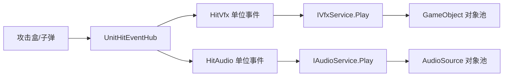

# 受击特效与音效最小系统设计

## 1. 当前目标

当前核心目标仍然是快速验证 ARPG 3C 的命中反馈，而不是建设完整的游戏级 VFX/Audio 中间件。

本阶段只实现：

1. 一个最小特效播放服务。
2. 一个最小音效播放服务。
3. SkillEditor 中两个可热插拔反馈单位事件。
4. `OnHit` 时在命中位置播放特效和音效。
5. 最基本的对象池。

暂不实现：

- ScriptableObject Definition 或 Catalog。
- 稳定逻辑资源 ID。
- Addressables 抽象。
- VFX/Audio Handle。
- Version 防复用机制。
- 全局 VFX 预算和 LOD。
- 音效并发组、冷却、抢占和 ShuffleBag。
- 音乐、对白和复杂声学系统。
- VFX Graph 的通用适配层。
- 独立的特效、音效资源编辑窗口。

原则是：

> 先以最少代码完成受击 VFX/SFX 的完整验证链路；只有真实需求出现后，再扩展通用系统。

---

## 2. 对前一版疑问的直接回答

### 2.1 为什么前一版有 ID 和 Version

前一版 `InstanceId + Version` 是为了防止池对象复用后，旧句柄误操作新实例。

例如：

1. 第一次播放得到实例 10。
2. 实例 10 播放完成并回到池中。
3. 第二次播放重新借出实例 10。
4. 旧调用方此时执行 `Stop(10)`，会错误停止第二次播放。
5. Version 可以区分“同一池对象的不同借用轮次”。

这个问题只在“调用方长期保存句柄并稍后停止实例”时重要。当前命中特效和音效都是短时 OneShot，不需要调用方持有实例，所以本阶段不需要 ID、Version 或 Handle。

### 2.2 Handle 是什么

Handle 只是服务返回给调用方的播放凭证，常用于：

- 停止循环音效。
- 提前结束持续特效。
- 修改正在播放实例的参数。
- 查询是否仍在播放。

当前需求是命中火花和命中 OneShot，播放后让服务自动回收即可。因此本阶段接口不返回 Handle。

### 2.3 为什么不需要 ScriptableObject

ScriptableObject 适合复用一套逻辑资源配置，但当前会增加额外资产和编辑成本。

本阶段直接在 SkillEditor 单位事件中配置：

- VFX Prefab。
- AudioClip。
- AudioMixerGroup。
- 播放位置、跟随、音量等参数。

SkillEditor 当前 Config 需要输出 JSON 和运行时数据，因此 Unity 对象不能直接可靠地写入 JSON。编辑器中的 ObjectField 负责选择资源，Config 实际保存对应的 Unity Asset Path。对用户而言仍然是“把资源直接拖进事件面板”，不需要手写路径，也不需要创建额外 Definition 资产。

---

## 3. 最小架构

仍保留两层，但每层都尽可能薄：



### SkillEditor 反馈事件负责

- `Immediate` 或 `OnHit` 触发。
- 监听 `UnitHitEventHub`。
- 保存用户在事件面板中配置的资源和参数。
- 根据命中结果确定位置、旋转和跟随目标。
- 调用通用服务。

### VFX/Audio 服务负责

- 接收播放参数。
- 从池中获取实例。
- 播放。
- 播放完成后自动回收。
- 提供最小 `Stop` 能力供未来普通持续事件使用。

### 攻击盒负责

- 检测、目标去重和结算。
- 提供尽可能可靠的命中空间数据。
- 发布 `UnitHitEvent`。
- 不直接保存或播放 VFX/SFX。

---

## 4. 最小 VFX 系统

## 4.1 VFX 服务接口

```csharp
public interface IVfxService
{
    void Play(in VfxPlayArgs args);
    void Stop(GameObject prefab, Transform followTarget = null);
    void StopAll();
}
```

`Play` 是当前反馈系统实际使用的接口。

`Stop` 和 `StopAll` 只提供基本能力：

- 命中 OneShot 不主动调用 `Stop`。
- 后续若增加持续跟随特效，可以按 Prefab 和 FollowTarget 停止。
- 当前不保证多个完全相同实例能被精确逐个停止。

这正是最小方案的边界。若以后确实出现“精确控制某个持续实例”的需求，再增加 Handle。

## 4.2 VFX 播放参数

```csharp
public enum VfxPlaySpace
{
    World = 0,
    FollowTarget = 1,
}

public readonly struct VfxPlayArgs
{
    public readonly GameObject Prefab;
    public readonly VfxPlaySpace Space;

    public readonly Vector3 Position;
    public readonly Quaternion Rotation;
    public readonly Vector3 Scale;

    public readonly Transform FollowTarget;
    public readonly Vector3 LocalPosition;
    public readonly Quaternion LocalRotation;

    public readonly float Lifetime;
    public readonly bool UseUnscaledTime;
}
```

### World

- 在命中位置创建效果。
- 播放后不跟随受击者。
- 适合火花、血花、刀痕冲击等瞬时反馈。

### FollowTarget

- 将实例挂到受击者或指定挂点。
- 使用本地位置和旋转偏移。
- 适合短时附着效果。

## 4.3 VFX Prefab 约定

首版只要求：

- Prefab 根节点或子节点包含至少一个 `ParticleSystem`。
- 服务自动查找全部子 ParticleSystem。
- 不要求添加额外包装组件。
- 不支持必须由自定义代码驱动的复杂特效。

## 4.4 VFX 对象池

按 Prefab 建池：

```csharp
Dictionary<GameObject, ObjectPool<PooledVfx>> _pools;
```

内部实例：

```csharp
public sealed class PooledVfx : MonoBehaviour
{
    public GameObject SourcePrefab;
    public ParticleSystem[] Particles;
    public Transform FollowTarget;
    public float Lifetime;
    public float ElapsedTime;
    public bool UseUnscaledTime;
}
```

获取时：

1. 从 Prefab 对应池获取实例，没有池时创建。
2. 重置父节点和 Transform。
3. 清理上一轮粒子。
4. 应用世界或跟随参数。
5. 播放全部 ParticleSystem。
6. 将实例加入活动列表。

回收时：

1. 停止并清空全部 ParticleSystem。
2. 清除 FollowTarget。
3. 恢复缩放。
4. 禁用并归还池。

## 4.5 VFX 生命周期

首版由事件参数明确配置 `Lifetime`，不分析每个 ParticleSystem 的完整模块时长。

原因：

- 实现简单、行为明确。
- 可快速验证反馈。
- 避免复杂粒子系统的自动时长推导错误。

`UseUnscaledTime = true` 时，服务使用 `Time.unscaledDeltaTime` 计时。命中特效默认开启，保证 HitStop 时仍然播放和回收。

如果 `FollowTarget` 在播放期间销毁：

- 实例保留最后世界位置。
- 解除父子关系。
- 按原生命周期自然回收。

---

## 5. 最小 Audio 系统

## 5.1 Audio 服务接口

```csharp
public interface IAudioService
{
    void Play(in AudioPlayArgs args);
    void Stop(AudioClip clip, Transform followTarget = null);
    void StopAll();
}
```

和 VFX 一样，本阶段主要使用 `Play`。命中 OneShot 自动播放并回收，不需要 Handle。

## 5.2 Audio 播放参数

```csharp
public enum AudioPlaySpace
{
    TwoD = 0,
    World = 1,
    FollowTarget = 2,
}

public readonly struct AudioPlayArgs
{
    public readonly AudioClip Clip;
    public readonly AudioMixerGroup MixerGroup;
    public readonly AudioPlaySpace Space;

    public readonly Vector3 Position;
    public readonly Transform FollowTarget;

    public readonly float Volume;
    public readonly float Pitch;
    public readonly float SpatialBlend;
    public readonly float MinDistance;
    public readonly float MaxDistance;
    public readonly bool Loop;
}
```

首版反馈事件默认：

- `Space = World`。
- 在命中点播放。
- `SpatialBlend = 1`。
- `Loop = false`。

`TwoD` 可用于重要的玩家确认音，但不是首个测试重点。

## 5.3 AudioSource 对象池

服务维护统一的 AudioSource 池：

```csharp
ObjectPool<PooledAudioSource> _pool;
List<PooledAudioSource> _activeSources;
```

```csharp
public sealed class PooledAudioSource : MonoBehaviour
{
    public AudioSource Source;
    public Transform FollowTarget;
}
```

获取时完整设置：

- `clip`
- `outputAudioMixerGroup`
- `volume`
- `pitch`
- `spatialBlend`
- `minDistance`
- `maxDistance`
- `loop`
- 世界位置或跟随目标

回收时：

- 停止播放。
- 清空 Clip、MixerGroup 和 FollowTarget。
- 恢复默认音量、Pitch、空间参数和 Loop。
- 禁用并归还池。

禁止使用 `AudioSource.PlayClipAtPoint`，因为它会创建临时对象，无法使用我们的池。

## 5.4 Audio 自动回收

非循环声音在以下条件回收：

```csharp
!audioSource.isPlaying
```

循环声音不会自动回收，需要调用 `Stop` 或 `StopAll`。当前 `HitAudio` 编辑器应强制 `Loop = false`，避免产生无人停止的循环音效。

首版不实现：

- 多 Clip 随机。
- 并发组。
- 同音效冷却。
- Voice 抢占。
- 淡入淡出。

同帧多目标重复播放问题先由 `HitAudio` 事件的 `MergeSameFrameHits` 解决。

---

## 6. 服务创建与注入

VFX 和 Audio 是场景级服务，不给每个 NPC 创建一套池。

```csharp
public sealed class GameFeedbackServiceHost : MonoBehaviour
{
    public VfxService VfxService;
    public AudioService AudioService;
}
```

Host 的职责仅是持有和提供两个服务。

`SkillContext` 墠加：

```csharp
public IVfxService VfxService;
public IAudioService AudioService;
```

装配方式：

- 正式场景可手工放置一个 Host。
- SkillEditor 预览场景若找不到 Host，则自动创建运行时 Host。
- `SkillPlayerController` 或预览装配器将接口注入 `SkillContext`。
- 单位事件不自行 `FindObjectOfType`。
- 服务缺失时只跳过反馈并发布 Trace，不影响命中结算。

当前为了快速验证，可以先让 Host 提供一个静态 `Instance` 作为装配入口；但 VFX/Audio 事件仍只访问 Context 中的接口，不直接依赖静态对象。

---

## 7. 命中空间数据

当前 `UnitHitEvent` 已有：

```csharp
public readonly Vector3 HitPoint;
public readonly Vector3 HitDirection;
public readonly bool HasHitPoint;
```

快速验证阶段先不扩展 Collider 和完整命中部位协议，只补充特效朝向真正需要的法线：

```csharp
public readonly struct UnitHitEvent
{
    // 已有字段省略
    public readonly Vector3 HitNormal;
    public readonly bool HasHitNormal;
}
```

`GameUnitTargetInfo` 同步增加：

```csharp
public readonly Vector3 HitNormal;
public readonly bool HasHitNormal;
```

### 数据来源

- Raycast 命中：使用 `RaycastHit.point` 和 `RaycastHit.normal`。
- Overlap 命中：使用 `Collider.ClosestPoint` 获得命中点。
- Overlap 无真实法线：`HasHitNormal = false`。
- 特效需要法线但无有效法线时：使用 `-HitDirection`。
- 再无有效方向时：使用 `Vector3.up`。

不在本阶段加入 `HitCollider`、受击骨骼或材质类型。它们不是验证命中 VFX/SFX 的必要条件。

---

## 8. HitVfx 单位事件

## 8.1 Timeline Event 类型

继续使用显式枚举值：

```csharp
public enum TimelineEventType
{
    // 已有值省略
    HitStop = 7,
    CameraShake = 8,
    HitVfx = 9,
    HitAudio = 10,
}
```

## 8.2 VFX 旋转模式

```csharp
public enum HitVfxRotationMode
{
    Identity = 0,
    HitNormal = 1,
    OppositeHitDirection = 2,
    AttackerForward = 3,
    DefenderForward = 4,
}
```

## 8.3 HitVfx 参数

```csharp
[Serializable]
public sealed class HitVfxEventArgs
{
    public FeedbackTriggerMode TriggerMode = FeedbackTriggerMode.OnHit;

    // Inspector 中使用 ObjectField 选择 Prefab，实际序列化保存 Asset Path。
    public string PrefabPath = string.Empty;

    public VfxPlaySpace Space = VfxPlaySpace.World;
    public HitVfxRotationMode RotationMode = HitVfxRotationMode.HitNormal;
    public SkillVector3 PositionOffset = Vector3.zero;
    public SkillVector3 RotationOffset = Vector3.zero;
    public SkillVector3 Scale = Vector3.one;

    public float Lifetime = 1f;
    public bool UseUnscaledTime = true;

    public bool TriggerOncePerEvent = true;
    public bool MergeSameFrameHits = true;
}
```

### 首版目标规则

为了减少配置复杂度，首版固定语义：

- `World`：生成在 `HitPoint`。
- `FollowTarget`：跟随受击者根节点。
- 如果没有有效受击者，退化为 World。
- 如果没有有效 HitPoint，使用受击者位置。
- `Immediate` 使用施法者位置。

首版不提供任意挂点名。受击根节点已经足够验证“世界空间”和“跟随受击者”两种需求。确认需要后再增加挂点选择。

### 朝向

```csharp
Vector3 forward = rotationMode switch
{
    HitVfxRotationMode.HitNormal when hit.HasHitNormal => hit.HitNormal,
    HitVfxRotationMode.HitNormal => -hit.HitDirection,
    HitVfxRotationMode.OppositeHitDirection => -hit.HitDirection,
    HitVfxRotationMode.AttackerForward => hit.Attacker.transform.forward,
    HitVfxRotationMode.DefenderForward => hit.Defender.transform.forward,
    _ => Vector3.forward,
};
```

最终旋转：

$$
R_{final}=R_{look}\times R_{offset}
$$

## 8.4 Data

```csharp
[TimelineEventData(TimelineEventType.HitVfx)]
public sealed class HitVfx_TimelineEventData : TimelineEventData
{
    public HitVfxEventArgs Args = new HitVfxEventArgs();
    public bool SupportsDuration => true;
    public float DefaultDuration => 0.3f;
}
```

时间线 `Duration` 仍然是 `OnHit` 监听窗口，`Args.Lifetime` 才是特效实际存在时长。

---

## 9. HitAudio 单位事件

## 9.1 HitAudio 参数

```csharp
[Serializable]
public sealed class HitAudioEventArgs
{
    public FeedbackTriggerMode TriggerMode = FeedbackTriggerMode.OnHit;

    // Inspector 中使用 ObjectField 选择 AudioClip，实际保存 Asset Path。
    public string AudioClipPath = string.Empty;

    // MixerGroup 是 Mixer 资产中的子资源，需要同时保存 Mixer 路径和 Group 名称。
    public string AudioMixerPath = string.Empty;
    public string MixerGroupName = string.Empty;

    public AudioPlaySpace Space = AudioPlaySpace.World;
    public float Volume = 1f;
    public float Pitch = 1f;
    public float SpatialBlend = 1f;
    public float MinDistance = 1f;
    public float MaxDistance = 30f;

    public bool TriggerOncePerEvent = true;
    public bool MergeSameFrameHits = true;
}
```

首版不支持 Loop，因为命中音效必须是 OneShot。

### 位置规则

- `TwoD`：忽略位置和目标。
- `World`：在 `HitPoint` 播放；没有命中点时使用受击者位置。
- `FollowTarget`：AudioSource 跟随受击者根节点。
- `Immediate`：使用施法者位置或施法者 Transform。

## 9.2 Data

```csharp
[TimelineEventData(TimelineEventType.HitAudio)]
public sealed class HitAudio_TimelineEventData : TimelineEventData
{
    public HitAudioEventArgs Args = new HitAudioEventArgs();
    public bool SupportsDuration => true;
    public float DefaultDuration => 0.3f;
}
```

AudioClip 自身时长决定实际播放时长。Timeline `Duration` 只表示 OnHit 监听窗口。

---

## 10. Runtime 生命周期

两个 Runtime 都复制 HitStop 和 CameraShake 已验证的生命周期模式。

### OnBegin

- 重置 `_hasTriggered` 和 `_lastMergedFrame`。
- `Immediate`：立即提交一次播放请求。
- `OnHit`：订阅 `UnitHitEventHub.HitConfirmed`。

### OnHitConfirmed

- 忽略 `Resolution.IsValid = false` 的消息。
- 检查 `TriggerOncePerEvent`。
- 检查 `MergeSameFrameHits`。
- 解析位置、旋转或跟随目标。
- 从资源路径加载 Prefab、AudioClip 或 MixerGroup。
- 调用 `IVfxService.Play` 或 `IAudioService.Play`。

### OnEnd / Dispose

- 取消订阅。
- 不停止已经播放的 OneShot。

单位事件被打断只结束监听窗口，不应让已经出现的火花或声音瞬间消失。

---

## 11. 资源选择和加载

用户操作形式：

1. 在 HitVfx 面板把 VFX Prefab 拖入 ObjectField。
2. 编辑器调用 `AssetDatabase.GetAssetPath` 写入 `PrefabPath`。
3. 在 HitAudio 面板把 AudioClip 和 AudioMixerGroup 拖入 ObjectField。
4. 编辑器保存对应资源路径或可解析引用。
5. 用户不接触字符串路径，也不创建额外配置资产。

运行时不再为此额外设计 Resolver、Catalog 或 Loader 接口。只增加一个项目内部的简单资源加载工具，负责把编辑器保存的路径转换为运行时资源并缓存结果：

```csharp
public static class FeedbackAssetRuntimeCatalog
{
    public static GameObject LoadVfxPrefab(string assetPath);
    public static AudioClip LoadAudioClip(string assetPath);
    public static AudioMixerGroup LoadMixerGroup(
        string audioMixerPath,
        string mixerGroupName);
}
```

首版沿用项目已有运行时资源加载方式实现。资源必须位于当前构建可加载的资源范围内；编辑器在拖入不可运行时加载的资产时显示警告。单位事件只调用这个简单 Catalog，不自行散落 `Resources.Load`。

为避免每次命中重复解析，Loader 或 Runtime Catalog 使用简单缓存：

```csharp
Dictionary<string, GameObject> _vfxPrefabCache;
Dictionary<string, AudioClip> _audioClipCache;
Dictionary<string, AudioMixerGroup> _mixerGroupCache; // key = MixerPath + GroupName
```

这不是额外配置文件，只是运行时缓存。

---

## 12. SkillEditor 参数面板

## 12.1 HitVfx

显示：

- 触发模式。
- VFX Prefab ObjectField。
- 播放空间：World / FollowTarget。
- 旋转模式。
- 位置偏移。
- 旋转偏移。
- 缩放。
- 特效生命周期。
- 使用非缩放时间。
- 单事件仅触发一次。
- 合并同帧多目标。

校验：

- Prefab 为空时警告。
- Prefab 不含 ParticleSystem 时警告。
- Lifetime 小于等于零时警告。
- `OnHit + Timeline Duration = 0` 时警告。

## 12.2 HitAudio

显示：

- 触发模式。
- AudioClip ObjectField。
- AudioMixerGroup ObjectField。
- 播放空间：2D / World / FollowTarget。
- 音量。
- Pitch。
- Spatial Blend。
- Min Distance。
- Max Distance。
- 单事件仅触发一次。
- 合并同帧多目标。

校验：

- AudioClip 为空时警告。
- 音量和距离范围非法时修正或警告。
- `OnHit + Timeline Duration = 0` 时警告。

首版不实现独立资源管理窗口，也不实现 Scene 中拾取偏移。

---

## 13. 预览范围

为了快速验证，首版只要求 Play Mode 预览场景可播放：

- 状态时间线运行时能生成特效。
- Main Camera 能听到音效。
- 自动创建或解析 `GameFeedbackServiceHost`。

暂不实现：

- Edit Mode 粒子 Scrub。
- Edit Mode Audio Scrub。
- Scene 视图摆放并反向读取偏移。
- 独立资源试听窗口。

这些不会阻塞 3C 命中反馈验证。

---

## 14. 同帧多目标和重复触发

首版不在通用服务中实现复杂并发系统。

由单位事件处理：

- `TriggerOncePerEvent = true`：监听窗口内只播放一次。
- `MergeSameFrameHits = true`：同一帧命中多个单位只播放一次。

因此常规单段攻击推荐：

```text
TriggerOncePerEvent = true
MergeSameFrameHits = true
```

持续多段攻击推荐：

```text
TriggerOncePerEvent = false
MergeSameFrameHits = true
```

如果以后实际测试发现高频音效仍然过密，再向 `AudioService` 增加最小冷却；当前不提前实现。

---

## 15. Trace 与容错

建议 Trace：

- `HitVfx.Subscribed`
- `HitVfx.Triggered`
- `HitVfx.ResourceMissing`
- `VfxService.Played`
- `VfxService.Recycled`
- `HitAudio.Subscribed`
- `HitAudio.Triggered`
- `HitAudio.ResourceMissing`
- `AudioService.Played`
- `AudioService.Recycled`

容错规则：

- 服务缺失：跳过反馈。
- 资源为空或加载失败：跳过并 Trace。
- Prefab 无 ParticleSystem：跳过或播放空实例后立即回收，推荐直接拒绝。
- 受击者销毁：世界效果自然完成，跟随效果解除父子关系后完成。
- 单位事件异常不得中断命中结算。
- 场景卸载时 `StopAll` 并清空池。

---

## 16. 开发顺序

### 第一阶段：命中法线

1. 给 `GameUnitTargetInfo` 增加 `HitNormal/HasHitNormal`。
2. 给 `UnitHitEvent` 增加同名字段。
3. Raycast 传递真实法线。
4. Overlap 只提供命中点，法线走方向兜底。
5. 验证 HitStop 和 CameraShake 不受影响。

### 第二阶段：VFX 最小服务

1. 定义 `VfxPlaySpace` 和 `VfxPlayArgs`。
2. 实现 `IVfxService`。
3. 实现按 Prefab 分组的 ParticleSystem 对象池。
4. 实现世界空间、跟随、生命周期和自动回收。
5. 在预览场景自动装配服务。

### 第三阶段：Audio 最小服务

1. 定义 `AudioPlaySpace` 和 `AudioPlayArgs`。
2. 实现 `IAudioService`。
3. 实现 AudioSource 池。
4. 实现 2D、世界位置、跟随和自动回收。
5. 支持 AudioMixerGroup。

### 第四阶段：反馈单位事件

1. 新增 `HitVfx = 9` 和 `HitAudio = 10`。
2. 实现 Args、Data、Runtime。
3. 注入 VFX/Audio 服务，并接通简单资源缓存。
4. 增加两个 Inspector 面板。
5. 实现 ObjectField 拖拽资源并保存路径。

### 第五阶段：快速验证

- 挥空无 VFX/SFX。
- 单目标命中正常播放。
- 世界空间特效留在命中点。
- FollowTarget 特效和声音跟随受击者。
- HitStop 完全冻结时 VFX/SFX 继续播放。
- 同帧多目标只播放一次。
- 连续攻击可反复从池获取和回收。
- 状态被打断后不再监听，但已播放 OneShot 自然完成。

---

## 17. 验收边界

本阶段完成的标志不是“具备完整商业化音频和特效系统”，而是：

1. 用户能在 SkillEditor 单位事件面板直接拖入 VFX Prefab 或 AudioClip。
2. 用户能配置 World/Follow、音量、MixerGroup 等必要参数。
3. 攻击有效命中时，特效和音效在正确位置播放。
4. 挥空不播放。
5. VFX 和 Audio 都通过池复用。
6. HitStop、CameraShake、HitVfx、HitAudio 可以独立组合。
7. 运行时没有每次命中创建和销毁临时播放对象。

以下需求出现前不实现：

| 真实需求 | 届时扩展 |
| --- | --- |
| 精确停止某个持续实例 | Handle + Instance Version |
| 多技能共享一套复杂反馈配置 | Definition 资源或 Preset |
| 大量资源需要异步加载 | Addressables Resolver |
| 高频音效拥挤 | 冷却、并发组和 Voice 抢占 |
| 多个随机 Clip | Clip List 和随机策略 |
| 大规模特效性能压力 | 全局预算、LOD 和距离裁剪 |
| 复杂持续特效 | 自定义播放适配器或 VFX Graph 支持 |

---

## 18. 最终决策

当前正式方案是：

> SkillEditor 单位事件直接选择 VFX Prefab、AudioClip 和 MixerGroup；配置实际保存在事件自身。VFX/Audio 服务只接收播放参数，负责池化、播放、停止和回收。

保持的架构边界只有三条：

1. 攻击盒不直接播放反馈。
2. 单位事件负责触发和参数转换。
3. 通用服务负责实例与 AudioSource 生命周期。

除此之外不提前增加资源 Definition、Catalog、Handle、Version、并发系统或复杂预览。先完成最小闭环并验证手感，再根据真实问题扩展。
