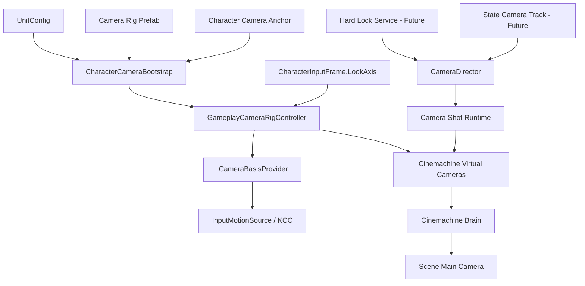

# 高级 3C 相机系统设计

## 1. 文档目标

本文定义 ActionEditor 的正式相机架构，以及当前第一阶段需要落地的第三人称自由跟随相机。

目标不是制作一个临时演示脚本，而是先建立可持续扩展的相机底座，并在本阶段只启用最小功能：

- Unit 配置第三人称相机预制体。
- Unit Apply 时，玩家预制体与相机预制体一起创建到当前场景。
- 相机绑定玩家的相机挂点。
- 使用 Cinemachine 2.10.6 实现第三人称跟随、自由环绕、俯仰限制和基础碰撞。
- 向移动系统提供稳定的相机平面坐标系。
- 为未来硬锁定、软锁定、状态相机轨、必杀技镜头、震屏和 FOV 效果预留正式扩展点。

本阶段不实现：

- 硬锁定与目标切换。
- 软锁定改造。
- 八方向 Locomotion。
- 状态相机轨及必杀技镜头。
- 镜头震动、动态 FOV、遮挡透明、自动回正等高级效果。

这些能力不在本阶段启用，但不得通过破坏架构的方式临时实现基础相机。

---

## 2. 当前项目事实与约束

### 2.1 技术版本

- Unity：2022.3。
- Cinemachine：2.10.6。
- 当前输入系统已经产生 `CharacterInputFrame.LookAxis`。
- PC Look 输入目前来自 `Mouse X / Mouse Y`。
- Unit 已有 `CameraResourcePath` 字段，但当前只是字符串，尚未参与 Apply 和运行时生成。
- Unit Apply 当前只创建角色，不创建相机。
- 角色已有挂点体系；旧参考工程使用 `CharacterConfig.HelpPointDic / Cam_Main`。
- 当前正式移动系统由 KCC 执行，后续需要使用相机平面方向解释移动输入。

### 2.2 参考工程可保留的思想

旧 `CameraControl`、`PlayerCamera` 的以下思想可以保留：

- 相机作为独立预制体资源配置给角色。
- 角色通过相机挂点提供跟随基准。
- 默认 Gameplay 相机和技能临时相机可以切换。
- 相机控制器统一初始化 Follow/LookAt，而不是让每个事件直接查找 Cinemachine 组件。

以下实现不直接沿用：

- 不让相机系统依赖旧 `ActionStateMachine`。
- 不用数组下标作为长期相机身份。
- 不通过反复 `SetActive(false/true)` 完成所有切换。
- 不用“保存上一个相机然后手工恢复”的方式处理技能镜头。
- 不直接使用全局单例读取 Player 和输入。
- 不让 Timeline Event 直接操作 `CinemachineVirtualCamera`。

---

## 3. 总体架构

相机系统分成六层：

1. **相机资源层**：Unit 引用的相机 Rig 预制体及镜头预设。
2. **角色绑定层**：由 `GameUnit.MountPoints` 提供 `Root/MainCamera` 枚举挂点和角色生命周期。
3. **输入层**：提供 Look Axis，不直接驱动 Cinemachine。
4. **Gameplay Rig 层**：维护 yaw、pitch、跟随位置和当前模式。
5. **导演/仲裁层**：决定当前由 Gameplay、HardLock、SkillShot 中哪一种镜头取得控制权。
6. **Cinemachine 表现层**：负责阻尼、碰撞、构图、镜头混合和最终 Camera 输出。



### 3.1 核心原则

#### 单一真实相机输出

场景只保留一个带 `Camera + AudioListener + CinemachineBrain` 的 Main Camera。

Unit 的相机预制体只包含：

- 相机 Rig 控制器。
- 一个或多个 Cinemachine Virtual Camera。
- 相机模式配置。

不要在每个角色相机预制体中再放真实 Camera 或 AudioListener，否则会产生多 Camera、多 AudioListener 和多人单位冲突。

#### 只有本地玩家拥有 Gameplay Camera

Unit 可以配置相机资源，但只有获得 Local Player Camera Authority 的单位才实例化并绑定它。敌人、NPC、远端玩家不得自动生成相机。

编辑器 Apply 当前可把“正在编辑的玩家 Unit”视为本地玩家，用于场景测试。

#### GameUnit 单一主相机挂点

`GameUnit.MountPoints` 使用自定义字符串挂点名，并直接拖入对应 Transform；新增挂点无需扩展枚举。相机系统约定玩家必须各配置一个唯一且非空的 `Root` 与 `MainCamera` 挂点。Default/Lock VCam 的 Follow/LookAt 初始均绑定 `MainCamera`；相机控制脚本维护该挂点的世界 yaw/pitch，使其不被角色转身强制带走。不创建额外代理 Pivot。

#### 移动只依赖相机坐标接口

移动系统不得直接访问 `Camera.main` 或某个 VCam。相机系统提供：

- 平面 Forward。
- 平面 Right。
- View Transform。
- View Center Ray。

移动、硬锁定目标评分和软锁定共享这份事实，避免各自重复计算。

---

## 4. 推荐运行时类型

以下是正式实现建议的职责边界。类型名可以在编码时按现有命名空间调整，但职责不应合并成一个巨型控制器。

### 4.1 `GameUnit.MountPoints`

角色相机绑定复用正式 `GameUnit` 挂点配置，不再增加独立相机挂点组件。当前角色挂点枚举：

- `Root`：角色根语义。
- `MainCamera`：第三人称相机 Follow/LookAt 基准。

挂点建议位于角色根节点上方约 `1.4～1.7m`，不要直接绑定 Humanoid Head 骨骼。绑定头骨会把呼吸、受击和动画抖动传入相机。

编辑器使用枚举下拉框配置，不允许手写角色挂点名。Apply 时要求 `Root/MainCamera` 各存在一个唯一的有效 Transform。

### 4.2 `CharacterCameraBootstrap`

负责相机的创建、绑定和释放，不负责每帧旋转。

职责：

- 从当前 Unit 读取 `CameraResourcePath`。
- 验证当前 Unit 是否拥有本地相机权限。
- 加载并实例化相机 Rig 预制体。
- 解析角色相机挂点。
- 绑定输入源和角色目标。
- 注册/注销 `ICameraBasisProvider`。
- 角色销毁、换人或退出 Play Mode 时释放相机。

### 4.3 `GameplayCameraRigController`

第一阶段的主要运行时组件。

职责：

- 消费 `CharacterInputDriver.CurrentFrame.LookAxis`。
- 累积 yaw/pitch。
- 限制 pitch。
- 在 LateUpdate 中把最终世界 yaw/pitch 写入 `GameUnit.MainCamera` 挂点。
- 暴露平面 Forward/Right。
- 处理输入启用、灵敏度和反转选项。
- 接受未来 Camera Mode，而不直接管理技能时间轴。

推荐层级：

```text
玩家预制体
└── CameraAnchor           // 在 GameUnit 中配置为 MainCamera

PlayerCamera               // 挂 GameplayCameraRigController
├── Default
│   └── camera1            // 默认 CinemachineVirtualCamera
└── Lock
    └── camera1            // 锁定 CinemachineVirtualCamera
```

控制器严格按固定直接子层级解析两台 VCam。构建后 Default 与 Lock 的 Follow/LookAt 都先绑定 `GameUnit.MainCamera`；当前启用 Default/camera1、禁用 Lock/camera1。后续进入硬锁定时由 CameraDirector 接管 Lock/camera1 的 LookAt 和镜头所有权。

控制器内部保存 yaw/pitch 数值。角色转身后，控制器在 LateUpdate 重新写入 `MainCamera` 挂点的世界旋转，因此自由镜头方向与角色朝向解耦。

### 4.4 `ICameraBasisProvider`

提供移动与目标选择需要的只读视角事实：

```text
Transform ViewTransform
Vector3 PlanarForward
Vector3 PlanarRight
Ray ViewCenterRay
bool IsAvailable
```

`PlanarForward` 必须投影到角色 Up 平面并归一化。俯视或仰视时，移动不能带 Y 分量。

### 4.5 `CameraDirector`

正式架构中的相机仲裁器。第一阶段建立接口和默认 Gameplay 所有权即可，不必实现全部模式。

建议优先级：

```text
Gameplay Follow < Hard Lock < Skill Shot < Cutscene/Debug Override
```

导演接受带生命周期的请求，而不是暴露 `ChangeCam(index)`：

```text
CameraRequestHandle Acquire(request)
void Update(handle, request)
void Release(handle, blendOut)
```

请求结束、状态被打断、施法者死亡时，释放句柄后自动重新选择下一高优先级镜头。这样必杀技结束恢复 Gameplay 相机不需要保存“上一个相机”。

### 4.6 `CameraShotDefinition`

未来相机轨引用的镜头定义。它描述“想要什么镜头”，不保存运行时对象。

建议内容：

- 镜头资源或 Shot Id。
- Follow 目标语义：Caster、Target、Mount Point、World Point。
- LookAt 目标语义。
- Lens/FOV。
- Blend In/Out。
- 优先级。
- 是否允许玩家 Look 输入。
- 中断时恢复策略。
- 可选屏幕构图偏移。

---

## 5. Cinemachine 基础相机选型

项目使用 Cinemachine 2.10.6。结合现有参考原型和简洁配置要求，第一阶段推荐：

> `CinemachineVirtualCamera + Body: Transposer + Aim: Composer + CinemachineCollider`

### 5.1 为什么选择 `Transposer + Composer`

- 只需要 `GameUnit.MainCamera` 挂点和配置好的 VCam，不需要代理 Transform 层级。
- `Transposer` 使用挂点旋转和 Follow Offset 决定机位；脚本只维护挂点世界 yaw/pitch。
- `Composer` 始终把挂点保持在期望屏幕区域，并提供成熟的构图参数。
- 增加 `CinemachineCollider` 后即可处理镜头穿墙。
- 后续特殊机位仍然是新增 VCam，由 Cinemachine Brain 混合，不改变基础挂点方案。
- 与参考工程的核心思路一致，但输入来自正式 `CharacterInputDriver`，切换由未来 `CameraDirector` 仲裁。

### 5.2 为什么不首选 `Framing Transposer`

`Framing Transposer` 更偏向屏幕空间构图、横版、俯视或群组目标。它会根据目标在画面中的位置主动调整相机距离与位置，不适合作为高速 ARPG 的基础自由环绕 Body。

未来硬锁定的双目标构图可以使用 Target Group + Group Composer/Framing Transposer 的专用 VCam，但不应作为自由相机底座。

### 5.3 `3rd Person Follow` 的定位

`3rd Person Follow` 适合强肩后视角、射击瞄准和左右肩切换，并自带第三人称碰撞。它的原理同样是读取 Follow Target 的位置与旋转，再按 Shoulder Offset、Vertical Arm 和 Camera Distance 求出相机位置。

它本身不要求三层 Pivot；此前的代理层级只是为了隔离角色旋转，不是 Cinemachine 的硬性要求。当前项目可直接让脚本维护 `GameUnit.MainCamera` 挂点的世界旋转。但就现阶段 ARPG 自由相机而言，`Transposer + Composer` 更简洁，也更接近已有可工作的参考方案，因此作为第一选择。

### 5.4 `Framing Transposer + POV` 的定位

该组合可以完全依赖 Cinemachine 的 Legacy Input Axis 工作，配置成本最低，但不作为正式首选：

- `POV` 默认直接读取 Input Manager，绕过项目已经统一的 `CharacterInputFrame.LookAxis`。
- 鼠标、手柄、输入禁用、UI 抢占和未来锁定模式会分散在 Cinemachine Axis 与项目输入系统两处。
- `Framing Transposer` 偏屏幕空间追踪，会主动调整位置维持构图；高速 ARPG 自由环绕时通常不如固定 Follow Offset 可预测。
- 仍需额外 Collider 扩展处理遮挡。

它适合快速配置或纯 Cinemachine 项目；本项目只需一个很薄的挂点旋转脚本，就能换取统一输入和清晰的后续扩展边界。

---

## 6. 推荐手工配置

以下参数是起点，不是最终手感标准。用户手工创建预制体，代码只校验和绑定。

### 6.1 Main Camera

场景 Main Camera：

- `Camera`
- `AudioListener`
- `CinemachineBrain`
- Brain Update Method：`Smart Update`
- Blend Update Method：`Late Update`
- Default Blend：`Ease In Out`
- Default Blend Time：`0.2s`

### 6.2 Gameplay Virtual Camera

`PlayerCamera/Default/camera1`：

- Priority：`10`
- Lens FOV：`55～60`，建议从 `58` 开始
- Near Clip Plane：`0.1`
- Body：`Transposer`
- Aim：`Composer`
- Follow：由构建代码绑定到 `GameUnit.MainCamera`
- LookAt：由构建代码绑定到 `GameUnit.MainCamera`
- Extension：`CinemachineCollider`

`Transposer` 建议初值：

- Binding Mode：`Lock To Target No Roll`（需要挂点的 yaw/pitch 都参与机位计算，同时剔除 Roll）
- Follow Offset：`(0.5, 0.4, -4.5)` 左右
- X/Y/Z Damping：`0.1～0.25`

`Composer` 建议初值：

- Tracked Object Offset：`0`
- Screen X：`0.5`
- Screen Y：`0.5～0.55`
- Dead Zone：先保持较小
- Soft Zone：使用默认值起调

`CinemachineCollider` 建议初值：

- Camera Radius：`0.15～0.25`
- Collision Filter：只包含环境碰撞层，不包含角色、HitBox、Trigger
- Strategy：`Pull Camera Forward`
- Damping：接近 `0`
- Damping When Occluded：`0.15～0.35`

碰撞时应快速靠近，离开障碍后略平滑恢复，避免穿墙和镜头弹簧感。

### 6.3 Rig Controller 建议初值

- Mouse Yaw Sensitivity：`2.0～4.0`
- Mouse Pitch Sensitivity：`1.5～3.0`
- Pitch Min：`-35°`
- Pitch Max：`70°`
- Invert Y：按用户设置
- Follow Position Sharpness：第一阶段可直接跟随；若平滑，使用帧率无关指数阻尼

鼠标输入通常视为每帧 delta，不再额外乘 `deltaTime`；手柄摇杆属于速率输入，应乘 `deltaTime`。输入层未来需要提供设备类型，避免两者共用错误单位。

---

## 7. Unit 配置与 Apply 流程

### 7.1 Unit 数据

保留 `UnitConfig.CameraResourcePath`，但编辑器 UI 应改为 Camera Prefab 的 `ObjectField`，避免手写路径。

第一阶段该字段指向相机 Rig Prefab 的工程资源路径。正式 Build 时再由资源目录转换为 Addressable/Resources Key，不应让运行时依赖 `AssetDatabase`。

### 7.2 Apply 校验

点击 Apply Unit 时执行：

1. 校验玩家 Prefab。
2. 校验 Camera Prefab 路径存在。
3. 校验 Camera Prefab 包含 `GameplayCameraRigController`。
4. 校验包含一个默认 Gameplay VCam。
5. 校验玩家 `GameUnit` 的 `Root/MainCamera` 枚举挂点各有一个唯一有效引用。
6. 校验 Camera Prefab 根节点下存在 `Default/camera1` 与 `Lock/camera1`。
7. 删除旧的 SkillEditor Preview Unit。
8. 删除旧的 SkillEditor Preview Camera Rig。
9. 实例化玩家到场景。
10. 实例化 Camera Rig 到场景根节点。
11. 将 Default/Lock camera1 的 Follow/LookAt 绑定到 `GameUnit.MainCamera`，并连接输入驱动。
12. 选中玩家或相机并标记场景 Dirty。

Apply 创建的两个对象建议使用稳定标记名：

```text
__SkillEditorPreviewUnit__
__SkillEditorPreviewCamera__
```

不能按类型删除场景里所有 VCam，以免破坏关卡原有镜头。

### 7.3 运行时生成

编辑器 Apply 和正式运行时生成应共享“绑定规则”，但不共享 `AssetDatabase` 加载代码：

- Editor Loader：按 Asset Path 加载。
- Runtime Loader：按资源 Key/Addressable 加载。
- Binder：接收已经实例化的 Unit 和 Camera Rig，执行相同绑定。

---

## 8. 相机与移动系统

当前自由移动最终应使用相机平面基向量：

```text
worldMove = cameraPlanarRight * input.x
          + cameraPlanarForward * input.y
```

然后再由 KCC 处理速度和朝向。

规则：

- 相机接近垂直俯视时，平面 Forward 不能退化为零；应使用控制器保存的 yaw 平面方向或保留上一次有效方向。
- Camera Rig 未就绪时，使用角色 forward/right 的明确回退。
- 输入坐标转换只做一次。
- 动画系统不再读取原始输入，而读取最终世界移动方向转换后的角色局部方向。

第一阶段接入相机后需要回归测试：

- 前后左右移动是否相对镜头。
- 相机旋转时角色移动方向是否连续。
- 跳跃空中移动是否仍相对镜头。
- Root Motion + MoveDirection 是否仍正确重定向。
- 碰墙和斜坡是否不受相机俯仰影响。

---

## 9. Camera Only 硬锁定

硬锁定是持久 Gameplay Camera Mode，不是 Timeline Event。第一版只有 `CameraOnly`：系统绝不访问或修改角色控制器、角色旋转、Movement Policy 或状态机。

### 9.1 配置与目标声明

`UnitConfig.HardLock` 保存搜索半径、水平扇形总角度、锁定视点高度偏移、目标/障碍 Layer、距离/角度权重、遮挡解锁延迟、解锁半径和五个输入动作名。旧朝向模式字段只为 BinaryFormatter 反序列化兼容保留，不在编辑器展示，也不被运行时消费。

目标通过 `HardLockTarget` 声明，可配置 AimPoint、AimOffset、LockEnabled 和优先级。候选碰撞体必须位于 TargetLayers，并能向上解析到该组件和唯一 `GameUnit`。

### 9.2 搜索、切换与失效

`HardLockTargetingController` 读取 `CharacterInputDriver.CurrentFrame.IsActionDown`：

- 首次 Toggle 使用可扩容的 `OverlapSphereNonAlloc` 搜索，按 `GameUnit` 去重。
- 先检查目标层、水平镜头扇形和无遮挡，再按归一化距离与角度加权、叠加目标优先级选择最优目标。
- 再次 Toggle 立即解除。
- 左右切换使用输出 Camera 的 `WorldToViewportPoint`，选择当前目标对应方向上屏幕横向最近的合法目标。
- Farther/Nearer 按角色到目标距离选择相邻一级合法目标。
- 切换没有候选时保持当前目标；所有新候选都必须无遮挡。
- 当前目标禁用、销毁、超过 UnlockRadius 或连续遮挡超过配置延迟时解除。

### 9.3 相机所有权

锁定时继续使用当前 Gameplay VCam，避免 Default/Lock 的 Lens、Body、阻尼或 Follow Offset 差异造成明显的切镜与距离变化。系统在 `GameUnit.MainCamera` 的世界位置上叠加可配置高度偏移，生成临时锁定视点代理；Gameplay VCam 的 Follow/LookAt 都绑定该代理，代理的正方向始终由抬高后的玩家视点指向目标 AimPoint/AimOffset。这样既保持自由相机的第三人称距离与镜头参数，又能抬高锁定机位，减少玩家遮挡目标。

锁定目标不直接作为 Cinemachine LookAt，避免 `CinemachineCollider` 将玩家自身识别为目标视线中的障碍并把镜头推近敌人。切换目标只更新视点代理的朝向，不重启相机模式。

锁定期间自由相机不消费 Look，也不把旧 yaw/pitch 写回挂点；`ICameraBasisProvider` 从实际输出 Camera 的平面 forward 提供移动基向量。解除时先从实际输出 Camera 同步 yaw/pitch，再恢复 Default VCam，避免自由镜头跳变。

每次 `GameplayCameraRigController.Bind` 都会在运行时对象上发现或自动添加目标控制器，并从当前 `GameUnit.UnitId` 加载 `UnitConfig.HardLock`，不要求修改角色或相机 Prefab。

---

## 10. 状态相机轨设计

未来在 `TimelineTrackType` 末尾追加 `Camera`，避免改变已有枚举序列化值。

相机轨条目不是直接调用 `ChangeCam`，而是提交 `CameraShotRequest`：

```text
Trigger / Begin
    -> CameraDirector.Acquire(request)
Tick
    -> CameraDirector.Update(handle, request)
End / Interrupt / State Exit
    -> CameraDirector.Release(handle, blendOut)
```

典型条目：

- `PlayCameraShot`
- `CameraFovOverride`
- `CameraNoiseImpulse`
- `CameraTimeScaleResponse`
- `CameraTargetOverride`

必杀技镜头流程：

1. 技能状态进入相机轨窗口。
2. Shot 请求以高优先级取得控制权。
3. Cinemachine Brain 按 Blend In 切入特写 VCam。
4. 状态结束或被打断时释放句柄。
5. Director 自动回到 HardLock 或 Gameplay 相机。
6. Brain 按 Blend Out 平滑恢复。

这保证必杀技被打断、角色死亡或状态强制退出时不会卡在特写镜头。

---

## 11. 更新时序

推荐时序：

1. `CharacterInputDriver.Update()` 采集 Move/Look，执行顺序为 `-200`。
2. Gameplay Camera Rig 在 `Update()` 消费 Look，更新 yaw/pitch target，执行顺序为 `-100`。
3. KCC 更新角色运动。
4. Gameplay Camera Rig 在 `LateUpdate()` 写入 `GameUnit.MainCamera` 挂点的最终世界 yaw/pitch。
5. Cinemachine Brain 在 Late Update 求解最终相机；Gameplay Rig 的负执行顺序保证挂点先于 Brain 更新。

如果发生一帧延迟，应通过 Cinemachine Update Method 和脚本执行顺序统一解决，不允许在多个系统中重复预测角色位置。

相机坐标供移动使用时使用当前稳定的 yaw 方向；移动不依赖本帧 Brain 最终渲染位置。

---

## 12. 第一阶段最小实现范围

虽然架构按完整系统设计，本轮代码只实现以下内容。

### 必须实现

- Camera Prefab 强类型选择与 Unit 保存。
- 玩家 `GameUnit.Root/MainCamera` 枚举挂点解析与 Apply 校验。
- Apply Unit 同时创建/替换预览相机 Rig。
- `GameplayCameraRigController`。
- 使用现有 `CharacterInputDriver.LookAxis` 的自由 yaw/pitch。
- `Transposer + Composer` VCam 自动绑定。
- `ICameraBasisProvider`。
- 自由 Locomotion 使用相机平面方向。
- 相机 Rig 生命周期清理。
- 缺失 Main Camera、Brain、VCam、Anchor 时给出明确错误。

### 本轮只建立接口、不启用业务

- `CameraDirector` 的默认 Gameplay 所有权。
- Camera Request/Handle 数据结构。
- HardLock Mode 接口。
- Camera Track Runtime 接口。

### 本轮不实现

- 硬锁定目标搜索。
- 八方向动画。
- 必杀技镜头条目。
- 多 VCam Shot 资产编辑器。
- 震屏和动态 FOV。

---

## 13. 验收标准

### 资源与 Apply

- Unit Inspector 能选择 Camera Prefab，不需要手写路径。
- 缺少 Camera Prefab 或 Anchor 时 Apply 给出可理解错误。
- 重复 Apply 不产生重复玩家或重复相机。
- 相机实例与玩家实例同级，角色转身不会直接旋转 Rig。

### 基础跟随

- 鼠标可以连续控制 yaw/pitch。
- Pitch 正确限制，不翻转。
- 相机稳定跟随角色地面、斜坡、楼梯和跳跃。
- 相机遇墙不会穿透。
- 角色动画不会把相机挂点剧烈抖动。

### 移动一致性

- W 始终朝镜头平面前方移动。
- A/D 始终沿镜头平面左右移动。
- 镜头俯仰不产生角色 Y 轴输入。
- 镜头旋转过程中移动方向无明显跳变。
- 无相机时存在明确回退，不出现零向量或 NaN。

### 生命周期

- 退出 Play Mode、删除预览 Unit、重新 Apply 后不残留失效引用。
- 场景只有一个 Main Camera 和 AudioListener。
- 敌人不会实例化玩家相机。

---

## 14. 最终决策摘要

- 使用 Cinemachine 2.10.6。
- 基础自由相机采用 `CinemachineVirtualCamera + Transposer + Composer + CinemachineCollider`。
- Main Camera/Brain 属于场景；Unit Camera Prefab 只包含 Rig 和 Virtual Camera。
- 相机预制体固定采用 `PlayerCamera/Default/camera1` 与 `PlayerCamera/Lock/camera1`；两台 VCam 构建时直接绑定 `GameUnit.MainCamera`，不创建代理 Target 节点。
- Unit Apply 同时生成玩家和相机。
- 相机输入复用 `CharacterInputDriver.LookAxis`，禁止再次直接读取 `Input`。
- 移动通过 `ICameraBasisProvider` 使用相机相对坐标。
- 硬锁定属于单一 `CameraOnly` 持续模式；软锁定属于临时辅助，二者不共用生命周期。
- 状态相机轨未来通过 `CameraDirector` 请求句柄切镜头，不直接操作 VCam。
- 本阶段只交付正式架构下的基础第三人称跟随，为硬锁定和八方向 Locomotion 提供稳定底座。
