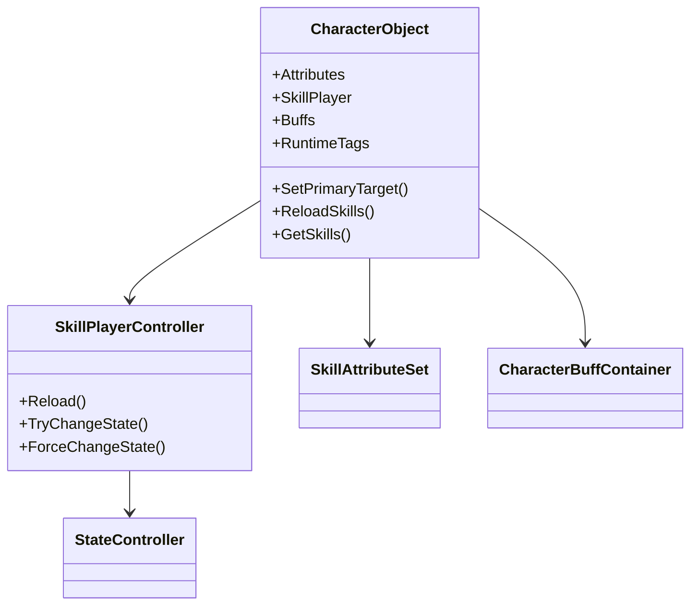

# CharacterObject 与 SkillPlayerController 职责优化建议

本文档专门回答你提出的核心问题：

1. `CharacterObject` 和 `SkillPlayerController` 是否职责重合。
2. 你想把“合法角色实体”的概念稳定落在 `CharacterObject` 上，这个方向是否正确。
3. 当前结构应不应该直接把二者合并。
4. 如果不直接合并，当前结构应该如何优化。

## 1. 先给结论

我的结论很明确：

1. `CharacterObject` 和 `SkillPlayerController` 现在确实存在职责交叉。
2. 你的方向是对的：
   - “找目标时，不是找一个 `object`，而是找一个能证明它是合法角色的入口组件”，这个入口就应该是 `CharacterObject`。
3. 但我不建议现在直接把 `CharacterObject` 和 `SkillPlayerController` 合并成一个类。
4. 更稳的做法是：
   - 让 `CharacterObject` 成为单位级总入口和合法角色实体门面。
   - 让 `SkillPlayerController` 退回“角色技能子系统控制器”的定位。
   - 再把当前 `SkillPlayerController` 里那些单位级装配职责继续拆出去。

也就是说：

不是“把 `CharacterObject` 干掉并把一切并进 `SkillPlayerController`”，
而是“让 `CharacterObject` 变成更上层的 Character 根入口，`SkillPlayerController` 变成它下面的一个能力模块”。

## 2. 为什么你会感觉二者重合

你的感觉来自一个真实结构事实：

当前 `SkillPlayerController` 已经不是单纯的技能播放器了，它实际上在承担单位级运行时宿主职责。

从现状看，`SkillPlayerController` 现在负责：

1. 装配主动技能
2. 装配被动技能
3. 管理动态授予技能
4. 构建 `SkillRuntime`
5. 构建共享 `StateController`
6. 构建共享 `SkillContext`
7. 每帧推进技能运行
8. 每帧推进状态运行
9. 采集输入快照
10. 采集命中/受击/BreakValue
11. 解析动画桥、资源服务、Buff 服务、战斗服务

这已经不是“技能控制器”了。
这更像是：

- 战斗角色运行时装配器
- 单位动作/状态/技能入口
- 局部 gameplay root

而 `CharacterObject` 现在又负责：

1. 对外代表一个合法角色实体
2. 提供属性访问
3. 提供 buff 访问
4. 提供 tag 访问
5. 提供技能查询入口
6. 转发主目标设置
7. 转发技能重载
8. 清理动态授予技能

所以结构上就出现了一个典型问题：

- `CharacterObject` 想当“角色对象门面”
- `SkillPlayerController` 却已经在做“角色运行时主控制器”

这两者就自然开始重叠。

## 3. 你关于 CharacterObject 的设计意图是正确的

你说的这句话，我认为是这次结构整理里最关键的设计原则：

“当我们寻找目标，找的不是 object，而是 object 身上的组件：CharacterObject。”

这是对的，而且应该继续强化。

因为在战斗系统里，一个普通 `GameObject` 只说明：

1. 它存在于场景里
2. 它可能有碰撞体
3. 它可能能被射线/重叠检测打到

但它并不能说明：

1. 它是不是一个合法战斗单位
2. 它是否有属性系统
3. 它是否可被加 buff
4. 它是否支持技能授予
5. 它是否有 tags
6. 它是否有状态机/技能系统

而 `CharacterObject` 正好可以承担这个“合法角色实体证明”的角色。

所以从系统语义上，`CharacterObject` 更应该是：

- Character Runtime Facade
- Combat Entity Root
- Valid Target Handle

而不是一个“可有可无的包装层”。

## 4. 是否应该直接合并 CharacterObject 和 SkillPlayerController

我的答案是不建议直接合并。

原因有四个。

## 4.1 合并会把“角色身份”与“技能子系统”再次绑死

如果直接合并，最后会变成：

- 这个类既代表角色实体
- 又代表技能系统
- 又代表状态系统入口
- 还会继续吸收 buff、attribute、target 相关行为

那它会变成一个更大的 God Object。

你现在已经在担心 `SkillPlayerController` 过胖。
如果此时再把 `CharacterObject` 并进去，只会更胖，不会更干净。

## 4.2 角色不应该等价于技能系统

一个角色实体理论上可以拥有很多子系统：

1. 属性系统
2. Buff 系统
3. 标签系统
4. 技能系统
5. 状态系统
6. 运动系统
7. 动画桥
8. 装备系统
9. AI / 输入驱动

`SkillPlayerController` 只是其中一个子系统控制器。

如果把它和 `CharacterObject` 合并，就相当于在语义上说：

“角色 = 技能控制器”

这不成立。

更自然的关系应该是：

- `CharacterObject` 拥有 `SkillPlayerController`
- 而不是 `CharacterObject` 等于 `SkillPlayerController`

## 4.3 你现在已经有了一个正确的实体解析入口

仓库里已经有 `CharacterObjectResolver`，而且很多 buff/attribute/skill action 也已经开始依赖它。

这说明当前结构其实不是没有路，而是“路开了一半”。

现在更合理的做法是继续把这条路走完：

1. 统一所有“角色实体目标解析”到 `CharacterObjectResolver`
2. 让 `CharacterObject` 成为角色能力访问入口
3. 让其他系统少直接碰 `GameObject`

而不是回头把 `CharacterObject` 吞进 `SkillPlayerController`。

## 4.4 当前真正的问题不是“要不要合并”，而是“层次顺序写反了”

更准确地说，当前的问题不是类太多，而是主从关系不清：

现在像是：

- `SkillPlayerController` 在上
- `CharacterObject` 在旁边给它做门面

而更合理的结构应该是：

- `CharacterObject` 在上，作为角色根入口
- `SkillPlayerController` 在下，作为技能子系统
- `SkillAttributeSet` 在下，作为属性子系统
- `CharacterBuffContainer` 在下，作为 buff 子系统
- 未来还可以有 Movement/Equipment/AI 等子系统

也就是说，不是合并，而是把层级摆正。

## 5. 我建议的目标结构

建议把角色运行时结构明确成下面这套关系：

这套结构表达的是：

1. `CharacterObject` 是角色根入口
2. `SkillPlayerController` 是技能域控制器
3. `StateController` 是技能域和状态域共享的状态机能力
4. Buff、Attribute 是角色下的其他子系统

## 6. 推荐的职责重划分

## 6.1 CharacterObject 应该承担什么

我建议 `CharacterObject` 固定为“角色根门面”。

它应该稳定承担：

1. 角色合法性标识
   - 只要能解析到 `CharacterObject`，就说明它是系统认可的角色实体。
2. 角色子系统聚合入口
   - 属性
   - buff
   - 技能
   - tags
   - 主目标
3. 跨子系统公共查询能力
   - 获取技能列表
   - 获取属性
   - 查询 buff/tag
4. 外部系统访问角色的统一入口
   - buff 系统
   - target 解析
   - hitbox/bullet 命中后续逻辑
   - skill action 目标操作

一句话：

`CharacterObject` 应该回答“这个对象是不是一个可参与战斗逻辑的角色，以及我如何统一访问它的子系统”。

## 6.2 SkillPlayerController 应该收缩成什么

我建议它收缩成“角色技能子系统控制器”。

它应该主要负责：

1. 技能装配与运行时持有
2. 输入转技能事件
3. `SkillRuntime` 更新
4. 与 `StateController` 的技能侧桥接
5. 动态授予技能的技能域处理

它不应该长期继续承担太多单位级聚合职责，例如：

1. 不应该成为“角色是否合法”的判断入口
2. 不应该在外部系统里直接被当成角色代名词
3. 不应该负责太多与角色身份绑定的泛化服务解析
4. 不应该成为所有战斗子系统的默认根组件

## 6.3 哪些职责还应该继续从 SkillPlayerController 往外拆

即使不合并，`SkillPlayerController` 现在也还是太胖，建议后续继续拆。

优先级最高的可拆职责有：

1. 单位级运行时装配
   - 现在的 `Reload()`、`BuildStateController()`、`AppendSkillRuntimeStates()` 已经更像装配器。
   - 后续可拆成 `CharacterCombatRuntimeAssembler` 或同类构件。
2. 输入采集
   - `CaptureStateInputSnapshot()` 与输入动作筛选可以继续从控制器中下沉。
3. 服务解析
   - `ResolveBattleResolver()`、`ResolveCharacterActionBridge()` 这类逻辑可变成独立 resolver/provider。
4. 角色级共享上下文构建
   - `SkillContext` / `StateRuntimeContext` 的组装也可进一步抽离。

## 7. 关于“很多地方直接找 obj，而不是找 CharacterObject”的问题

这是你当前最应该立规矩的一条。

我建议明确下面这条规则：

1. 物理检测阶段
   - 可以先拿到 `GameObject` / `Collider` / `Component`
2. 进入战斗语义阶段
   - 必须尽快解析为 `CharacterObject`
3. 只有解析成功，才认为是“合法角色目标”

这意味着系统里要区分两类目标：

1. 场景对象目标
   - 只是被检测到了
2. 角色实体目标
   - 被 `CharacterObjectResolver` 认定为合法角色

你真正想操作“角色属性、buff、技能、tags、状态”时，就不应再停留在 `GameObject` 层。

这个原则应该逐步贯彻到：

1. `SkillTargetResolver`
2. hitbox 命中处理
3. bullet 命中处理
4. buff 服务
5. skill action 对目标的操作
6. 属性修改逻辑

## 8. 那么 CharacterObjectResolver 现在应该怎么用

我建议把它从“工具函数”提升为“实体边界守门器”。

建议的使用原则：

1. 对外部命中对象、目标对象、来源对象，优先先 `Resolve(CharacterObject)`。
2. 需要角色语义时，如果解析失败：
   - 要么直接失败
   - 要么明确按“非角色对象”分支处理
3. 不要再写成“解析不到角色也照常把原始 object 传下去然后碰碰运气”。

当前最典型的可继续收紧点就是：

- `SkillTargetResolver` 现在仍是 `Resolve(CharacterObject) ?? 原始 object`

如果你的目标是“战斗目标必须是合法角色实体”，这里未来就应该改成更严格的分流，而不是温和回退。

## 9. 推荐的结构优化路线

我建议按下面三阶段做，而不是一步合并。

## 阶段一：先定角色实体入口

目标：让 `CharacterObject` 成为统一角色门面。

建议动作：

1. 统一文档与代码约定：
   - “合法角色实体”以 `CharacterObject` 为准。
2. 新代码里凡是涉及角色能力访问，优先通过 `CharacterObject` 取子系统。
3. 补充明确接口，例如：
   - `TryGetSkillPlayer()`
   - `TryGetAttributes()`
   - `TryGetStateController()`
   - 或直接暴露稳定只读属性

## 阶段二：让 SkillPlayerController 退回技能域

目标：让它不再被当作角色总入口。

建议动作：

1. 减少其他系统直接依赖 `SkillPlayerController` 代表目标角色。
2. 让外部先拿 `CharacterObject`，再从其上访问 `SkillPlayer`。
3. 把 `CaptureBreakValue()` 这类“回头再查 CharacterObject”的反向依赖改成更清晰的角色级依赖输入。

## 阶段三：继续拆 SkillPlayerController 内部职责

目标：把“单位级装配逻辑”从“技能控制逻辑”中剥离。

优先可拆：

1. runtime 装配
2. 输入快照桥接
3. 共享 context 构建
4. 服务解析逻辑

## 10. 如果你一定要合并，什么情况下才合理

只有一种情况我认为可以考虑合并：

你最终决定整个运行时里“角色根入口”就只保留一个组件，而且这个组件本质上就是“战斗角色控制器”，未来也愿意把属性、buff、状态、技能都统一纳入它。

但那样你就不该再叫 `SkillPlayerController`。

你应该改成类似：

1. `CharacterRuntime`
2. `CombatCharacterRuntime`
3. `CharacterCombatController`

也就是说，如果要合并，应该是“升格为统一角色运行时根类”，而不是简单把 `CharacterObject` 并进现在这个 `SkillPlayerController` 名字和结构里。

否则语义会越来越乱。

## 11. 最终建议

最终建议我明确写成一句话：

保留 `CharacterObject`，不要直接和 `SkillPlayerController` 合并；应该把 `CharacterObject` 提升为角色级总入口，把 `SkillPlayerController` 收缩回技能子系统控制器，并逐步把当前 `SkillPlayerController` 中的单位级装配职责继续拆分出去。

你这个方向的判断标准可以固定成下面三句：

1. 角色是否合法，看 `CharacterObject`。
2. 技能怎么跑，看 `SkillPlayerController`。
3. 单位级共享运行时怎么装起来，不应该永远塞在 `SkillPlayerController` 里。

## 12. 一个可执行的短期改造目标

如果你要我继续按这个方向落代码，我建议下一步的最小可执行目标是：

1. 先补一轮文义和调用约束
   - 让目标解析、buff、attribute、skill action 明确以 `CharacterObject` 为角色实体入口。
2. 再把 `SkillPlayerController` 里最明显的单位级职责做第一次拆分设计
   - 至少先拆出“共享状态机/共享上下文装配”这一块。
3. 然后再逐步清 `SkillTargetResolver`、hitbox、bullet 等仍直接使用 `GameObject/object` 的角色语义路径。

这样改，风险低，也最符合你现在已经形成的设计意图。
