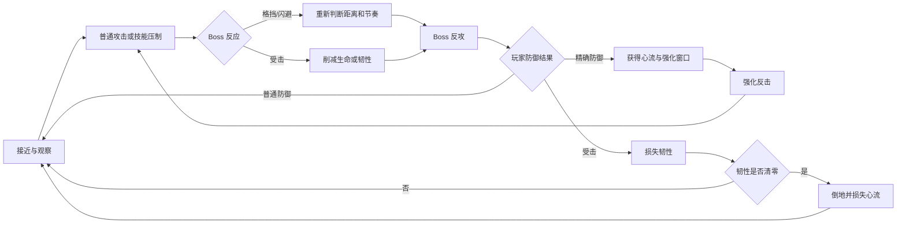

# ARPG 战斗 Demo 核心设计案

> 文档性质：Demo 设计、开发与验收的核心指导文档  
> 当前阶段：3C 纵切片验证  
> 核心工具：ActionEditor（原 SkillEditor）  
> 目标体验：高速、连续、低基础门槛，以格挡、闪避、时机判断和心流管理构成主要深度

---

## 1. 文档目的

本 Demo 的首要目的不是制作大量内容，而是使用真实战斗纵切片验证 ActionEditor 是否能够稳定、高效地生产高质量 ARPG 角色行为，并在制作过程中发现和补齐通用 3C 能力。

本文用于统一：

1. Demo 的体验目标与范围。
2. 玩家、敌人及 Boss 的核心战斗规则。
3. 格挡、闪避、韧性与心流的关系。
4. ActionEditor 在 Demo 中需要承担的配置职责。
5. 开发顺序、验证方法和阶段验收标准。
6. 功能缺口进入 Runtime、Editor 或配置层的判断规则。

本文是后续 Demo 开发的基准。若实现与本文冲突，应先确认是设计调整、配置问题，还是 ActionEditor 的通用能力缺失，再决定是否修改底层。

---

## 2. 项目定位

### 2.1 一句话定位

一款以现代高速 ARPG 操作为基础、以连续攻防博弈为核心，通过精确格挡和精确闪避积累心流，并将成功防御转化为强化反击机会的单 Boss 战斗 Demo。

### 2.2 Demo 的双重目标

#### 游戏体验目标

- 移动、攻击、格挡、闪避之间切换迅速且结果可预测。
- 玩家可以低压力完成战斗，也可以通过精确防御打出高表现连段。
- Boss 不是被动木桩，而会针对玩家行为进行有限、可读且公平的反应。
- 普通命中、格挡、精确防御和高等级反击具有清晰不同的视听层级。

#### 工具验证目标

- 验证分层状态机能否支撑 Locomotion 与 Action 并行协作。
- 验证移动、转向、Root Motion、外力与碰撞之间的控制权是否稳定。
- 验证动画过渡、取消窗口、Timeline 和命中反馈是否足够精确。
- 验证相机、锁定、震动和局部时间控制能否满足高强度战斗。
- 验证玩家与 AI 能否复用同一套行为配置和执行框架。
- 验证编辑器能否高效配置、调试和复用角色行为。

### 2.3 参考方向

公开可观察的体验参考包括：

- 高速移动、闪避响应与镜头表现：现代高速动作 RPG。
- 连续兵刃交互和精确防御：强调招架节奏的动作游戏。
- 敌我互相格挡、闪避和反制：强调双向行为反馈的动作游戏。
- Root Motion、目标辅助与动作连续性：重视近战距离控制的第三人称动作游戏。

仅参考操作规律、节奏、反馈结构和镜头语言。Demo 使用自有或合法授权的模型、动画、特效和音频，不以一比一复制任何商业作品为目标。

---

## 3. 核心设计支柱

### 3.1 响应优先

输入后应尽快得到可信反馈。普通攻击的动作承诺较低，格挡和闪避拥有较高响应优先级；重攻击、强化反击等高收益行为允许更高动作承诺。

### 3.2 攻防连续

玩家的防御不是等待阶段，而是进攻循环的一部分：

```text
观察敌方信号
→ 格挡或闪避
→ 获得心流与反击窗口
→ 使用强化攻击或技能
→ 迫使敌人防御
→ 继续寻找精确防御机会
```

### 3.3 奖励精确，但不强迫精确

普通格挡和普通闪避应保证基本生存；精确时机则提供心流、时间窗口、强化行为和高规格反馈。玩家不需要精通精确防御也能通关，但精通后能显著提高战斗效率和表现力。

### 3.4 敌我规则尽量对称

玩家与 Boss 尽量共享以下概念：

- 行为状态与取消规则。
- 攻击威胁等级。
- 格挡、闪避和受击。
- 韧性、破韧与倒地。
- 攻击目标、朝向和运动策略。

玩家和 AI 的主要差异应来自请求来源，而不是维护两套互不兼容的行为执行系统。

### 3.5 规则、运动、表现分离

- **规则层**：行为能否发生、优先级、取消、格挡、闪避、韧性和心流。
- **运动层**：KCC、输入移动、Root Motion、外力、转向和目标适配。
- **表现层**：动画、相机、HitStop、VFX、Audio 和材质反馈。

表现不能决定玩法结果，动画系统不能绕过角色运动后端直接修改最终位置。

### 3.6 可读性高于纯粹速度

战斗可以高速，但必须保证：

- 敌方攻击预警可辨认。
- 普通、黄光和红光攻击差异明确。
- 格挡成功、精确防御和受击结果不混淆。
- 强化窗口开始、可用和结束均有清晰提示。
- 镜头强化不能遮挡下一次关键输入信息。

---

## 4. 首个可玩版本范围

### 4.1 必须完成

#### 玩家

- Idle、八方向移动、启动/停止和急转基础。
- 自由相机与 Camera Only 硬锁。
- 一套三段普通攻击。
- 两个代表性主动技能。
- 常驻格挡。
- 高速闪避。
- 普通格挡、精确格挡和高等级精确格挡。
- 普通闪避、精确闪避和高等级精确闪避。
- 韧性、破韧、倒地和恢复。
- 三管九格心流资源。
- 精确防御后的短时强化反击。
- 基础受击、击退、死亡和重置。

#### 敌人和 Boss

- 静止木桩和可攻击测试敌人。
- Boss 一阶段完整战斗。
- 普通、黄光、红光三档攻击信号。
- Boss 格挡和闪避玩家部分攻击。
- Boss 韧性、破韧和输出窗口。
- 基于距离、玩家状态和最近行为的有限反应。

#### 反馈与工具

- 命中、受击、格挡、精确防御的分级 HitStop。
- 分级 CameraShake、VFX 和 Audio。
- 输入、状态、速度、锁定目标和关键窗口调试显示。
- 固定 Benchmark 测试场景。

### 4.2 延后到基础闭环稳定后

- Boss 二阶段。
- 机关、弹幕或额外场地干扰。
- QTE 与演出镜头。
- 空中完整连段。
- 多武器切换。
- 处决和双人同步动画。
- 多角色切换、支援和连携系统。

以上内容不能阻塞首个可玩版本验收。

---

## 5. 核心战斗循环

### 5.1 基础循环



### 5.2 期望节奏

- 普通阶段：快速移动、短连段、Boss 反制。
- 防守阶段：读取攻击信号，选择格挡或闪避。
- 奖励阶段：精确防御触发强化窗口，玩家迅速反击。
- 破韧阶段：敌方韧性清零，形成稳定输出窗口。
- 重置阶段：双方恢复距离和行为节奏，避免无限压制。

---

## 6. 玩家动作集

### 6.1 Locomotion

- Idle。
- 八方向移动。
- 普通转向和 180° 急转。
- 自由相机移动。
- 硬锁下相机相对移动。
- 攻击或防御结束后的移动恢复。

验收重点：

- 输入方向与角色运动方向一致。
- 起步、松手和反向输入不拖沓。
- Action 覆盖期间 Locomotion 仍保持正确事实状态。
- 锁定与非锁定切换不产生速度或朝向突变。

### 6.2 三段普通攻击

推荐动作结构：

```text
Light1 Execute → Light1 Recovery
Light2 Execute → Light2 Recovery
Light3 Execute → Light3 Recovery
```

| 段数 | 定位 | 位移 | 反馈 | 动作承诺 |
| --- | --- | --- | --- | --- |
| Light1 | 快速起手 | 小 | 轻 | 低 |
| Light2 | 连续推进 | 中 | 中 | 中低 |
| Light3 | 连段终结 | 中或大 | 强 | 中 |

基本规则：

- 每段起手可进行有限朝向修正。
- Active 后禁止大角度追踪。
- Recovery 可在规定窗口被移动、下一段攻击、格挡或闪避取消。
- 提前输入应进入缓冲，而不是要求玩家精确到单帧。
- 挥空、命中、被格挡时可以有不同反馈，但不应维护完全不同的状态机。

### 6.3 两个主动技能

首版技能用于验证不同 3C 能力，而不是追求数量。

#### 技能 A：位移压制技

验证：

- 明显 Root Motion 或运动曲线。
- 有限目标修正。
- 近距离停止和靠墙裁剪。
- 普通攻击或精确防御强化后的派生表现。

#### 技能 B：高承诺爆发技

验证：

- 较长 Startup。
- 较严格取消规则。
- 强反馈命中。
- 心流消耗。
- 强化状态下的替代版本或参数升级。

技能具体主题、动画和数值在动作素材确定后再定，但两个技能必须覆盖不同的运动和取消需求。

### 6.4 格挡

格挡是常驻行为，不设置传统长 CD。其限制来自：

- 输入与状态门禁。
- 防御方向或有效角度。
- 当前动作是否允许取消。
- 敌方攻击是否可防御。
- 精确窗口时机。

首版格挡状态建议：

```text
Guard Enter
→ Guard Hold
→ Guard Success / Precise Guard
→ Guard Recovery / Counter Opportunity
```

普通格挡的目标是保证稳定防御，不应附带过强收益；精确格挡才是心流和强化反击的主要来源。

### 6.5 闪避

闪避同样是常驻高优先级行为，短间隔或无传统 CD，但必须通过状态门禁避免无限无敌。

首版至少定义：

- 输入响应。
- 位移方向与距离。
- 无敌窗口。
- 精确闪避窗口。
- 可转向窗口。
- 连续闪避最短间隔。
- 能取消哪些行为阶段。
- 结束后恢复移动或进入闪避派生攻击。

闪避不能只是一段动画；无敌、运动、碰撞、目标穿越规则和相机反馈都必须有明确所有权。

---

## 7. 攻击威胁等级

敌方攻击按防御交互划分为三档。颜色是表现提示，玩法判定使用结构化威胁等级，不能通过 VFX 颜色反推规则。

| 威胁等级 | 表现提示 | 普通格挡 | 精确格挡/闪避结果 | 主要目的 |
| --- | --- | --- | --- | --- |
| 普通 | 常规攻击表现 | 可防御，玩家不损失韧性 | 小反馈或基础收益 | 维持攻防节奏 |
| 黄色 | 明确黄光预警 | 可防御或闪避 | 触发二级防御收益 | 制造短反击窗口 |
| 红色 | 强红光预警 | 具体招式可要求精确应对 | 触发三级防御收益 | 制造高价值反击窗口 |

### 7.1 红光攻击约束

红光不能简单等同“不可格挡”。每个红光招式必须在配置中明确：

- 可精确格挡；
- 只能闪避；
- 格挡会破防但精确格挡成功；
- 需要特殊反制。

首个版本建议仅采用前两种，避免在基础规则尚未稳定时引入过多例外。

### 7.2 公平性规则

- 攻击信号必须早于有效命中窗口出现。
- 预警时长应匹配攻击速度和镜头距离。
- 相同视觉信号必须产生一致规则。
- 连续攻击中的每次关键时机应可辨认。
- Boss 不能在不可读的镜头外无预警命中玩家。

---

## 8. 格挡与闪避等级

为避免“攻击颜色”和“玩家操作等级”混为同一概念，二者分开定义。

### 8.1 防御结果等级

| 等级 | 名称 | 判定 | 收益 |
| --- | --- | --- | --- |
| Level 1 | 普通防御 | 进入基础格挡或闪避有效窗口 | 避免伤害；普通格挡避免韧性损失 |
| Level 2 | 精确防御 | 在黄色攻击精确窗口内成功格挡或闪避 | 短时强化；较高反馈；获得心流 |
| Level 3 | 高价值精确防御 | 在红色攻击规定窗口内完成正确防御 | 更长强化窗口；最高反馈；大量心流 |

Level 不是单纯由时间精度决定，而是由“敌方威胁等级 + 玩家防御方式 + 命中时机”共同解析。

### 8.2 推荐首版收益

| 防御行为 | Level 1 | Level 2 | Level 3 |
| --- | --- | --- | --- |
| 格挡 | 不受生命伤害且不损失韧性 | +1 格心流 | +1 管心流 |
| 闪避 | 避免命中 | +0.5 格心流 | +1 格心流 |

数值为首轮测试基线，可根据获得频率调整。所有小数心流在内部使用统一整数最小单位表示，避免浮点累计误差。

### 8.3 判定输出

防御解析至少应输出：

- 防御是否成功。
- 防御方式。
- 防御等级。
- 攻击威胁等级。
- 是否承受生命伤害。
- 是否承受韧性伤害。
- 心流变化。
- 是否触发强化窗口。
- 反馈等级。
- 后续允许行为。

---

## 9. 韧性系统

### 9.1 定位

韧性代表单位当前承受攻击压力的能力，不是攻击资源。玩家主动攻击和释放技能不消耗自己的韧性。

### 9.2 玩家规则

- 未被防御的有效攻击削减玩家韧性。
- 普通格挡成功时不削减韧性。
- 闪避成功时攻击未命中，因此不削减韧性。
- 韧性清零时进入破韧倒地。
- 倒地时损失 1 管心流，最低降至 0。
- 起身后恢复一定韧性并获得短暂保护，避免连续倒地锁死。

### 9.3 敌人规则

- 玩家攻击根据动作配置削减敌人韧性。
- Boss 成功格挡时，可减免或免除本次韧性损失。
- Boss 韧性清零时进入明确的失衡/倒地状态。
- 破韧状态形成稳定输出窗口，结束后恢复韧性并获得短时破韧保护。

### 9.4 待调参数

- 韧性上限。
- 每种攻击的韧性伤害。
- 玩家脱离压力后的恢复规则。
- Boss 破韧持续时间。
- 起身恢复比例。
- 连续受击保护。
- 霸体或不可破韧状态的表现方式。

---

## 10. 心流系统

### 10.1 资源结构

- 心流上限：3 管。
- 每管：3 格。
- 总计：9 格。
- 建议内部最小单位：半格，共 18 单位。
- 初始值：1 管，即 3 格。

UI 同时显示管数和格数，但运行时只维护一个统一整数值。

### 10.2 获取方式

- 攻击命中敌人：少量累计。
- Level 2 格挡：+1 格。
- Level 3 格挡：+1 管。
- Level 2 闪避：+0.5 格。
- Level 3 闪避：+1 格。

同一攻击事件只能结算一次心流收益，避免格挡、命中监听和反馈事件重复奖励。

### 10.3 消耗方式

- 普通主动技能：基线消耗 1 格。
- 强化技能是否额外消耗，待首轮手感测试后决定。
- 被破韧倒地：损失 1 管。

### 10.4 脱战恢复

玩家脱战 3 秒后，若心流不足 1 管，则逐步恢复至 1 管；已达到或超过 1 管时不进行脱战恢复。

“脱战”需要由明确条件判断，首版建议：

- 最近 3 秒未造成或承受有效攻击；
- 当前没有敌对单位处于主动攻击状态；
- 玩家不处于倒地、受击或强化反击状态。

### 10.5 心流阶段收益

首版不建议立即为三管心流设计大量常驻被动。优先使用心流完成两件事：

1. 作为技能资源。
2. 作为精确防御表现和强化反击的奖励刻度。

当基础循环稳定后，再评估是否加入：

- 高心流下的新派生动作。
- 动画、VFX 或音频层级变化。
- 特殊终结技。
- 高心流风险收益机制。

---

## 11. 强化反击窗口

### 11.1 设计目标

精确防御后不是简单获得数值 Buff，而是进入一个极短、信息清晰、鼓励立即行动的反击机会。

### 11.2 Level 2 窗口

- 触发短时局部慢速或短暂停顿。
- 普攻和两个技能获得一级强化。
- 玩家执行任一强化攻击后结束窗口。
- 超时未使用则自然结束。

### 11.3 Level 3 窗口

- 停顿或慢速持续时间更长。
- 普攻和两个技能获得二级强化。
- 使用强化攻击后结束窗口。
- 反馈明显强于 Level 2，但不能长到破坏连续战斗节奏。

### 11.4 时间控制原则

“时停”必须区分：

- 判定瞬间的 HitStop。
- 玩家可思考和选择行为的局部慢速窗口。
- 强化行为开始后的恢复正常时间。

不建议长期使用完全冻结世界且玩家仍自由行动的实现，因为它会显著增加动画、物理、输入和 AI 时间域复杂度。首版优先尝试：

```text
极短全局/双方 HitStop
→ 短暂世界慢速、玩家输入正常采集
→ 玩家提交强化行为
→ 恢复正常时间
```

具体倍率和持续时间通过 A/B 测试确定。

### 11.5 强化方式

首版优先采用“参数和表现升级”，避免为每个动作复制整套逻辑：

- 更高伤害或韧性伤害。
- 更强 HitStop、Shake、VFX 和 Audio。
- 有限额外推进或朝向修正。
- 改变攻击盒尺寸或命中次数时必须专项验证。

只有动画和行为结构确实发生显著变化时，才使用独立强化 State。

---

## 12. Boss 设计

### 12.1 Boss 定位

Boss 是玩家核心动作系统的对练对象，其目标不是以高伤害制造失败，而是通过可读的攻防互动促使玩家使用格挡、闪避和心流。

### 12.2 一阶段行为集合

至少包含：

- 近距离普通连击。
- 一种黄色单段攻击。
- 一种黄色连续攻击。
- 一种红色可精确格挡攻击。
- 一种红色建议闪避攻击。
- 接近或拉开距离行为。
- 对玩家部分普通攻击进行格挡。
- 对高承诺攻击进行条件闪避。
- 被破韧、倒地和恢复。

### 12.3 AI 反应原则

Boss 可以读取结构化战斗事实，但不能直接读取玩家刚刚按下的输入来作弊。

允许读取：

- 双方距离和夹角。
- 玩家当前公开状态。
- 玩家攻击的 Startup/Active 等可观察阶段。
- 最近使用行为及重复次数。
- Boss 自身资源、韧性和冷却。
- 战场位置和墙体距离。

不允许：

- 在玩家按键同帧、动作尚无可见迹象时立即完美反制。
- 无视朝向和反应时间瞬间格挡。
- 连续以百分之百成功率克制同一行为。
- 为了制造难度绕过正式 State、Timeline 或运动系统。

### 12.4 Boss 防御决策

格挡和闪避应由以下因素共同决定：

- 当前行为是否允许防御取消。
- 玩家攻击类型和方向。
- 反应延迟。
- 决策冷却。
- 最近是否连续使用同一反应。
- 当前韧性和位置风险。
- 随机权重，但结果必须保持可读。

### 12.5 二阶段与可选内容

Boss 半血后可进入二阶段，但只在一阶段完整达到验收标准后实施。

二阶段候选变化：

- 改变现有招式节奏，而不是只提高数值。
- 增加延迟攻击或组合派生。
- 加入有限场地机关或弹幕干扰。
- 提高对重复玩家行为的反应倾向。
- 使用短演出完成阶段切换。

QTE、复杂机关和大型演出均为可选项，不能反向污染一阶段的基础 3C 架构。

---

## 13. 相机与锁定

### 13.1 玩法相机目标

- 普通移动舒适，不制造晕动。
- Boss 始终尽可能保持在可读区域。
- 近距离不出现剧烈横摆。
- 锁定进入和退出不跳镜。
- 墙角、狭窄空间和大型目标下仍可操作。

### 13.2 硬锁与攻击目标

- 硬锁目标属于相机系统。
- 攻击辅助目标属于战斗/行为系统。
- 首版二者可以默认一致，但接口和调试信息必须区分。
- 攻击不能因为镜头切换而无条件瞬间转向新目标。

### 13.3 反馈相机

反馈分级：

| 场景 | 镜头强度 |
| --- | --- |
| 普通轻击 | 极弱或无 |
| 重击/终结段 | 中 |
| 普通格挡 | 弱 |
| Level 2 防御 | 中强，短促 |
| Level 3 防御 | 强，带构图或 FOV 强化 |
| 玩家破韧倒地 | 中强，但保证后续信息可读 |

Shake 必须限幅、去重和支持优先级，不能因多目标同帧命中无限叠加。

---

## 14. 命中与反馈规格

### 14.1 反馈层级

| 等级 | 适用场景 | HitStop | Shake | VFX/Audio |
| --- | --- | --- | --- | --- |
| Light | 普攻第一段、轻碰撞 | 短 | 很弱 | 清脆、小型 |
| Medium | 普攻第二段、普通格挡 | 中短 | 弱到中 | 明确金属或肉感层 |
| Heavy | 终结段、重击、破韧 | 中 | 中强 | 大型、低频加强 |
| Precision | 精确格挡/闪避 | 分级特殊曲线 | 定向且限幅 | 独立高辨识度表现 |

### 14.2 反馈事件规则

- 玩法判定先完成，再广播表现事件。
- 同一次命中拥有唯一事件标识。
- 多目标反馈需要合并或限流。
- HitStop 期间仍应采集输入。
- VFX、Audio 和 Shake 不影响命中是否成立。
- 状态中断时，持续反馈必须正确清理。

---

## 15. ActionEditor 配置映射

| 设计概念 | ActionEditor 承担内容 |
| --- | --- |
| Locomotion | Locomotion 层 State、Directional Mixer、Movement Profile |
| 攻击/格挡/闪避/受击 | Action 层 State |
| Startup/Active/Recovery | State Duration、Timeline 区块及 Execute/Recovery 结构 |
| 动画 | Animation 配置、Animancer 层、Fade 和播放速度 |
| 位移与转向 | Movement Profile、Root Motion、技能运动和外力 |
| 攻击有效帧 | HitBox Timeline |
| 弹体 | Bullet Timeline |
| 窗口与状态标记 | Timeline Event、Runtime Tag、Interrupt 配置 |
| 命中结果 | Effect Graph 与战斗结算服务 |
| VFX/Audio | 独立 Timeline 轨道和命中反馈事件 |
| 相机反馈 | CameraFeedbackService 请求 |
| 连段与技能派生 | Skill Graph；当前阶段只使用现有能力，不扩展技能底层 |
| AI 行为执行 | 与玩家共享 State/Timeline，由 AI 提交行为请求 |

### 15.1 当前开发约束

- 当前阶段不主动重构 SkillRuntime。
- 优先使用现有 State、Timeline、运动、动画和相机能力完成 3C。
- 如果问题只影响技能图内部，先记录，不阻塞 3C 纵切片。
- 如果问题影响攻击、格挡、闪避、受击、运动、输入或相机等通用行为，则按 3C 阻塞项处理。

---

## 16. 纵切片开发顺序

### M0：Benchmark 与可观测性

完成：

- 米制网格平地。
- 墙角、狭窄通道、斜坡、台阶。
- 小型、大型、移动和多目标木桩。
- 输入、双层状态、速度、Root Motion、锁定目标、窗口和最近切换原因显示。

验收：同一输入序列可以稳定复现，并能解释每次状态变化。

### M1：基础移动与相机

完成：

- Idle/Move。
- 八方向动画。
- 加速、减速、急转。
- 自由相机与硬锁。
- 锁定目标切换。

验收：连续操作 10 分钟无明显不适；墙角、斜坡和目标穿身场景不出现严重问题。

### M2：基础攻击纵切片

完成：

- 三段普通攻击。
- 动画、位移、转向、HitBox 和 Recovery。
- 移动、攻击、格挡和闪避取消基线。

验收：静止、移动、挥空、命中、低帧率和 HitStop 条件下连段结果稳定。

### M3：命中反馈

完成：

- 分级 HitStop。
- CameraShake。
- Hit VFX、Audio 和武器表现。
- 多目标反馈限流。

验收：三段攻击反馈层级明确，反馈不会遮挡操作或因多目标失控。

### M4：格挡与闪避

完成：

- 普通格挡。
- 普通闪避与无敌窗口。
- 精确判定。
- 普通、黄光、红光攻击交互。

验收：相同攻击在重复测试中得到一致结果；窗口边界在低帧率下稳定。

### M5：韧性与心流

完成：

- 玩家和敌人韧性。
- 破韧、倒地、起身和保护。
- 心流获取、消耗、损失和脱战恢复。
- UI 和调试显示。

验收：所有资源变化都能追踪到唯一战斗事件，不重复结算。

### M6：强化反击

完成：

- Level 2/3 防御收益。
- 局部慢速或时停流程。
- 普攻和两个技能的强化版本。
- 使用后或超时结束。

验收：输入不因时间控制丢失，强化只消费一次，时间恢复可靠。

### M7：测试敌人与 AI

完成：

- 敌人移动、攻击、格挡、闪避、受击和死亡。
- 玩家与 AI 共享行为执行框架。
- 反应延迟、冷却和重复行为抑制。

验收：AI 有反馈但不读按键作弊，行为结果可由调试记录解释。

### M8：Boss 一阶段

完成：

- 完整招式集。
- 三档攻击提示。
- 攻防互动与破韧窗口。
- 战斗开始、结束和重置。

验收：普通玩家可以通关；熟练玩家能通过精确防御稳定打出更高表现和效率。

### M9：可选高级内容

按收益评估是否加入：

- Boss 二阶段。
- 机关和弹幕。
- QTE。
- 演出镜头。

---

## 17. 固定测试矩阵

| 系统 | 必测场景 | 通过标准 |
| --- | --- | --- |
| 输入 | 同帧攻击+移动、提前输入、HitStop、30/15 FPS | 不随机丢失、不重复消费、优先级固定 |
| 双层状态 | 移动中攻击、Action 中切换 Locomotion | 两层事实正确，Action 退出连续 |
| 运动 | 180° 折返、斜坡、台阶、墙角 | 不异常滑步、不穿墙、速度可解释 |
| Root Motion | 突进、闪避、目标近远变化 | 不与输入重复叠加，位移可裁剪 |
| 攻击 | 挥空、命中、被格挡、多目标 | 命中次数正确，状态和反馈一致 |
| 格挡 | 窗口前/内/后，正面/侧后方 | 判定边界稳定，方向规则一致 |
| 闪避 | 各方向、窗口边界、连续闪避 | 无敌和运动窗口一致，不无限无敌 |
| 韧性 | 连续受击、格挡、破韧、起身 | 不重复扣除，保护机制有效 |
| 心流 | 命中、防御、技能、倒地、脱战 | 每次变化来源唯一，边界正确 |
| 时间控制 | Level 2/3、防御后立即输入 | 输入仍采集，状态和动画恢复正确 |
| 相机 | 多目标、遮挡、高低差、大型目标 | 不跳镜，目标可读，不遮挡关键攻击 |
| AI | 重复攻击、诱导反应、边界距离 | 有反应延迟和冷却，不读输入作弊 |

---

## 18. 动作规格模板

每个动作进入配置前必须填写：

```text
动作名称：
行为类别：Locomotion / Attack / Guard / Dodge / HitReaction / Other
输入或 AI 请求：
前置状态：
目标状态层：
目标 State：
优先级：

Startup：
Active：
Recovery：

输入缓冲：
允许取消：
禁止取消：
取消开放时间：
取消后目标：
是否保留原行为链：

动画：
Animancer 层：
起播时间：
播放速度：
Fade In：
正常 Fade Out：
中断 Fade Out：

位移模式：
Root Motion：
位移曲线：
转向策略：
追踪窗口：
最大修正角：
碰撞规则：

攻击威胁等级：
可格挡规则：
可闪避规则：
HitBox：
单目标命中次数：
生命伤害：
韧性伤害：

HitStop：
CameraShake：
VFX：
Audio：

心流变化：
自然后继：
请求失败退化：
测试用例：
已知差异：
```

---

## 19. 编辑器缺口处理规则

制作每个动作时，问题统一标记为：

- `Config`：现有系统能表达，只需调整参数或资源。
- `Runtime`：运行时缺少通用行为能力。
- `Editor`：运行时能表达，但缺少高效配置、校验或可视化。
- `Asset`：动画、模型、音效或特效素材不足。
- `Design`：规则本身尚未明确。

升级为通用系统前必须回答：

1. 是否至少两个动作需要该能力？
2. 是否可能被玩家和敌人共同复用？
3. 是否属于规则、运动或表现层？
4. 能否先用已有配置完成验证？
5. 新抽象是否能在第二个动作上立即验证？

原则：

- 单动作独有表现优先留在配置层。
- 多动作重复需求才进入通用 Runtime。
- Runtime 已支持但难配置的问题进入 Editor。
- 不为尚未出现的假设需求提前建设大型系统。

---

## 20. 首版完成标准

### 20.1 操作质量

- 移动、攻击、格挡和闪避响应稳定。
- 合法取消不会随机失败。
- 同帧请求的结果固定且可解释。
- HitStop 和低帧率下不丢失关键输入。

### 20.2 战斗质量

- 玩家能明显区分普通、黄色和红色攻击。
- 普通防御可靠，精确防御收益明确。
- 心流鼓励主动攻防，而不是鼓励被动等待。
- Boss 会反应但不作弊。
- 战斗难度适中，高手能表现出明显更高的流畅度和效率。

### 20.3 表现质量

- 动画过渡无明显闪帧。
- 角色位移不轻易穿墙或穿过目标。
- 普通命中、重命中和精确防御反馈层级清晰。
- 相机强化不牺牲下一次攻击的可读性。

### 20.4 工具质量

- 大部分基础动作可以通过配置完成。
- 新增动作不要求修改角色专用通用代码。
- 关键状态、窗口、请求和拒绝原因可观察。
- Demo 暴露的通用问题有明确分类和复现步骤。

---

## 21. 待确认设计项

以下内容在对应里程碑开始前决定，不提前阻塞基础移动和攻击：

1. 红光攻击首版是否全部支持精确格挡，还是部分只能闪避。
2. 格挡是否有方向角度，以及背后攻击的处理。
3. 玩家韧性的自然恢复时机和速度。
4. Boss 格挡时是否完全免除韧性伤害。
5. 心流命中获取量和多段攻击限流规则。
6. Level 2/3 强化窗口的时间倍率和持续时间。
7. 强化攻击采用参数升级还是独立动画。
8. 两个主动技能的具体动作主题。
9. Boss 一阶段目标战斗时长。
10. Boss 二阶段、机关和 QTE 是否进入最终 Demo。

这些项目应通过可玩版本和 A/B 测试决定，而不是仅凭文档推演。

---

## 22. 最终执行原则

1. 先完成可测量的最小纵切片，再增加系统数量。
2. 每次只引入一个主要变量，确保能够判断手感变化来源。
3. 先尝试用现有 ActionEditor 配置，再判断是否扩展底层。
4. 所有通用扩展必须由真实动作需求推动，并由第二个动作验证复用性。
5. 每个阶段都同时验证正常结束、中断、低帧率、HitStop、碰撞边界和清理路径。
6. 不以“功能存在”为完成标准，以稳定、可预测、可调试和可复用为完成标准。
7. Boss 一阶段和玩家核心攻防闭环优先于二阶段、QTE 与演出。
8. 当前开发重点是 3C；技能系统内部架构问题单独记录，暂不阻塞 Demo 3C 纵切片。
