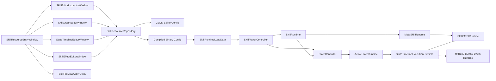
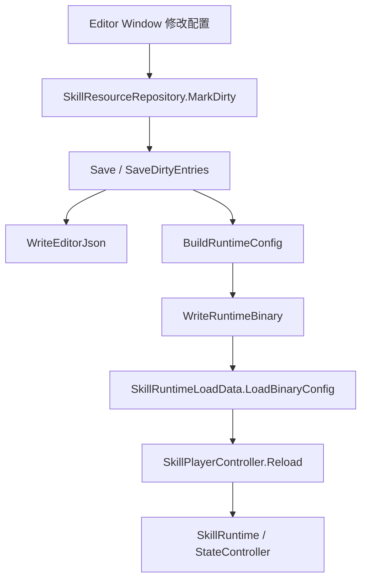
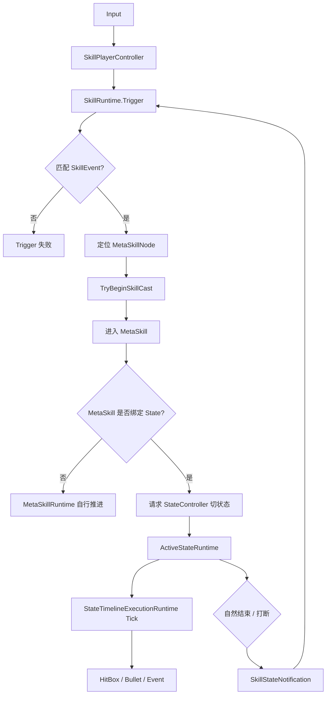
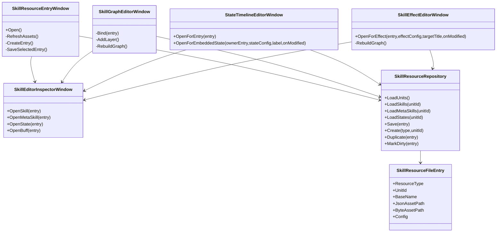
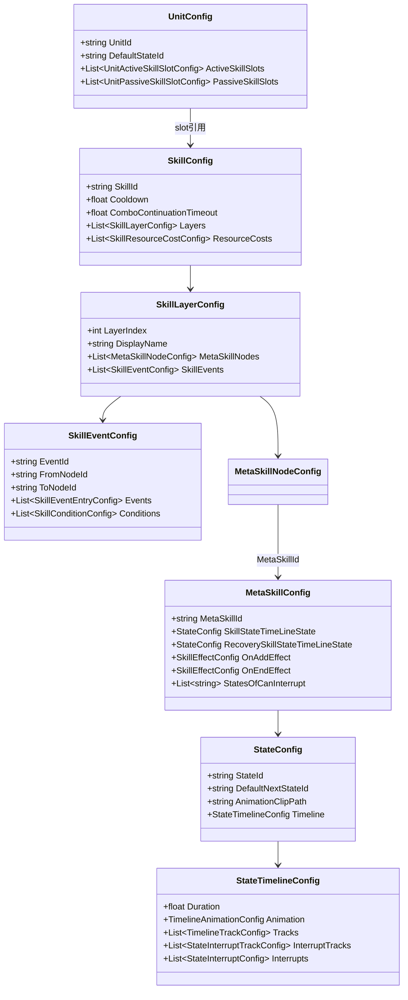
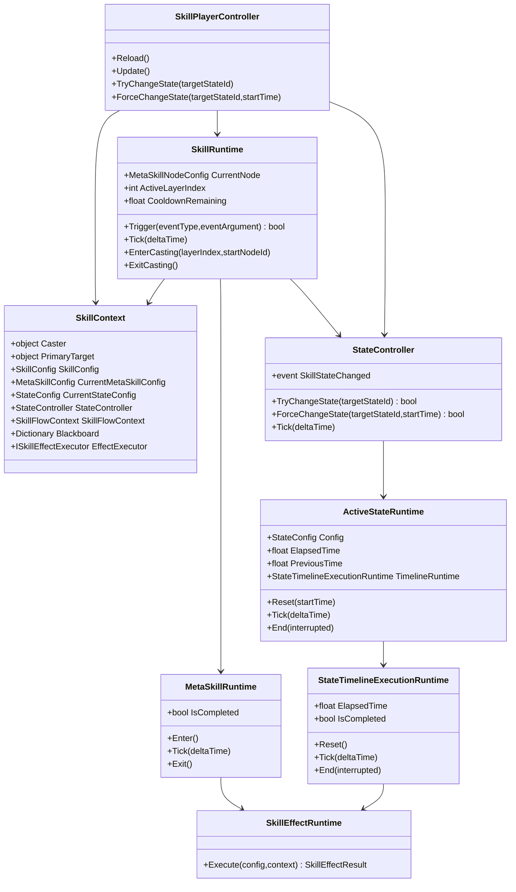

# SkillEditor 最终版系统总结

## 1. 文档目的

这份文档不是需求文档，也不是历史方案说明，而是面向代码审查与二次迭代的“现状总结”。

目标有三个：

1. 把当前编辑器系统的真实结构收敛成一份可阅读的总览。
2. 让后续阅读代码时，先知道每层系统在解决什么问题、边界在哪里。
3. 为后续你自己做代码审查、风格修正、架构收束提供一个统一参照。

本文聚焦六个主题：

1. 设计思路
2. 编辑器部分的界面设计
3. 数据的转化和存储
4. 运行时设计
5. 技能设计
6. 状态设计

文中图例使用 Mermaid，Obsidian 可直接查看。

---

## 2. 系统总览

当前 SkillEditor 系统可以分成四层：

1. 编辑器层：负责资源入口、图形编辑、时间轴编辑、Inspector 编辑、预览应用。
2. 配置层：负责 `SkillConfig`、`MetaSkillConfig`、`StateConfig`、`BuffConfig`、`UnitConfig` 等纯数据结构。
3. 运行时层：负责 `SkillRuntime`、`StateController`、`StateTimelineExecutionRuntime`、`MetaSkillRuntime`、`SkillEffectRuntime` 等执行逻辑。
4. 角色集成层：负责把技能系统接到角色对象、输入系统、动画桥、Buff、战斗结算和预览对象上。

核心设计思想可以归纳成一句话：

`Skill` 负责组织释放逻辑，`MetaSkill` 负责定义一次技能节点执行单元，`State` 负责承载真正的时间线执行，`StateController` 负责状态切换，`SkillRuntime` 负责技能链路和层级调度。

也就是说，这套系统不是“一个大时间轴包办一切”，而是把职责拆成了：

1. 技能图负责“什么时候进哪个节点”。
2. 状态机负责“当前角色到底在什么状态里”。
3. 状态时间线负责“这个状态内的动画、事件、攻击盒、子弹如何推进”。
4. 效果树负责“命中后要产生什么游戏效果”。

---

## 3. 核心设计思路

### 3.1 Skill 与 State 解耦，但运行时互相协作

这里最重要的设计，不是把 Skill 和 State 合并，而是把两者的边界拉清楚：

1. `SkillRuntime` 不直接接管状态生命周期。
2. `StateController` 不负责技能图跳转决策。
3. `SkillRuntime` 在节点进入时，决定要不要请求进入技能状态。
4. `StateController` 接手状态后，完整负责进入、Tick、自然结束、打断、默认跳转。
5. 状态结果再通过通知回流给 `SkillRuntime`，让它决定技能链是否继续、是否开放连段窗口、是否推进 layer。

这样做的意义是：

1. 避免 Skill runtime 和 State runtime 各自维护一套时间推进逻辑。
2. 避免 hitbox、bullet、timeline event 同时存在两套宿主。
3. 让技能逻辑和角色状态逻辑都能保持独立可演化。

### 3.2 Skill 是组织器，MetaSkill 是执行单元

在当前设计里：

1. `SkillConfig` 负责技能整体配置，例如冷却、资源消耗、连段超时、逻辑层数。
2. `SkillLayerConfig` 负责一层技能逻辑图。
3. `MetaSkillNodeConfig` 代表图上的节点。
4. `SkillEventConfig` 代表边，也就是从哪个节点到哪个节点，在什么事件和条件下跳。
5. `MetaSkillConfig` 则是真正的节点内容，包含：
   - 执行态 State
   - 后摇态 State
   - OnAddEffect
   - OnEndEffect
   - 可打断白名单

所以 Skill 图本质上是“节点调度图”，而不是一条直接执行 hitbox/bullet 的时间线。

### 3.3 State 是统一的时间线执行宿主

当前版本已经明确把时间线收口到 `StateTimelineExecutionRuntime`。

也就是说：

1. 动画同步在 State 维度驱动。
2. Timeline event 在 State 维度驱动。
3. HitBox 在 State 维度驱动。
4. Bullet 在 State 维度驱动。

`StateController` 的职责只是调度当前激活状态，而不是自己执行轨道。

### 3.4 Layer 是逻辑层，不是渲染层

`SkillLayerConfig` 里的 Layer 不是 Unity Layer，也不是渲染层。

它现在的语义是：

1. 用于描述同一个技能输入下的多段逻辑层级。
2. 每个 layer 有自己的节点图和事件边。
3. 每个 layer 独立计算冷却。
4. 当前实现中，layer 的切换指针由 `SkillRuntime` 统一维护。

这套设计非常适合你前面定义的“充能型/分层型技能”：

1. 同一个输入绑定。
2. 每层像一套独立技能图。
3. 正常结束后推进到下一层。
4. 每层各自独立进入冷却。

---

## 4. 编辑器部分的界面设计

编辑器层目前不是一个单窗口系统，而是“资源入口 + Inspector + 图编辑器 + 时间轴编辑器 + 预览”的组合结构。

### 4.1 资源入口窗口

主入口是 `SkillResourceEntryWindow`。

它负责：

1. 资源类型切换：Unit / Skill / MetaSkill / State / Buff。
2. Active Unit 上下文选择。
3. 新建、复制、删除、保存。
4. 列出当前作用域内可编辑资源。

设计上，这个窗口不是一个“编辑器”，而是资源浏览器和工作台入口。

其价值在于：

1. 让 Skill、MetaSkill、State 都受 Unit 上下文约束。
2. 避免资源散落在 Project 面板里无上下文地编辑。
3. 让 Unit 成为技能系统装配和预览的真实根节点。

### 4.2 Inspector 窗口

`SkillEditorInspectorWindow` 是一个统一 Inspector 宿主，内部通过 panel 分发到不同资源类型。

目前它承担的角色是：

1. Skill 基础字段编辑。
2. MetaSkill 基础字段编辑。
3. State 基础字段编辑。
4. Buff / Unit 编辑。
5. 图节点、边、时间轴条目、打断条目的细项 Inspector。

这里的设计重点不是“一个窗口画所有东西”，而是：

1. Graph/Timeline 负责空间结构编辑。
2. Inspector 负责当前选中对象的详细字段编辑。

这符合 Unity 编辑器常见工作流，也让复杂结构保持可拆分。

### 4.3 Skill 图编辑器

`SkillGraphEditorWindow` 用 GraphView 维护技能图。

它的核心界面元素有两部分：

1. 左侧 Layer 面板
2. 右侧 GraphView 节点图

左侧 Layer 面板负责：

1. 展示当前 Skill 的所有 layer。
2. 新增 layer。
3. 切换当前正在编辑的 layer。

右侧 GraphView 负责：

1. 展示 Entry/Exit 特殊节点。
2. 展示 `MetaSkillNodeConfig` 节点。
3. 展示 `SkillEventConfig` 边。
4. 通过选择回联到 Inspector 编辑事件和节点属性。

这套界面设计的优点是：

1. Skill 的“组织关系”可视化。
2. Layer 和节点图是天然分层的，不会混在一个大图里失控。
3. Entry/Exit 固定存在，使技能图的起止约束明确。

### 4.4 效果树编辑器

`SkillEffectEditorWindow` 也是 GraphView 编辑器，但它编辑的不是技能图，而是效果树。

其界面结构是：

1. 左侧逻辑侧栏：创建根节点、清空。
2. 右侧 GraphView：Sequence / Condition / Action 节点图。

效果树目前采用内嵌式设计：

1. `MetaSkillConfig.OnAddEffect`
2. `MetaSkillConfig.OnEndEffect`
3. `HitBoxConfig.OnHitEffect`
4. `BulletConfig.OnHitEffect`

优点是：

1. 命中效果和宿主配置绑定紧密。
2. 不需要先建立独立 effect asset 的资源引用关系。
3. 运行时读取时，不需要二次查资源。

代价是：

1. 效果树跨资源复用能力较弱。
2. 复杂项目里可能产生重复效果树。

### 4.5 State 时间轴编辑器

`StateTimelineEditorWindow` 是当前最复杂的单窗口编辑器之一。

它的界面结构大致分为：

1. 顶部工具栏
2. 中部时间轴区域
3. 左侧轨道头
4. 右下细节面板
5. SceneView 预览联动

当前轨道组明确分成：

1. HitBox
2. Bullet
3. MetaSkillEvent
4. Interrupt（单独展开区域）

这个窗口的设计原则很清晰：

1. 时间轴编辑只关心 State 内部轨道。
2. 不负责技能图跳转。
3. 轨道编辑和对象详细参数编辑分离。
4. 允许在 SceneView 中进行可视化辅助预览。

### 4.6 预览与应用

预览链路主要由以下编辑器工具组成：

1. `SkillPreviewApplyUtility`
2. `SkillPreviewSceneInstanceUtility`
3. `SkillPreviewUnitSettings`
4. `PreviewUnitConfig`

其设计目标不是做完整 runtime，而是提供一个“资源应用到预览角色”的验证闭环：

1. 先保证 Unit 配置合法。
2. 检查 prefab、Animator、PreviewUnitConfig、挂点、武器挂载是否完整。
3. 把 `UnitConfig` 中的主动/被动技能槽位写入 `PreviewUnitConfig`。
4. 在场景里生成或替换当前预览角色实例。

这使编辑器不只是写数据，还能把数据快速落到预览对象上。

---

## 5. 数据的转化和存储

当前系统采用的是“编辑态 JSON + 运行态二进制”的双轨存储策略。

### 5.1 编辑态数据

编辑器工作时，主要操作的是 JSON 文件。

优点：

1. 可读。
2. 便于版本管理和差异比较。
3. 适合作为编辑器 DeepClone 的媒介。

在 `SkillResourceRepository` 中：

1. `SerializeEditorConfig` 使用 `JsonUtility.ToJson`。
2. `DeserializeEditorConfig` 使用 `JsonUtility.FromJsonOverwrite`。
3. `DeepCloneEditorConfig` 也是通过 JSON 序列化再反序列化完成。

也就是说，JSON 不仅是存储格式，还是编辑态对象复制和重建的基础媒介。

### 5.2 运行态数据

运行时读取的是编译后的二进制资源。

当前实现里：

1. `SkillResourceRepository.WriteRuntimeBinary` 使用 `BinaryFormatter` 写出运行时对象。
2. `SkillRuntimeLoadData.LoadBinaryConfig` 使用 `BinaryFormatter` 读回。
3. `SkillRuntimeLoadData` 负责按 Skill / MetaSkill / Buff / Unit / State 分类加载。

当前系统的真实状态是：

1. 编辑器持有易编辑的 JSON。
2. Runtime 持有序列化后的二进制快照。
3. 加载时不再走 AssetDatabase，而是走运行时路径和二进制反序列化。

### 5.3 Unit 作用域下的资源组织

Skill / MetaSkill / State 不是全局平铺的，而是明显受 Unit 作用域约束。

组织关系是：

1. `UnitConfig` 是装配根。
2. 一个 Unit 下面可以有自己的 Skills / MetaSkills / States。
3. 编译后的二进制输出也按 Unit 作用域落目录。

这个设计非常关键，因为它让以下行为成立：

1. 同名技能可在不同单位下拥有不同实现。
2. Unit 可以形成独立的技能包。
3. 预览时可以直接以 Active Unit 为上下文。

### 5.4 运行时构建时的转换

`SkillResourceRepository.BuildRuntimeConfig` 体现了一个重要设计：

1. Unit 和 Skill 在运行态可以做额外收束或补充。
2. MetaSkill / State / Buff 当前更接近“编辑态即运行态”。

换句话说，这里其实保留了一个未来演进口：

1. 编辑态 schema 可以更偏编辑友好。
2. 运行态 schema 可以更偏执行友好。

目前这个转换还不算很重，但结构上已经留好了位置。

### 5.5 资源目录和索引附产物

除了主配置资源外，编辑器还会构建附加目录和索引：

1. 动画目录 `SkillAnimationCatalog`
2. 子弹目录 `SkillBulletCatalog`

这些目录的作用不是业务配置，而是运行时查找加速与预览支持。

### 5.6 当前需要重点审查的存储风险

这里有一个必须明确写出来的审查点：

1. 当前运行态二进制仍基于 `BinaryFormatter`。

这在当前项目阶段可以工作，但从长期维护角度看，需要你重点审查：

1. 序列化兼容性
2. 版本迁移成本
3. 跨平台稳定性
4. 后续是否迁移到自定义二进制格式、MessagePack、Odin 或 Unity 自带可控方案

这不是“现在不能用”，而是“最终版审查时必须被明确记录的技术债”。

---

## 6. 运行时设计

### 6.1 运行时核心对象

当前运行时最关键的几个对象是：

1. `SkillPlayerController`
2. `SkillRuntime`
3. `MetaSkillRuntime`
4. `StateController`
5. `ActiveStateRuntime`
6. `StateTimelineExecutionRuntime`
7. `SkillEffectRuntime`
8. `SkillContext`

它们之间不是树状一把抓，而是协作关系。

### 6.2 SkillPlayerController

`SkillPlayerController` 是角色侧总入口。

它负责：

1. 从 Unit/Preview 配置重建技能运行时。
2. 维护主动技能、被动技能的运行时状态。
3. 驱动每帧 Tick。
4. 从输入系统采样，再把输入事件转给 `SkillRuntime`。
5. 构建 `StateController` 和状态运行时上下文。

可以把它理解为“角色身上的技能系统装配器 + 驱动器”。

### 6.3 SkillContext

`SkillContext` 是当前系统里最重要的共享上下文对象。

它承载：

1. Caster / Weapon / PrimaryTarget
2. SkillConfig / CurrentMetaSkillConfig / CurrentStateConfig
3. StateController
4. SkillFlowContext
5. Blackboard
6. EffectExecutor
7. BuffService
8. TagQueryService
9. ResourceService
10. CharacterActionBridge
11. CombatResolver
12. 输入/命中/受击/BreakValue 提供器

这个对象的作用是把技能 runtime、状态 runtime、效果执行、战斗服务连成一张共享上下文网络。

### 6.4 SkillRuntime

`SkillRuntime` 负责的是“技能图逻辑”，而不是 State 的内部时间线。

它当前主要职责有：

1. 维护当前 layer。
2. 维护当前节点。
3. 处理技能冷却和资源判断。
4. 根据 `SkillEventConfig` 做图跳转。
5. 进入和退出 `MetaSkillRuntime`。
6. 管理 combo continuation waiting state。
7. 与 `StateController` 做双向协作。
8. 维护 layer 冷却和推进策略。

这部分现在已经形成一个比较清晰的“技能调度器”角色。

### 6.5 MetaSkillRuntime

`MetaSkillRuntime` 是中间执行单元，负责把一个 MetaSkill 的执行期和恢复期组织起来。

它的职责是：

1. 进入 MetaSkill。
2. 执行 `OnAddEffect`。
3. 管理 execute / recovery 两个 phase。
4. 在非 State 驱动时，也可以维持时间推进。
5. 退出时执行 `OnEndEffect`。

从当前代码看，它已经更像一个兼容层和阶段组织器，而不再是 hitbox/bullet 的真正宿主。

### 6.6 StateController

`StateController` 是状态机总控。

其职责边界很明确：

1. 维护当前激活状态。
2. 暴露 `TryChangeState` / `ForceChangeState`。
3. 每帧推进当前状态。
4. 扫描打断条件。
5. 处理自然结束和默认后继状态。
6. 在状态切换前后做清理、动画同步和技能通知。

当前实现里，它已经不再持有一个假的 timeline shell，而是通过 `ActiveStateRuntime` 直接驱动真正的 `StateTimelineExecutionRuntime`。

### 6.7 ActiveStateRuntime

`ActiveStateRuntime` 是当前状态实例。

它持有：

1. `StateConfig`
2. `StateTimelineExecutionRuntime`
3. `ElapsedTime / PreviousTime`
4. 输入缓冲
5. `SkillTransitionContext`

这说明 StateConfig 是静态配置，而 ActiveStateRuntime 才是真正的“正在运行中的状态对象”。

### 6.8 StateTimelineExecutionRuntime

这是当前时间线执行的核心宿主。

它负责：

1. 记录状态时间推进。
2. 执行 timeline event。
3. 执行 hitbox。
4. 执行 bullet。
5. 管理 duration 型 runtime。
6. 在状态结束时回收活跃 runtime。

也就是说，所有和“这个状态内部发生什么”相关的轨道逻辑，都应该汇总在这里。

### 6.9 SkillEffectRuntime

`SkillEffectRuntime` 是效果树执行器。

它的角色很纯粹：

1. 接收 `SkillEffectConfig`
2. 从 RootNode 开始执行
3. 驱动 Condition / Action / Sequence 节点
4. 返回效果结果

它不关心 hitbox、bullet、state；它只关心“给我一棵效果树和上下文，我来执行”。

---

## 7. 技能设计

### 7.1 Skill 的层次结构

当前技能结构是四层：

1. `SkillConfig`
2. `SkillLayerConfig`
3. `MetaSkillNodeConfig`
4. `SkillEventConfig`

语义分别是：

1. Skill：一整个技能定义。
2. Layer：这个技能中的一个逻辑层。
3. Node：这个 layer 中的一个节点。
4. Event：从一个节点跳到另一个节点的边。

### 7.2 技能释放流程

当前技能释放流程可以概括为：

1. 输入到达 `SkillPlayerController`
2. 输入转换为 `SkillEventType`
3. `SkillRuntime.Trigger(...)` 收到事件
4. 如果当前不在技能中，则尝试准备 entry layer
5. 根据 layer 内的 `SkillEventConfig` 匹配边
6. 进入目标 `MetaSkillNode`
7. 取出对应 `MetaSkillConfig`
8. 做 CD / 资源 / 可打断判定
9. 进入 MetaSkill
10. 如果 MetaSkill 绑定了 State，则请求 `StateController` 切入技能状态

### 7.3 连段与 continuation

当前系统没有把连段理解成“重新施法一次”，而是保留了 continuation waiting state。

这意味着：

1. 一个节点自然结束后，可以短暂等待下一次输入。
2. 等待窗口超时则退出当前技能链。
3. 这比每段都重新完整起一次技能，更符合连段技能的语义。

### 7.4 Layer 机制现状

当前 layer 机制已经从“配置上有 layer，runtime 上弱化”进化到“runtime 明确支持 layer 调度”。

当前语义是：

1. `SkillRuntime` 持有 `_activeLayerIndex`。
2. 每个 layer 记录独立的冷却起始时间。
3. 当技能空闲且收到自输入事件时，runtime 会从当前 layer 开始扫描可进入的 layer。
4. 选中第一条满足事件、条件、CD、资源约束的 layer 作为入口。
5. 当前 layer 正常结束后，指针推进到下一层。
6. 被打断或异常结束时，不推进 layer。

这正对应你定义的“多层充能技能”思路。

### 7.5 MetaSkill 的职责

`MetaSkillConfig` 当前本质上是“节点内容包”。

它统一收纳：

1. 执行态 State
2. 恢复态 State
3. OnAddEffect
4. OnEndEffect
5. 可打断白名单
6. MetaSkill 自身标签

这让 Skill 图上的节点不只是一个 ID，而是一个带完整行为语义的执行单元。

---

## 8. 状态设计

### 8.1 State 的基础结构

`StateConfig` 当前很简洁：

1. `StateId`
2. `StateName`
3. `AnimationClipPath`
4. `DefaultNextStateId`
5. `StateTimelineConfig`
6. `Tags`

这说明 State 本身不承载技能图逻辑，只承载“一个状态怎么运行”。

### 8.2 StateTimelineConfig 的结构

`StateTimelineConfig` 是状态内部的执行骨架，包含：

1. `Duration`
2. `Animation`
3. `Tracks`
4. `InterruptTracks`
5. `Interrupts`

这意味着 State 是一等运行时对象，不只是给动画挂一些附属事件。

### 8.3 打断设计

当前 `StateInterruptConfig` 已经具备比较完整的打断表达能力：

1. 目标状态
2. 触发时间
3. 持续时长
4. 执行时间
5. 排序优先级
6. 条件列表
7. 过渡覆写
8. 目标开始时间

`StateController` 每帧评估打断，命中后统一转成 `StateTransitionRequest` 走切换管线。

这个设计是对的，因为：

1. 外部切状态和内部打断共用一套提交流程。
2. 状态退出清理不会分叉。
3. 后续扩展条件系统时，不需要推翻整体结构。

### 8.4 时间轴轨道设计

State timeline 当前已经稳定承载三类核心轨道：

1. 事件轨道
2. 攻击盒轨道
3. 子弹轨道

语义上：

1. Event 用于过程型 runtime 行为。
2. HitBox 用于近战/区域命中窗口。
3. Bullet 用于投射物生成和飞行命中。

它们现在统一挂在 `StateTimelineExecutionRuntime` 下，是当前架构最关键的一次收口。

### 8.5 State 与 Skill 的关系

State 不是 Skill 的子集，也不是 MetaSkill 的别名。

关系应该理解为：

1. Skill 组织执行顺序。
2. MetaSkill 提供一次节点执行内容。
3. State 承载节点期内的角色状态表现与时间轴行为。

所以当前架构不是“技能系统吞掉状态系统”，而是“技能系统驱动状态系统进入正确状态”。

---

## 9. 架构图

### 9.1 总体模块关系图

### 9.2 编辑器到运行时的数据流

### 9.3 Skill 与 State 的运行时协作图

---

## 10. 类图

### 10.1 编辑器与资源层类图

### 10.2 配置层类图

### 10.3 运行时类图

---

## 11. 当前实现的优点

### 11.1 结构上已经形成清晰分层

从当前代码状态看，最大进步不是功能点数量，而是职责边界已经开始稳定：

1. 编辑器、配置、运行时、角色集成四层边界比较清楚。
2. Skill 图和 State timeline 不再混成一套结构。
3. HitBox / Bullet / Event 已经统一回收到 State timeline 宿主。

### 11.2 Layer 机制已经进入可用架构状态

现在的 layer 已经不是“只有配置，没有语义”。

它已经具备：

1. 独立 layer 冷却。
2. 入口事件自动选层。
3. 正常完成后推进下一层。
4. 中断不推进。

这让 layer 真正成为玩法层的可用机制，而不只是编辑器上的分组概念。

### 11.3 State 作为时间线宿主是正确方向

当前版本最关键的架构收敛就是这一点。

一旦时间线执行宿主不统一，后面所有问题都会重复出现：

1. 状态退出残留 hitbox
2. event 不触发
3. bullet 生命周期失配
4. Skill 和 State 重复推进时间

现在这条主线已经理顺。

---

## 12. 建议你在代码审查时重点关注的点

### 12.1 BinaryFormatter 技术债

这是当前最明确的技术债，建议优先评审。

### 12.2 SkillContext 是否过胖

`SkillContext` 很强大，但也意味着它已经逐步变成系统总线。

这类对象后期容易出现两个问题：

1. 什么服务都往里塞。
2. 生命周期和责任边界模糊。

建议你审查时重点看：

1. 是否所有字段都必须在同一个 context 中。
2. 是否有些服务可以通过更窄接口下沉到局部 runtime。

### 12.3 MetaSkillRuntime 的长期定位

目前它在 execute/recovery 组织上仍有必要，但随着 State 驱动越来越完整，它可能进一步退化成：

1. 进入前执行 OnAddEffect
2. 退出时执行 OnEndEffect
3. 维护 execute/recovery 阶段标记和 fallback 逻辑

建议你后续审查时判断：

1. 它是否仍承担了不必要的 timeline 职责。
2. 是否有进一步轻量化空间。

### 12.4 编辑器窗口之间的耦合

当前 Inspector、Graph、Timeline、EffectEditor 的协作方式是可用的，但仍偏“硬连接”。

比如：

1. Graph 选中对象后直接打开 Inspector panel。
2. 不少窗口通过静态打开方法互相调用。

这对单人迭代没问题，但如果后续还要继续扩展，建议你评估：

1. 是否需要更清晰的 editor session / selection model。
2. 是否需要减少窗口之间的反射和静态跳转。

### 12.5 Effect 树的复用策略

当前内嵌式效果树很直接，但你在审查时需要决定长期策略：

1. 保持内嵌，追求局部性。
2. 引入可复用 effect asset，追求复用和复合。

这个决策会影响编辑器复杂度和运行时资源加载策略。

---

## 13. 结论

如果只用一句话总结当前系统：

这套 SkillEditor 已经从“功能片段集合”进入到了“有明确边界的编辑器 + 配置 + 运行时框架”。

当前最关键的稳定点有三个：

1. Skill 负责组织，State 负责执行，职责已经拉开。
2. 时间线执行已经统一收敛到 State runtime。
3. Layer 机制已经从静态配置升级为实际 runtime 语义。

因此，接下来你的代码审查重点不应该再是“功能是否存在”，而应该转向：

1. 哪些边界已经对，应该继续收紧。
2. 哪些地方是可工作的技术债，需要排优先级处理。
3. 哪些编辑器交互已经够用，哪些要为长期维护做重构。

如果你后面要继续做最终版收束，我建议这份文档作为总目录，然后你再分别对下面四块各出一份更细的 review note：

1. 编辑器代码结构审查
2. 运行时职责边界审查
3. 数据序列化与资源组织审查
4. Skill/State 玩法语义审查