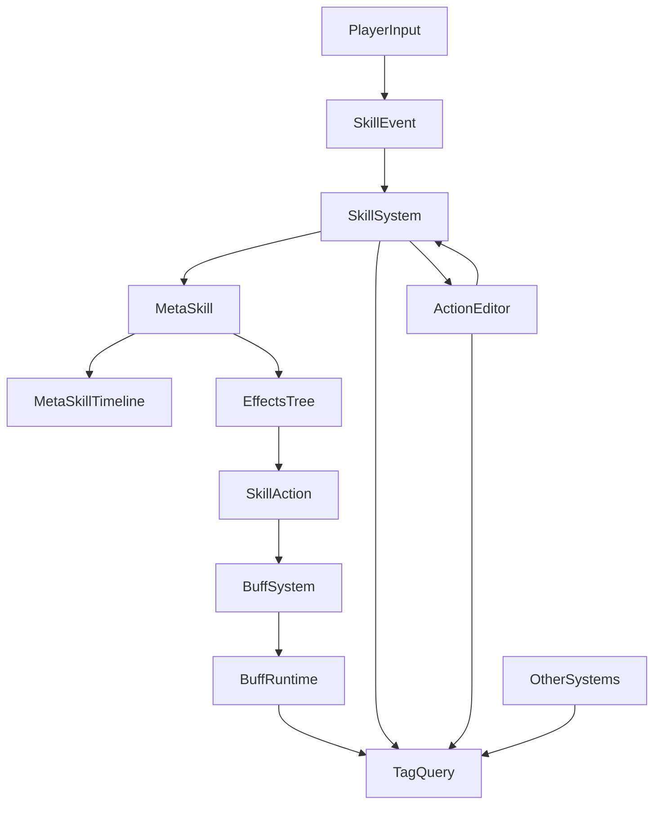

## 目标
- 加快Arpg游戏中技能的开发效率和灵活性。数据驱动、可视化编辑，方便开发人员迅速配置出一个技能：包括技能动画、特效、音效、输入监听、事件驱动（如某些被动）、技能效果、攻击判定、对Action的影响、打断判定等。有关技能的一切，该技能编辑器都要全部覆盖。
- 目前市面上主流上的技能编辑器都是单一的节点型或timeline式的，两者各有优劣。我希望结合两者的优点：用节点来处理复杂技能或技能效果间的逻辑关系、用timeline处理技能释放期间的细节表现：动画、攻击判定、特效等。
- 非常重要的一点：技能本身的开发，要脱离角色、脱离状态——实现完全的灵活插拔。举例：原神和哈迪斯。原神的技能和人物高度绑定，人物-输入-状态（技能）完全一体。哈迪斯：根据武器，角色可以使用不同的技能。而我想要的效果偏向于后者，甚至更甚于后者：玩家角色唯一，玩家有x个技能槽位，随着游戏的进行，玩家会解锁各种技能。玩家可以自由的配置自己想要的技能的组合。把技能20、1、3配置到槽位1（Q)、2(E)、3(R)中，玩家就有了全新的三个技能。这意味着，不能直接使用actionEditor配置一个技能1、技能2、技能3。因为技能不确定，动画不确定。这就是为什么，需要单独做一个skillEditor，母的就是将技能和状态划分。
- 支持各种复杂的技能触发方式，且要灵活。比如之前的例子：技能20虽然是按Q触发，但可能有两种模式，长按Q，是一种，短按Q,是一种，或者释放完后，还有连段。参考原神里刻晴的星斗归位。
- 该技能编辑器相对独立，不与其他系统耦合。但是考虑到后续开发一定会有状态机或者说ActionEditor这种，技能必然会影响状态。状态也会影响技能。这里要考虑扩展。我的思路是，比如定义一个casting状态，释放技能时，会publish一个事件：casting.action系统会监听到事件，改变state为casting。这样就实现了skill和actionState的解耦。而action如何影响skill,比如怪物重击我方，我方可能会在技能释放的时候倒地，导致技能的中断——我的想法是技能会配置一个可打断区（或者单位事件，在事件的有效区允许被打断），当敌人攻击我方，这次攻击累计的失衡值大于一定数值，技能可以被打断，就会被打断。技能会skill.stop。同时发出event:quitCasting。只负责告诉其他系统，退出了施法阶段。而后续是倒地还是击退等，则完全由其他系统处理——我希望系统尽量减少和其他系统的耦合。
## 模块和模块间的关系

![[Component 1.png]]


- Skill是完整的一个技能体，由MetaSkill组成，MetaSkill间主要通过Event联系起来。SkillEditor的职责就是用节点编辑器的方式编辑技能的MetaSkill间的关系。
- MetaSkill是技能系统最核心的组件。由Bullet、HitBox、MetaSkillEvent、Effects、View（Anim、Audio和特效）组成。MetaSkillTimeLine的职责就是用TimeLine编辑器的方式处理MetaSkill的各个轨道。
- Bullet是子弹，专门为远程技能服务，用来做目标判定。当命中敌人，会和近战的HitBox一样对目标触发对应的Effects。
- HitBox是攻击盒，专门为近战技能技能服务。当命中敌人，会对目标触发对应的Effects。
- Effects是技能效果。由SkillCondition和SkillAction组成。当Effect触发，按照触发逻辑，判定SkillAction是否生效。EffectsEditor的职责就是用节点编辑器的方式编辑Conditions和Actions间的关系。
- SkillCondition是技能效果触发条件，用来判定某些Action是否可以触发。
- SKillAction是技能实际效果，比如造成伤害、添加buff、添加被动、属性增加，都将实际通过SkillAction实现。是最复杂、工作量最大也是玩法层最核心的部分。
- View:指动画、摄像机、特效、音效等部分。MetaSkillTimeLine下面组件，组件有复数轨道，动画默认只有一个轨道，特效、音效、摄像机都不固定。
## 编辑器界面
### SkillEditorMainWindow:负责管理Skill和MetaSKill——创建和删除。是技能编辑器的入口。
![[SkillEditorMainWindow 1.png]]

### SkillInfo:当新建技能，点击列表中技能按钮，可以对该技能进行编辑，定义技能的基础信息，以及打开（这里的技能状态机描述有误）技能节点编辑器——编辑具体的技能逻辑。
![[SkillInfo 2.png|714]]

### MetaSkillInfo:新建MetaSkill,点击列表中MetaSkill技能按钮，可以对MetaSkill进行编辑，定义MetaSkill的必要信息（技能冷却、消耗、动画（没有就不配）、OnAdd、OnEnd是释放技能时和timeline无关的施加的effects。点击effects(BT)会进入effectsEditor，编辑具体的效果逻辑。OnUpdate是打开metaSkillTimeLine，对具体的技能施法时的编辑。如果metaSkill配置了动画，metaSkillTimeLine才生效，才可以打开。

![[MetaSkillInfo.png]]
### SkillEditor:+号可以添加层级，不同的层级可以配置不同的技能逻辑；是为了类似于英雄联盟里维克兹的w这种充能型技能而设计：可以同时储存多个技能。cd独立计算。右边的节点图，节点是metaSkill。线是event。
![[SkillFSMEditor.png]]
### MetaSkillNode：右键SkillEditor，可以创建MetaSkillNode,点击Node,可以选择MetaSkill(就是mainwindow里配置好metaSkill，都会在这里出现,这里缺少一些东西，我打算增加额外的行动：比如setindex=1)
![[metaSkill 1.png]]
### EventInfo:点击连线，可以配置连线是哪些event组成，也可以选择是同时满足或任意的逻辑。（图中没提：我打算增加一些额外的判定，比如判断index是否等于0)
![[EventInfo.png]]
### MetaSkillTimeLine:最重要的编辑器部分。可以通过点击向左一帧、暂停播放、向右一帧来预览技能动画、滑块调节动画播放速度、移动蓝色时间滑块调节动画播放位置。AnimationClip只有一个默认轨道。其他都可以有复数轨道。这里各个组件的作用已经说明，这里不做赘述。当点击+创建对应轨道。右键轨道，出现下拉框，选择创建比如攻击盒（图中绿色）。攻击盒可以拖动调整位置，也可以调整攻击盒的长度（表示在timeline里生效的范围）。
![[MetaSkillTimeLineEditor.png]]
### HitBoxInfo:点击攻击盒，可以查看可以配置攻击盒（且要支持能在编辑器scene里看到盒子的具体情况（gizmos))。其他地方不做赘述，烘焙参考AsiActionEditor，这里的设计和它完全保持一致。重点是施加效果，意思是攻击命中，会施加效果。点击effects(BT)打开对应的effectsEditor配置具体的效果。
![[HitBoxInfo.png]]
### BulletInfo:点击子弹显示子弹信息。其他同攻击盒。类型可以选择不同的子弹类型：直线、抛物线、追踪曲线等。
![[BulletInfo.png]]
### EffectEditor:技能效果编辑器：Logic现在只保留了一个Sequence。表示顺序执行子节点。Condition用来判定条件是否满足，满足，执行右子节点，不满足，执行左子节点，如果只有一个节点，则直接失败。Action就是实际执行的节点。目前设计只能按顺序执行，不允许并行。
![[EffectsBTEditor 1.png]]
### EffectNodeInfo:点击对应节点，显示具体信息（这里拿Action举例）这里少了一个ActionType(选择是什么Action),Targets默认是继承攻击盒，也可以有下拉框选自己或其他逻辑。
![[NodeInfo.png]]
## 数据
仿照AsiActionEditor做数据部分的处理：生成一个json、一个byte。运行时loadData使用byte，editor使用json。
## 运行时
仿照AsiActionEditor的设计和我自己之前设计的一个SkillSystem。参考对照，进行设计。
## 特殊：如何接入ActionEditor
优先完成技能编辑器本体，留扩展，后续可能会接入AsiActionEditor或其他ActionEditor（反正和状态相关）
## 技术栈
Unity+C#
节点图部分（GraphView)
TimeLine部分和其他所有编辑器UI(IMGUI)

## 数据分层约定
为了避免后续开发中“编辑器数据”、“配置数据”、“运行时实例”混淆，SkillEditor 的数据统一拆成三层：

### 1. Editor层
- 仅服务于编辑器本身。
- 允许保存节点坐标、轨道折叠状态、Inspector 当前选择、窗口可视化信息等。
- 不直接给运行时使用。
- 命名统一为：`EditorXxx`

示例：
- `EditorSkill`
- `EditorMetaSkill`
- `EditorMetaSkillNode`
- `EditorSkillEvent`
- `EditorEffectsTree`

### 2. Config层
- 表示真正的技能逻辑配置，是技能系统最核心的资源层。
- 不关心编辑器里节点摆在哪里，但关心技能具体由什么组成、如何触发、如何执行。
- 运行时会根据 Config 层构建 Runtime 层。
- 命名统一为：`XxxConfig`

示例：
- `SkillConfig`
- `MetaSkillConfig`
- `SkillEventConfig`
- `MetaSkillTimelineConfig`
- `HitBoxConfig`
- `BulletConfig`
- `EffectsTreeConfig`
- `BuffConfig`

### 3. Runtime层
- 表示游戏运行时真正参与执行的实例。
- 由 Config 层在运行时或加载阶段构造。
- 命名统一为：`XxxRuntime`

示例：
- `SkillRuntime`
- `MetaSkillRuntime`
- `SkillEventRuntime`
- `MetaSkillTimelineRuntime`
- `HitBoxRuntime`
- `BulletRuntime`
- `EffectsTreeRuntime`
- `BuffRuntime`

## 核心对象职责划分
### Skill
- `SkillConfig`：一个完整技能的配置。
- 它负责描述：技能基础信息、Layer、MetaSkill间的流转关系。
- 它不直接负责：每一帧怎么跑、碰撞怎么检测、buff如何更新。

### MetaSkill
- `MetaSkillConfig`：可复用的元技能模板资源。
- 它负责描述：冷却、消耗、动画、`OnAdd`、`OnEnd`、`OnUpdate/Timeline` 等。
- 不同 `Skill` 可以引用同一个 `MetaSkillConfig`。
- 但运行时真正执行时，必须构造自己的 `MetaSkillRuntime`。

### MetaSkill节点
- `EditorMetaSkillNode`：SkillEditor 节点图中的节点实例。
- 节点不等于 `MetaSkillConfig` 本体。
- 节点只是“引用某个 MetaSkillConfig”，同时可以带自己的附加配置。

例如：
- 同一个 `MetaSkillConfig` 可以在同一个 `Skill` 中被多次引用。
- 因此节点层和 `MetaSkillConfig` 层必须分开。

### SkillEvent
- `SkillEventConfig`：MetaSkill 节点之间连线的配置。
- 它负责描述：
  - 触发类型
  - 满足逻辑（同时满足 / 任意满足）
  - 条件列表
  - 参数
- 连线本身就是事件，不是装饰。

### EffectsTree
- `EffectsTreeConfig`：一棵内嵌的效果树配置。
- 它不复用，不做公共资源。
- 复用的是 `Condition` 和 `Action` 的节点类型，而不是整棵树。

内嵌位置包括：
- `MetaSkill.OnAdd`
- `MetaSkill.OnEnd`
- `HitBox` 命中施加效果
- `Bullet` 命中施加效果

### SkillAction
- `SkillAction` 只执行瞬时行为。
- 比如：
  - 造成伤害
  - 添加 buff
  - 移除 buff
  - 发布事件
  - 修改值
- 持续行为不由 `SkillAction` 自己负责维持。

### Buff
- `BuffConfig` / `BuffRuntime` 属于独立 BuffSystem。
- SkillSystem 只负责通过 `AddBuffAction`、`RemoveBuffAction` 等动作去操作 BuffSystem。
- Buff 的持续时间、挂点特效、叠层规则、周期更新等，都不归 SkillSystem 本体负责。

## 运行时构建关系
SkillEditor 的运行时构建关系建议统一理解为：

```text
Editor层
  ↓（整理/导出）
Config层
  ↓（加载/构造）
Runtime层
```

进一步展开：

```text
EditorSkill
  ↓
SkillConfig
  ↓
SkillRuntime

EditorMetaSkill
  ↓
MetaSkillConfig
  ↓
MetaSkillRuntime
```

需要特别注意：
- `MetaSkillConfig` 是模板资源。
- `MetaSkillRuntime` 是运行时实例。
- `EditorMetaSkillNode` 只是图中的节点实例，不等于模板，也不等于运行时实例。

## Timeline与动画的关系
- `MetaSkillTimeline` 必须依赖动画。
- 如果 `MetaSkillInfo` 中没有配置 `anim`：
  - 则 `MetaSkillTimeline` 不可打开、不可使用、不生效。
  - 该 `MetaSkill` 只执行 `OnAdd` 和 `OnEnd`。
- 这种 `MetaSkill` 常用于：
  - 被动技能
  - 无动画逻辑型技能

## EffectsEditor执行语义
当前 `EffectsEditor` 只保留三种节点：
- `Sequence`
- `Condition`
- `Action`

执行规则：
- `Sequence`：顺序执行子节点，不允许并行。
- `Condition`：满足时执行右子节点，不满足时执行左子节点。
- 若某个分支不存在，则该分支直接失败。

## Skill、Buff、Action三者边界
### SkillSystem负责
- 技能触发
- MetaSkill 流转
- Timeline 编排
- HitBox / Bullet / Effects 的组织
- 向其他系统发送事件

### BuffSystem负责
- Buff 的添加、移除、更新、过期
- Buff 挂点特效
- 持续属性修正
- 叠层、刷新、覆盖

### ActionEditor负责
- 状态与动作本体
- 动画状态切换
- Action 时间轴与动作事件

三者关系：
- Skill 可以影响 Action，但尽量通过事件解耦。
- Skill 可以给单位加 Buff，但 Buff 的内部逻辑不归 Skill 负责。
- Action 影响 Skill 时，也尽量通过中断、退出施法、信号通知等方式进行，而不是直接硬耦合。

## 主动技能与被动技能的统一理解
当前建议统一采用“事件驱动”的理解方式：

- 主动技能：输入系统不直接释放技能，而是发送事件，例如 `castingSkill1`
- 被动技能：由外部事件触发，例如受击、击杀、进入区域等

因此，主动与被动在顶层都可以理解为：
- “某个事件触发了 SkillSystem”

但为了避免后续事件过于混乱，后续实现时建议保留一个统一入口：
- 输入层负责发送“技能请求”
- SkillSystem 负责接收请求，并转为技能内部事件逻辑

## 命名规范建议
为了避免开发中继续混淆，建议后续统一采用以下命名：

### Editor层
- `EditorSkill`
- `EditorMetaSkill`
- `EditorMetaSkillNode`
- `EditorSkillEvent`
- `EditorEffectsTree`

### Config层
- `SkillConfig`
- `MetaSkillConfig`
- `SkillEventConfig`
- `MetaSkillTimelineConfig`
- `HitBoxConfig`
- `BulletConfig`
- `EffectsTreeConfig`
- `BuffConfig`

### Runtime层
- `SkillRuntime`
- `MetaSkillRuntime`
- `SkillEventRuntime`
- `MetaSkillTimelineRuntime`
- `HitBoxRuntime`
- `BulletRuntime`
- `EffectsTreeRuntime`
- `BuffRuntime`

## 当前阶段结论
当前阶段最重要的不是继续细化 UI，而是先统一下面几个概念：
- `SkillConfig`
- `MetaSkillConfig`
- `EditorMetaSkillNode`
- `SkillEventConfig`
- `EffectsTreeConfig`
- `BuffConfig`

只要这些对象的职责边界和命名先统一，后续 GraphView、Timeline、运行时 byte/json 导出就会清晰很多。

## SkillEvent 一级分类建议
这里先不穷举全部具体事件，只先定义“事件的一级分类”，用于明确 SkillEditor 的连线（Event）大致会承载哪些类型的触发源。

### 1. 输入事件
- 用于主动技能输入触发。
- 典型特征：
  - 通常由输入层发送请求或事件
  - 可以带按键类型、按下/释放/长按等参数
- 示例：
  - `PressSkillSlot`
  - `ReleaseSkillSlot`
  - `HoldSkillSlot`

### 2. MetaSkill 生命周期事件
- 用于 MetaSkill 节点之间的流转。
- 典型特征：
  - 与当前 MetaSkill 自身执行状态有关
  - 常用于连段、派生、结束后接下一段
- 示例：
  - `OnMetaSkillBegin`
  - `OnMetaSkillEnd`
  - `OnMetaSkillCancel`

### 3. 技能系统信号事件
- 用于 SkillSystem 内外部系统之间通过信号协作。
- 典型特征：
  - 更偏系统消息而不是输入
  - 适合做解耦扩展
- 示例：
  - `SignalReceived`
  - `CastingBegin`
  - `QuitCasting`

### 4. 命中相关事件
- 用于根据技能释放过程中的命中结果来驱动 SkillFSM 流转。
- 典型特征：
  - 和 HitBox / Bullet / 命中结果有关
  - 常用于命中后派生技能或条件追击
- 示例：
  - `OnHitTarget`
  - `OnHitAny`
  - `OnBulletArrive`

### 5. 受击 / 打断事件
- 用于技能释放过程中受到外部影响时的流转。
- 典型特征：
  - 由外部战斗系统或状态系统触发
  - 常用于退出技能、进入失败分支、中断施法
- 示例：
  - `OnInterrupted`
  - `OnBreakThresholdReached`
  - `OnBeHit`

### 6. 被动 / 外部系统事件
- 用于支持被动技能、遗物、祝福等事件驱动能力。
- 典型特征：
  - 来源可能不是输入，而是战斗事件、环境事件、角色事件
  - 后续很适合扩展为统一能力系统触发源
- 示例：
  - `OnKillTarget`
  - `OnEnterArea`
  - `OnBuffAdded`

### 当前建议
- `SkillEvent` 先只定一级分类。
- 每个具体事件后续再补充：
  - 是否带参数
  - 参数结构
  - 是否为瞬时触发
  - 是否需要持续监听

## SkillCondition 一级分类建议
Condition 用于判断某个 Event 是否满足流转条件，或者某个 EffectsTree 中某条逻辑是否成立。

### 1. 数值比较类
- 用于比较某个数值是否满足条件。
- 示例：
  - `Index == 0`
  - `TargetHpPercent < 20%`
  - `BreakValue >= X`

### 2. 状态检查类
- 用于判断某个状态是否存在。
- 示例：
  - `IsCasting`
  - `IsOnGround`
  - `IsInAir`

### 3. Buff 检查类
- 用于和 BuffSystem 交互。
- 示例：
  - `HasBuff`
  - `BuffStack >= X`
  - `BuffRemainTime > X`

### 4. Tag 检查类
- 用于检查目标、自身、技能、buff、状态等对象身上是否带有某些 Tag。
- Tag 是跨系统协作的重要胶水层。
- 示例：
  - `HasTag(Frozen)`
  - `HasTag(Uninterruptible)`
  - `HasTag(ImmuneDebuff)`

### 5. 技能上下文类
- 用于读取当前 SkillSystem 内部的上下文。
- 示例：
  - `SkillLayerIndex == 1`
  - `CurrentMetaSkill == XXX`
  - `NodeLocalValue == XXX`

### 6. 目标信息类
- 用于判断目标是否满足条件。
- 示例：
  - `TargetIsBoss`
  - `TargetDistance < X`
  - `TargetHasDebuff`

### 7. 随机与概率类
- 用于支持玩法上的随机触发。
- 示例：
  - `RandomChance`
  - `CriticalRollPass`

### 当前建议
- Condition 先只定一级分类和参数形式。
- 统一约束：
  - Condition 的返回值永远是 `bool`
  - Condition 可以被“同时满足 / 任意满足”组合
- 具体条件项可以后续随着玩法扩展慢慢增加。

## SkillAction 一级分类建议
Action 只负责“瞬时执行”的操作，不负责长期维持。长期持续效果交由 BuffSystem 或其他子系统管理。表现层（特效、音效、摄像机等）原则上由 Timeline 的 Track 负责，不放进 SkillAction 体系。

### 1. 即时效果类
- 直接对目标产生一次性结算。
- 示例：
  - `DealDamage`
  - `Heal`
  - `AddToughnessDamage`

### 2. Buff 操作类
- 通过 Action 去驱动 BuffSystem。
- 示例：
  - `AddBuff`
  - `RemoveBuff`
  - `RefreshBuff`

### 3. 数值修改类
- 对 SkillSystem 或临时上下文做瞬时值修改。
- 示例：
  - `SetIndex`
  - `SetInt`
  - `SetFloat`
  - `SetBool`

### 4. 技能流转控制类
- 用于影响 SkillSystem 本体的流程。
- 示例：
  - `StopSkill`
  - `JumpToMetaSkill`
  - `ResetLayer`

### 5. 外部系统调用类
- 用于向其他系统发出调用或请求。
- 示例：
  - `PublishSignal`
  - `CallActionSystem`
  - `CallQuestSystem`

### 6. 系统对象操作类
- 用于驱动非表现层、非 buff 的系统对象或逻辑对象。
- 这里不负责直接做表现，而是负责发起逻辑对象的创建/销毁/控制。
- 示例：
  - `SpawnLogicObject`
  - `DestroyLogicObject`
  - `RegisterSkillEntity`

### 当前建议
- `SkillAction` 先只定一级分类。
- 具体 Action 后续再决定：
  - 作用目标
  - 参数结构
  - 是否可配置返回值
  - 是否需要调用外部系统

## 当前阶段的落地建议
现阶段不需要穷举所有具体 `Event / Condition / Action`，否则容易在纯思维层卡住太久。

当前最合理的方式是：
- 先把一级分类定下来
- 再选一小批最核心的具体项作为第一版实现集

建议第一版优先实现时，只选最必要的少量能力：

### 第一版 Event 可优先考虑
- 输入事件
- MetaSkill 生命周期事件
- 打断事件

### 第一版 Condition 可优先考虑
- 数值比较类
- 技能上下文类
- Buff 检查类
- Tag 检查类

### 第一版 Action 可优先考虑
- 即时效果类
- Buff 操作类
- 数值修改类
- 技能流转控制类

## Tag 体系建议
Tag 是一个非常关键的跨系统概念。它本身不是某个单独系统，而更像是连接 Skill、Buff、状态、目标判定等系统的“胶水层”。

### Tag 的作用
- 用统一方式表达某个对象当前携带的语义状态。
- 让不同系统之间通过同一种判断方式协作，而不需要彼此直接了解内部实现。

### 哪些对象可以携带 Tag
- 角色
- Skill
- MetaSkill
- Buff
- 状态
- 目标

### Tag 的典型用途
#### 1. Buff 判断
- 判断目标身上是否存在某类效果。
- 示例：
  - 敌人是否带有 `Frozen`
  - 敌人是否带有 `Burning`

#### 2. 中断与保护
- 通过 Tag 判断当前技能或状态是否允许被打断。
- 示例：
  - `Uninterruptible`
  - `SuperArmor`

#### 3. 免疫与限制
- 通过 Tag 判断某类效果是否免疫。
- 示例：
  - `ImmuneDebuff`
  - `Invincible`
  - `ImmuneControl`

#### 4. 技能联动
- 通过 Tag 让 Skill、Buff、状态之间建立弱耦合联系。
- 示例：
  - 某技能只对带 `Frozen` Tag 的目标触发额外效果
  - 某状态下角色释放技能会自动附带 `CastingProtected`

### 当前建议
- Tag 暂时不需要独立成一个专门编辑器。
- 但应尽早作为基础概念写入设计案。
- `SkillCondition` 中应明确支持 `Tag检查类`。
- `BuffSystem`、`SkillSystem`、状态系统后续都应预留 Tag 查询接口。

### 关于附魔等持续特效
像“雷属性附魔”这种效果，不属于 SkillSystem 本体长期维护的内容，而应通过：
- `SkillAction -> AddBuff`
- `BuffRuntime` 负责持续时间与逻辑
- `Buff` 配置挂点路径、特效等信息

也就是说：
- SkillSystem 负责触发
- BuffSystem 负责持续
- Tag 负责让外部系统知道当前对象带有什么语义状态

## SkillSystem、BuffSystem、Tag、ActionEditor 关系图
这一节用于把几个最容易混淆的系统边界明确下来。

### 系统关系图


### 一句话理解
- `SkillSystem` 负责技能编排与触发。
- `BuffSystem` 负责持续性效果。
- `Tag` 负责跨系统判断与协作。
- `ActionEditor` 负责动作和状态，不直接接管技能逻辑。

## 系统职责表
| 系统 | 负责什么 | 不负责什么 | 与其他系统如何协作 |
|---|---|---|---|
| `SkillSystem` | 技能触发、MetaSkill流转、Timeline编排、HitBox/Bullet/Effects组织 | Buff持续更新、角色状态本体维护、长期挂件表现 | 通过 `SkillAction` 调用 BuffSystem；通过事件/信号与 ActionEditor 协作；通过 Tag 做条件判断 |
| `BuffSystem` | Buff 添加、移除、更新、过期、叠层、挂点特效 | 技能节点流转、Timeline编排、动作状态切换 | 接收 `AddBuff/RemoveBuff` 类 Action；运行中向 Tag 系统暴露状态 |
| `Tag` | 跨系统语义状态表达与查询 | 不负责实际逻辑执行 | 提供统一判断入口，供 Skill、Buff、Action、状态系统查询 |
| `ActionEditor` | 动作、状态、动画状态切换、Action 时间轴与动作事件 | 技能本体逻辑、技能效果树、Buff 生命周期 | 监听 SkillSystem 发出的信号；必要时通过打断/退出施法等方式影响 SkillSystem |

## 对象关系理解
### 1. SkillSystem 与 BuffSystem
- `SkillSystem` 不能直接承担持续性效果。
- 如果一个技能需要“持续3秒的雷附魔”：
  - SkillSystem 只会执行一次 `AddBuffAction`
  - BuffSystem 负责创建对应 `BuffRuntime`
  - 后续 3 秒内发生什么，都由 BuffSystem 自己处理

### 2. SkillSystem 与 Tag
- `SkillSystem` 自己可以带 Tag。
- `Skill`、`MetaSkill`、目标、状态、Buff 都可以提供 Tag 查询能力。
- `SkillCondition` 中很多判断最终会落到 Tag 查询上。

比如：
- 目标是否有 `Frozen`
- 当前技能是否有 `Uninterruptible`
- 目标是否有 `ImmuneDebuff`

### 3. BuffSystem 与 Tag
- Buff 本身是 Tag 的重要来源之一。
- 有些 Tag 不一定来自 Buff，但很多玩法层语义会通过 Buff 挂出 Tag。

例如：
- `Frozen`
- `Burning`
- `Invincible`
- `ImmuneDebuff`

### 4. SkillSystem 与 ActionEditor
- `SkillSystem` 和 `ActionEditor` 是平级系统。
- 两者都可能影响对方，但应尽量通过事件、信号或统一接口协作。

推荐理解：
- SkillSystem 负责发出“我要进入施法阶段”“我要退出施法阶段”这类意图
- ActionEditor 负责决定动画和状态怎么变化
- 如果外部打断发生，ActionEditor 或战斗系统也可以通过事件通知 SkillSystem 停止技能

### 5. Timeline 与表现层
- 表现层默认归 `Timeline Track` 管理。
- 所以这些内容原则上不应该做成 `SkillAction`：
  - 播放特效
  - 播放音效
  - 镜头表现

这些更适合：
- `VFX Track`
- `Audio Track`
- `View Track`

而 `SkillAction` 更应该负责：
- 伤害
- 加 Buff
- 移除 Buff
- 改值
- 发信号
- 控制技能流转

## 典型案例：雷属性附魔
### 需求
- 某技能命中或释放后，给角色武器附加 3 秒雷属性附魔
- 持续期间武器挂一个雷特效
- 普通攻击附带雷属性

### 正确分工
#### SkillSystem
- 负责在某个时机执行 `AddBuffAction(LightningEnchant)`

#### BuffSystem
- 负责创建 `LightningEnchantBuffRuntime`
- 负责持续时间计时
- 负责附魔期间的属性修改
- 负责挂点特效管理

#### Tag
- 给角色或武器暴露 `LightningEnchant`
- 供其他系统查询

#### ActionEditor 或战斗系统
- 在普通攻击命中逻辑里，根据 Tag 或 Buff 结果决定是否附加雷属性处理

### 结论
- “雷附魔”不是 Timeline 本体负责长期维护的东西
- 也不是 SkillSystem 自己一直维护的东西
- 正确归属应该是：
  - SkillSystem 负责触发
  - BuffSystem 负责持续
  - Tag 负责跨系统可见性

## 当前阶段的原则总结
- `SkillSystem` 负责技能逻辑的开始、流转、结束
- `BuffSystem` 负责持续效果
- `Tag` 负责跨系统语义判断
- `ActionEditor` 负责状态和动作
- `Timeline` 负责施法过程中的表现和时序

只要坚持这个边界，后续系统再复杂，也不会轻易互相缠死。

## SkillEvent、MetaSkillEvent、SkillAction 职责对照
这三个概念非常容易混淆，必须明确分开。

| 名称 | 所在位置 | 负责什么 | 不负责什么 |
|---|---|---|---|
| `SkillEvent` | `SkillEditor` 图上的连线 | 控制 `MetaSkillNode` 之间如何流转 | 不负责施法过程中的具体行为，不负责战斗效果结算 |
| `MetaSkillEvent` | `MetaSkillTimeline` 的事件轨道 | 负责施法过程中的运行时行为事件 | 不负责效果树里的战斗结算，不负责 SkillFSM 图层流转本身 |
| `SkillAction` | `EffectsTree` 的 `Action` 节点 | 负责瞬时战斗效果结算 | 不负责表现播放，不负责子弹/攻击盒生成，不负责技能状态流转 |

### 进一步理解
#### SkillEvent
- 是图层级事件。
- 它的职责是让一个 `Skill` 在不同 `MetaSkillNode` 之间发生切换。
- 它更像“什么时候从节点A进入节点B”的规则。

#### MetaSkillEvent
- 是施法过程中的行为事件。
- 它发生在 `MetaSkillTimeline` 内部。
- 典型用途：
  - 瞄准
  - 软锁定
  - 开启/关闭可打断区间
  - 其他和施法过程强相关，但又不属于纯表现或纯结算的行为

#### SkillAction
- 是效果树中的瞬时动作。
- 它的职责非常单一，专注于战斗效果本身。
- 典型用途：
  - 造成伤害
  - 添加 Buff
  - 移除 Buff

## 第一版最小实现集建议
这一节不是在定义最终完整能力，而是在定义“SkillEditor 第一版真正需要先做出来的能力范围”。目标是：
- 先打通完整流程
- 先验证编辑器结构
- 先验证运行时数据链路
- 避免一开始就陷入大量细节实现

原则：
- 第一版优先支持“主动技能”
- 第一版优先支持“近战攻击盒 + 基础子弹 + 基础效果”
- 第一版优先支持“技能流转、基础中断、基础 buff 交互”
- 复杂联动、复杂被动、复杂目标筛选先延后

## 第一版 SkillEvent 最小实现集
### 1. 输入触发类
这是主动技能最基础的一类事件。

建议先做：
- `PressSkillSlot`
- `ReleaseSkillSlot`
- `HoldSkillSlot`

说明：
- 虽然主动技能本质也按事件驱动理解，但第一版依旧需要把最基础输入事件先做出来。
- 这三项足够覆盖：
  - 点按释放
  - 长按分支
  - 松开触发

### 2. 命中类
用于支撑命中后派生。

建议先做：
- `OnHitTarget`

说明：
- 第一版不必细分命中什么类型的目标。
- 有一个“命中了目标”就足够支撑很多技能逻辑验证。

### 当前说明
- 第一版先不做 `MetaSkill` 生命周期类。
- 第一版先不做“中断事件”作为 `SkillEvent`。
- 中断属于 `MetaSkill` 在运行时根据可打断区域和条件自行判断的逻辑，不通过 SkillFSM 图上的连线事件表达。

## 第一版 SkillCondition 最小实现集
### 1. 属性比较类
建议先做：
- `CurrentHpCompare`
- `MaxHpCompare`
- `AttackCompare`
- `BreakValueCompare`

典型用途：
- `当前生命值 < X`
- `攻击力 >= X`
- `失衡值 > X`

说明：
- 这里不是泛化“任意数值比较”，而是偏业务的属性判断。
- 属性系统本体虽然不在 SkillEditor 中深度配置，但技能系统需要能读取属性结果。

### 2. Buff 检查类
建议先做：
- `HasBuff`

说明：
- 第一版先不做 BuffStack 和剩余时间判断。
- 只要能判断“有 / 没有某个 buff”即可。

### 3. Tag 检查类
建议先做：
- `HasTag`

说明：
- 这是第一版非常关键的一项。
- 因为它可以打通：
  - 无法打断判断
  - 免疫判断
  - 冰冻/无敌/免疫减益等玩法判断

### 4. 执行结果类
建议先做：
- `LastActionSucceeded`
- `LastActionFailed`

说明：
- 用于表达“当前一个 Action 执行成功/失败，才决定是否继续”这类逻辑。
- 这比泛化的技能上下文类更符合当前第一版需求。

### 当前说明
- 第一版不做输入状态类。
- 第一版不做目标信息类。
- 第一版不做过宽泛的技能上下文类。

## 第一版 SkillAction 最小实现集
### 1. 即时效果类
建议先做：
- `DealDamage`
- `AddToughnessDamage`

说明：
- `DealDamage` 是最核心的玩法 Action。
- `AddToughnessDamage` 用于后续和打断、失衡体系接轨。

### 2. Buff 操作类
建议先做：
- `AddBuff`
- `RemoveBuff`

说明：
- 这两项就足够支撑：
  - 附魔
  - 持续增益
  - 持续减益
  - 基础状态移除

### 当前说明
- 第一版 `SkillAction` 不做数值修改类。
- 第一版 `SkillAction` 不做技能流转控制类。
- 第一版 `SkillAction` 不做外部系统调用类。
- 第一版 `SkillAction` 不做系统对象操作类。
- `setIndex` 这类行为应视为 `Skill` / `MetaSkill` 本身的方法或上下文控制能力，而不是 `SkillAction`。
- `StopMetaSkill` 属于 `MetaSkillTimeline` / `MetaSkill` 自身控制逻辑，不属于 `SkillAction`。
- `SpawnBullet` / `SpawnHitBox` 属于 Timeline 轨道配置驱动的对象生成，不属于 `SkillAction`。

## 第一版 MetaSkillEvent 最小实现集
`MetaSkillEvent` 是第一版非常重要的一层，因为很多运行时行为既不属于战斗结算，也不适合放到 ActionEditor 中。

### 建议先做
- `AimControl`
- `SoftLockTarget`
- `SetInterruptWindow`

### 说明
- `AimControl`
  - 用于处理例如刻晴长按 E 的瞄准逻辑。
- `SoftLockTarget`
  - 用于处理近战攻击中的软锁定。
- `SetInterruptWindow`
  - 用于配置某一时间段内是否允许被打断。
  - 运行时由 `MetaSkill` 自己根据“可打断区间 + 当前失衡值”决定是否 `stopMetaSkill`。

### 当前说明
- `MetaSkillEvent` 是对 `SkillAction` 的必要补充。
- 它不负责战斗结算。
- 它负责施法过程中的“运行时行为”。

## 第一版 EffectsEditor 最小实现集
### Logic
- `Sequence`

### Condition
- `CurrentHpCompare`
- `HasBuff`
- `HasTag`
- `LastActionSucceeded`
- `LastActionFailed`

### Action
- `DealDamage`
- `AddBuff`
- `RemoveBuff`

说明：
- 第一版 EffectsEditor 不需要过度丰富。
- 只要能支撑：
  - 命中造成伤害
  - 命中上 buff
  - 命中移除某 buff
  - 根据 Tag / Buff / 前序动作结果决定是否生效
就足够验证整套效果树链路。

## 第一版 MetaSkillTimeline 最小实现集
### 必做轨道
- `AnimationClip`（默认单轨）
- `HitBoxTrack`
- `BulletTrack`
- `EventTrack`
- `VFXTrack`
- `AudioTrack`

### 可延后轨道
- `CameraTrack`
- `ActionCallTrack`
- `SignalTrack`

说明：
- 第一版先优先保证施法表现闭环：
  - 动画
  - 攻击判定
  - 子弹
  - 技能事件
  - 基础表现

## 第一版 SkillEditorMainWindow 最小实现集
建议第一版只先支持：
- Skill 列表
- MetaSkill 列表
- 新建 / 删除 / 保存
- 点击 Skill 打开 SkillEditor
- 点击 MetaSkill 打开 MetaSkillInfo

以下内容可以晚一点补：
- 复制
- 搜索
- 分类
- 批量管理

## 第一版 SkillEditor（SkillFSM）最小实现集
建议第一版先支持：
- `Entry`
- `Exit`
- `MetaSkillNode`
- `Event` 连线
- `Layer` 切换
- 节点选择打开 `MetaSkillNodeInfo`
- 连线选择打开 `EventInfo`

第一版只要先验证：
- 一个技能可以由多个 MetaSkill 串联
- 可以通过输入或命中流转
- 可以通过 Timeline 事件配置施法行为
- MetaSkill 可以在运行时自行判断并停止

## 第一版明确暂不实现的内容
为了避免范围失控，建议第一版先不做这些：

### Event 暂不做
- `MetaSkill` 生命周期类
- 中断类
- 大量复杂被动事件
- 环境事件
- 复杂多来源系统事件

### Condition 暂不做
- 输入状态类
- 目标信息类
- Buff 层数判断
- Buff 剩余时间判断
- 过宽泛的技能上下文类
- 复杂嵌套条件组
- 高级随机逻辑

### Action 暂不做
- 数值修改类
- 技能流转控制类
- 外部系统调用类
- 系统对象操作类
- 复杂外部系统调用
- 复杂对象管理
- 大量玩法特化 Action

### 其他暂不做
- BuffSystem 本体
- 复杂被动技能
- 遗物 / 祝福
- ActionEditor 深度接入
- 大量编辑器体验优化

## 第一版完成标准
如果第一版完成，至少应该能够跑通下面这个完整案例：

### 案例
- 玩家按下技能键
- SkillSystem 收到输入事件
- Skill 进入第一个 MetaSkill
- MetaSkill 播放动画并打开 Timeline
- Timeline 生成攻击盒或子弹
- Timeline 通过 `MetaSkillEvent` 触发瞄准/软锁定/可打断区配置
- 命中目标后触发 EffectsTree
- EffectsTree 根据条件判断执行 `DealDamage` / `AddBuff`
- MetaSkill 在可打断区内根据失衡值自行判断是否 `stopMetaSkill`
- 即使某一段 `MetaSkill` 被打断，也不代表整个 Skill 连段立刻失效

### 只要这个链路通了，就说明第一版的系统骨架成立了。


