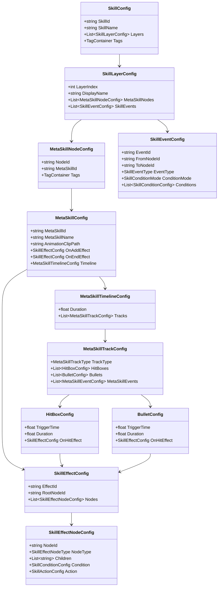
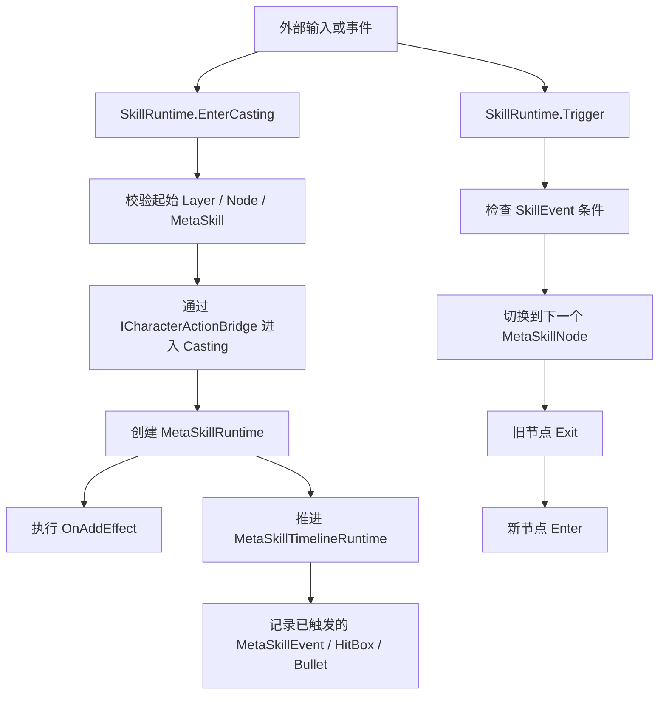

# SkillRuntime 第一版框架说明

## 1. 目标

这一版不是完整技能系统，也不是最终编辑器，而是一个可继续扩展的运行时骨架。

当前目标只有 4 个：

- 定义 `Skill -> MetaSkill -> Timeline -> SkillEffect` 的核心配置结构
- 建立最小运行时执行链
- 把 `Buff`、`Tag`、`Combat`、`ActionEditor` 的耦合点收敛成接口
- 为后续编辑器模块、编译器、注册式工厂预留扩展位

## 2. 本版已完成内容

### 2.1 配置层

已建立以下配置模型：

- `SkillConfig`
- `SkillLayerConfig`
- `MetaSkillNodeConfig`
- `SkillEventConfig`
- `MetaSkillConfig`
- `MetaSkillTimelineConfig`
- `MetaSkillTrackConfig`
- `HitBoxConfig`
- `BulletConfig`
- `MetaSkillEventConfig`
- `SkillEffectConfig`
- `SkillEffectNodeConfig`
- `SkillConditionConfig`
- `SkillActionConfig`

这意味着目前已经可以表达：

- 一个技能有多个逻辑层 `Layer`
- 每个 `Layer` 内有多个 `MetaSkillNode`
- 节点之间通过 `SkillEvent` 进行状态切换
- 每个 `MetaSkill` 自带 `OnAddEffect`、`OnEndEffect`、`Timeline`
- `Timeline` 可挂 `HitBox`、`Bullet`、`MetaSkillEvent`
- `SkillEffect` 采用 `Sequence / Condition / Action` 树结构

### 2.2 运行时层

已建立以下运行时骨架：

- `SkillRuntime`
- `MetaSkillRuntime`
- `MetaSkillTimelineRuntime`
- `SkillEffectRuntime`
- `SkillEffectResult`
- `SkillContext`

当前已具备的最小执行能力：

- 进入技能施法态 `EnterCasting()`
- 退出技能施法态 `ExitCasting()`
- 根据 `SkillEventType` 触发节点切换 `Trigger()`
- 执行 `MetaSkill.OnAddEffect`
- 执行 `MetaSkill.OnEndEffect`
- 按时间推进 `Timeline`
- 以树结构执行 `SkillEffect`

### 2.3 接口边界

本版没有直接绑死外部系统，而是通过接口隔离：

- `ISkillConditionEvaluator`
- `ISkillActionExecutor`
- `ISkillEffectExecutor`
- `IBuffService`
- `ITagQueryService`
- `ICharacterActionBridge`
- `ICombatResolver`

这意味着：

- `SkillSystem` 不直接依赖 `BuffSystem`
- `SkillSystem` 不直接依赖角色动作系统实现
- `SkillSystem` 不直接依赖战斗伤害结算实现

## 3. 当前执行关系图

### 3.1 结构关系

### 3.2 运行时执行流程

## 4. 当前各类职责

### 4.1 `SkillRuntime`

职责：

- 管理当前技能运行状态
- 管理当前 `Layer`
- 管理当前 `MetaSkillNode`
- 响应 `SkillEventType`
- 驱动节点切换
- 通过 `ICharacterActionBridge` 通知角色进入/退出 `casting`

### 4.2 `MetaSkillRuntime`

职责：

- 持有当前 `MetaSkillConfig`
- 执行 `OnAddEffect`
- 执行 `OnEndEffect`
- 驱动当前 `MetaSkill` 的时间轴运行

说明：

- 当前版本要求有 `AnimationClipPath` 时才推进 Timeline
- 没有动画配置时，当前 `MetaSkill` 被视作“不依赖 Timeline”

### 4.3 `MetaSkillTimelineRuntime`

职责：

- 累积时间
- 逐轨扫描可触发项
- 保证同一事件只触发一次
- 将已触发对象写入 `SkillContext.Blackboard`

当前版本仅做最小记录，不直接真正生成：

- VFX
- Audio
- HitBox 实例
- Bullet 实例

这些会在后续版本通过服务接口真正接出去。

### 4.4 `SkillEffectRuntime`

职责：

- 按根节点执行 `SkillEffect`
- 支持 `Sequence / Condition / Action`
- 维护最近一次 `SkillEffectResult`

当前语义：

- `Sequence`：按顺序执行，遇失败停止
- `Condition`：成功走第一个子节点，失败走第二个子节点
- `Action`：交给 `ISkillActionExecutor`

## 5. 当前默认实现策略

### 5.0 当前数据组织方式

`SkillConditionConfig`、`SkillActionConfig`、`MetaSkillEventConfig` 已调整为：

- 外层保留共通壳子
- 具体参数通过 `SerializeReference` 指向多态数据对象
- 未选择具体类型时，`Data` 允许为空
- `ConditionType / ActionType / EventType` 在空状态下返回 `None`
- 具体实例统一通过 `SkillPolymorphicFactory` 显式创建

也就是更接近 `Asi` 现有的 `ActionEvent + IActionEventData` 思路，而不是把所有可能参数都堆在同一个配置类里。

当前示例：

- `SkillConditionConfig -> SkillConditionData`
- `SkillActionConfig -> SkillActionData`
- `MetaSkillEventConfig -> MetaSkillEventData`

这里明确不再使用“默认偷偷塞一个具体子类型”的做法。

### 5.1 为什么现在用 `switch-case`

当前 `Condition` 和 `Action` 执行层采用的是：

- `enum`
- 强类型参数对象
- `switch-case` 分发

这样做的原因是：

- 第一版重点是先把语义和边界稳定下来
- 当前类型数量不多，`switch-case` 可读性和可调试性更高
- Unity 开发早期不必过早引入反射和动态装配复杂度

### 5.2 后续可升级方向

如果未来 `Condition` / `Action` 类型大量增加，可以升级为：

- 注册表工厂
- `typeId -> executor` 映射
- 模块化注册

当前已经保留了这条升级路径，但本版暂不引入反射。

## 6. 本次修正过的问题

本轮针对第一版代码，已修正以下问题：

1. `EnterCasting()` 不再在无效起始节点时提前进入 `casting`
2. 节点切换时，先校验 `MetaSkillConfig`，后提交状态
3. `SkillEffectResult.None` 不再是共享可变静态实例
4. `LastActionSucceeded / Failed` 现在会检查 `HasValue`
5. 空 `Sequence` 改为 no-op success
6. `Timeline` 的重复触发逻辑已抽成统一方法
7. `MetaSkillTimeline` 仅在存在动画配置时推进

## 7. 当前未完成内容

这部分仍然未做，属于后续批次：

- 编辑器主窗口
- SkillFSM GraphView
- MetaSkill Timeline 编辑器
- SkillEffect GraphView
- 配置到运行时的编译器
- Runtime Asset / Json 导出
- 真正的 HitBox / Bullet / VFX / Audio 服务对接
- 完整 BuffSystem
- 完整 TagSystem
- 与 ActionEditor 的正式桥接实现

## 8. 下一步建议

建议下一步进入以下两项之一：

### 方案 A：先做编辑器骨架

适合你现在想尽快看到操作界面的时候。

优先做：

- `SkillEditorMainWindow`
- `SkillFSMGraphModule`
- `InspectorModule`

### 方案 B：先做编译层

适合你现在想尽快把“编辑器配置 -> 运行时数据”这条链打通的时候。

优先做：

- `SkillCompiler`
- `SkillRuntimeAsset`
- Json 导出入口

如果按“先能看、再能跑”的节奏，我建议下一批先做编辑器骨架。

## 9. 编辑态预览与运行时可视化

这两个能力是需要的，而且我认为应该从架构第一批就预留，不应该等编辑器全部做完再补。

### 9.1 编辑态预览

目标体验：

- 在 `Timeline` 编辑界面拖动时间指针
- 点击 `Play / Pause / Stop`
- 在编辑器中预览当前 `MetaSkill` 的时间推进
- 后续逐步接入动画、HitBox、Bullet、VFX、Audio 的编辑态模拟

当前已做：

- 主窗口已经预留播放条
- 已定义 `ISkillEditorPreviewBridge`
- 已预留 `SetNormalizedTime()`、`Play()`、`Pause()`、`Stop()`

当前未做：

- 真正驱动角色模型和动画
- 真正创建编辑态 HitBox / Bullet / VFX 预览对象

也就是说：现在“壳子和接口”已经立住了，后面只需要把具体预览桥接实现接上去。

### 9.2 运行时可视化观测

目标体验：

- 游戏运行时打开 SkillEditor
- 能看到当前技能是否正在 `casting`
- 能看到当前走到哪个 `MetaSkillNode`
- 能看到 `Timeline` 当前推进到哪里
- 能看到最近触发了哪个 `HitBox / Bullet / MetaSkillEvent`
- 能看到 `SkillEffect` 最近执行到哪个节点

当前已做：

- 定义 `SkillRuntimeSnapshot`
- 定义 `SkillRuntimeTraceEvent`
- 定义 `ISkillRuntimeObserver`
- 定义 `SkillRuntimeDebugBus`
- `SkillRuntime / MetaSkillRuntime / MetaSkillTimelineRuntime / SkillEffectRuntime` 已经会发出 snapshot 和 trace
- 编辑器窗口已经可以显示最近 snapshot 和 trace

这就是后面实现类似 `BehaviourDesigner` 运行时高亮的基础。

### 9.3 后续演进方向

后面如果要做到真正类似 `BehaviourDesigner` 的可视化高亮，建议这样推进：

1. `SkillFSM` GraphView 节点支持“当前节点高亮”
2. `Timeline` 支持“运行时播放头”与“当前触发 clip 高亮”
3. `Effects` GraphView 支持“最近执行节点描边”
4. trace 加上时间序列缓存和清理策略
5. 运行时观测支持目标单位筛选

## 10. BuffSystem 设计补充

### 10.1 Buff 生命周期

`Buff` 的核心生命周期接口为：

- `OnAdd`
- `OnUpdate`
- `OnRemove`

这三个阶段都会执行对应的 `EffectGraph`。

其中：

- `OnAdd`：Buff 刚被添加时执行一次
- `OnUpdate`：Buff 存续期间按固定时间间隔执行
- `OnRemove`：Buff 被移除时执行一次

### 10.2 Buff 与 SkillEffect 的关系

`Buff` 不重新定义一套效果系统，而是直接复用当前 `SkillEffect`。

也就是说：

- `Buff.OnAddEffect`
- `Buff.OnUpdateEffect`
- `Buff.OnRemoveEffect`

它们的内部结构，和现在 `MetaSkill.OnAddEffect / OnEndEffect` 使用的是同一套 `EffectGraph` 数据与运行时执行逻辑。

这样做的好处是：

- 避免出现第二套“几乎一样但不兼容”的效果配置系统
- `Buff`、`Skill`、后续被动、遗物、祝福，都可以共享同一套 `Condition / Action`
- 编辑器中的 `EffectGraph` 模块可以复用

### 10.3 Buff 配置建议

建议 `BuffConfig` 至少包含以下核心字段：

- `BuffId`
- `BuffName`
- `Duration`
- `UpdateInterval`
- `TagContainer Tags`
- `bool Stackable`
- `BuffStackType StackType`
- `int MaxStackCount`
- `SkillEffectConfig OnAddEffect`
- `SkillEffectConfig OnUpdateEffect`
- `SkillEffectConfig OnRemoveEffect`

其中：

- `UpdateInterval` 用于控制 `OnUpdate` 的触发频率
- `Tags` 作为跨系统胶水，供 `Skill`、`Buff`、角色状态等系统统一查询
- `Stackable / StackType / MaxStackCount` 用于定义 Buff 叠加规则

### 10.4 Buff 叠加规则

Buff 需要显式定义是否可叠加，以及叠加时采用什么规则。

建议后续定义：

- `BuffStackType.None`
- `BuffStackType.RefreshDuration`
- `BuffStackType.AddLayer`
- `BuffStackType.ReplaceByStronger`
- `BuffStackType.Coexist`

当前不强行细化全部运行时实现，但设计上必须预留，否则后面会影响：

- `BuffManager` 的数据结构
- UI 显示
- 数值结算
- 标签判断

### 10.5 Buff 与 Tag 的关系

Buff 可以携带 `Tag`，这些 `Tag` 会参与统一判断，例如：

- 目标是否带 `Frozen`
- 目标是否带 `ImmuneDebuff`
- 当前单位是否带 `LightningEnchant`

这意味着后续 `ITagQueryService` 不应该只看技能或角色本体状态，而要把 `Buff` 也纳入统一标签来源。

### 10.6 编辑器交互

在编辑器中，`Buff` 的 `OnAdd / OnUpdate / OnRemove` 后面都应提供 `EffectGraph` 入口。

交互预期为：

- 点击 `OnAdd` 后的 `EffectGraph`
- 点击 `OnUpdate` 后的 `EffectGraph`
- 点击 `OnRemove` 后的 `EffectGraph`

都会打开和 `MetaSkill` 一样的 `EffectGraph` 编辑界面，而不是重新做一套单独编辑器。

也就是说，后续编辑器应支持：

- 当前正在编辑的是 `MetaSkill.OnAddEffect`
- 或 `MetaSkill.OnEndEffect`
- 或 `Buff.OnAddEffect`
- 或 `Buff.OnUpdateEffect`
- 或 `Buff.OnRemoveEffect`

它们底层都映射到同一个 `SkillEffectGraphModule`。

### 10.7 架构边界

`SkillSystem` 与 `BuffSystem` 的职责边界应保持清晰：

- `SkillSystem` 负责通过 `SkillAction` 添加/移除 Buff
- `BuffSystem` 负责 Buff 的生命周期推进、叠加、移除、标签挂接
- `BuffSystem` 在生命周期节点执行复用的 `SkillEffect`

也就是说：

- `AddBuffAction` 只是发起添加
- `RemoveBuffAction` 只是发起移除
- Buff 后续自己怎么每帧或每间隔生效，不由 `SkillSystem` 负责
