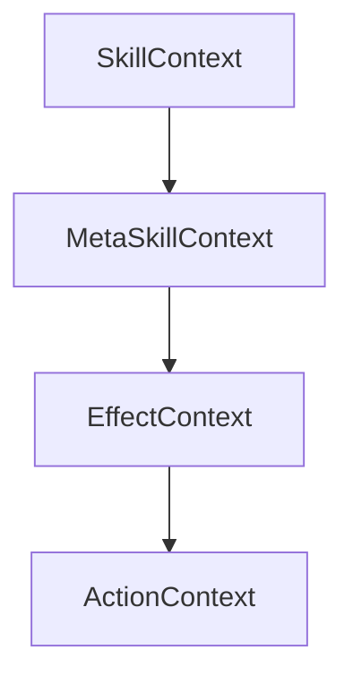

# context设计

## 1. 目标

本设计用于重新定义技能运行时中的上下文数据结构，解决以下问题：

1. 现有 `SkillContext` 缺少明确的分层域语义，无法区分 `skill / metaskill / effect / action` 四层上下文。
2. 现有 `SkillEffectResult` 过于薄弱，只像一个简单返回值，无法承载后续 action 所需的统计结果与上下文引用。
3. 当前黑板 `Blackboard` 记录了大量调试或临时信息，但缺少正式作用域与稳定语义，不适合作为 gameplay 判定的正式数据源。
4. 目前无法方便地回答以下问题：
   - 当前 skill 一共造成了多少伤害。
   - 上一个 metaskill 一共造成了多少伤害。
   - 当前 effect 一共对哪些目标造成了多少伤害。
   - 当前 action 对某个目标单独造成了多少某类型伤害。
    - 当前 action / effect / metaskill / skill 命中了哪些目标，而不是只知道一个主目标。
   - 某个目标在某一层域内累计添加了多少 buff、tag、属性变化等。

本设计的核心目标是：

1. 明确四层运行域：`SkillContext`、`MetaSkillContext`、`EffectContext`、`ActionContext`。
2. 每一层域都可以：
   - 访问当前子域。
   - 访问本域累计统计。
   - 按目标查询本域统计。
3. 让 `SkillEffectResult` 不再承载字符串解释，而是承载当前 effect 树执行结果的结构化结果。
4. 将 `Blackboard` 降级为调试/临时桥接容器，不再承担正式 gameplay 上下文语义。

---

## 2. 域模型

### 2.1 四层域

运行时的上下文分为四层：

1. `SkillContext`
   - 表示一整次 skill 执行链的上下文。
    - 例如：当前技能总伤害、当前技能命中过哪些目标、当前技能累计加了多少 buff。

2. `MetaSkillContext`
   - 表示当前 skill 中某一个 metaskill 段的上下文。
   - 例如：上一个连段造成了多少伤害、该段命中过哪些目标。

3. `EffectContext`
   - 表示某一次 effect tree 执行的上下文。
   - 例如：`OnAddEffect`、`OnMetaSkillTimelineEndEffect`、命中盒命中后触发的 `OnHitEffect`，都各自有一份 effect 上下文。

4. `ActionContext`
   - 表示 effect tree 中某一个 action 节点的执行上下文。
    - 例如：本次 `DealDamage` 对哪些目标造成了多少火焰伤害。

### 2.2 父子关系

四层域关系固定如下：



语义规则：

1. `SkillContext` 持有当前 `MetaSkillContext`。
2. `MetaSkillContext` 持有当前 `EffectContext`。
3. `EffectContext` 持有当前 `ActionContext`。
4. 子域执行产生的统计结果，会累加回父域。
5. 父域可以查询本域总统计，也可以查询本域对某个目标的统计。
6. 命中盒、子弹、buff 等延迟触发的 effect，不构成新的统计根，而是归属于触发它们的源 action，并继续向上汇总回源 effect / metaskill / skill。

---

## 3. 核心设计原则

### 3.1 正式上下文与调试上下文分离

正式 gameplay 判定只能依赖：

1. `SkillContext`
2. `MetaSkillContext`
3. `EffectContext`
4. `ActionContext`
5. `SkillEffectResult`

`Blackboard` 仅保留以下用途：

1. 调试显示
2. 临时桥接旧逻辑
3. 非正式诊断信息

不得再把 `Blackboard` 作为正式 gameplay 判定的主要来源。

### 3.2 不再使用字符串描述执行失败

`SkillEffectResult` 不再使用这种设计：

```csharp
SkillEffectResult.Failed("AddTag action data is invalid.")
```

原因：

1. 字符串不是正式语义。
2. 字符串不能稳定参与逻辑判断。
3. 字符串会把调试信息和结果语义混在一起。

新的结果模型中：

1. 成功与失败只由布尔语义表示。
2. 如果确实需要细分失败原因，用枚举字段表达。
3. 详细调试信息走日志或 debug bus，不写入正式结果结构。

### 3.3 统计必须支持按目标查询和全域总查询

每一层域都要支持两类查询：

1. `总量查询`
   - 例如：该 metaskill 总共造成 1000 点伤害。

2. `按目标查询`
   - 例如：该 metaskill 对 `UnitId=Enemy_01` 造成了 320 点火焰伤害。

### 3.4 目标统计 key 使用 UnitId

按目标统计时，统一使用 `GameUnit.UnitId` 作为 key。

原因：

1. 这是当前项目里已经存在的稳定单位标识。
2. 统计层不直接依赖对象引用存活。
3. 更利于后续序列化、日志、回放或调试展示。

但仅存 `UnitId` 还不够，建议统计条目里同时缓存最近一次命中的 `GameUnit` 引用，便于运行时直接取对象。

### 3.5 多目标是默认语义，不再把 PrimaryTarget 当作结果容器

需要明确区分两件事：

1. `PrimaryTarget`
    - 这是“默认查询目标”或“输入给当前 action/effect 的初始目标语义”。
    - 它不是执行结果集合。

2. `HitTargets` / `AffectedTargets`
    - 这是“本次 action/effect/metaskill/skill 实际影响到的目标集合”。
    - 这里天然可能是多个目标。

因此：

1. 现有 `PrimaryTarget` 可以继续保留，作为默认目标入口语义。
2. 但所有 context 都必须新增多目标集合字段，不能再假设结果只落在单个目标上。
3. 后续诸如“onUpdate 攻击到的所有目标，在 onEnd 时统一加 buff”这类需求，必须从这些多目标结果集合中取数，而不是依赖单个 `PrimaryTarget`。

### 3.6 统计字段风格必须统一

统计结构不能同时保留：

1. `TotalFireDamage` 这类固定字段
2. `Dictionary<string, int> DamageByType` 这类开放字典

二者必须二选一。

本设计选择：

1. 保留少量真正跨系统稳定的总量字段，例如 `TotalDamage`、`TotalToughnessDamage`。
2. 所有“按类型拆分”的统计，统一走字典。
3. 所有“按 buffId / tag / attribute 类型”等可扩展统计，也统一走字典。

原因：

1. 伤害类型、属性变化类型、后续扩展类型都天然是开放集合。
2. 如果同时保留固定字段和字典，后面一定会出现双写、漏写、语义不一致的问题。
3. 统一字典后，扩展新类型时不需要反复修改上下文基础结构。

### 3.7 延迟触发 effect 必须保留归属链

需要明确区分两件事：

1. `执行载体`
    - 例如 buff、命中盒、子弹，它们可以在稍后的时机触发 effect。
    - 它们负责“代为触发 effect”，但不是最终统计归属。

2. `统计归属`
    - 延迟触发出来的 effect，仍然属于最初创建该载体的那个 action。
    - 因而它造成的伤害、buff、tag、属性变化，也必须继续累计回源 action，再继续累计回源 effect / metaskill / skill。

因此：

1. buff 不应被视为新的统计根。
2. 命中盒、子弹、buff 触发出来的 effect，都必须带着明确的 source lineage 执行。
3. 这个 lineage 至少要能回答：“这个延迟 effect 归属于哪个 source action，以及它所在的 source effect / metaskill / skill 是谁”。
4. 只有这样，源技能总伤害、源 action 累计贡献、延迟伤害归属等统计才会稳定成立。

---

## 4. 六个核心类

本设计建议定义六个核心类：

1. `SkillContext`
2. `MetaSkillContext`
3. `EffectContext`
4. `ActionContext`
5. `ContextStatBlock`
6. `TargetStatBlock`

其中：

1. 四个 `Context` 类负责表达四层域。
2. 两个 `StatBlock` 类负责承载“全域统计 + 按目标统计”。

---

## 5. 统计块设计

### 5.1 ContextStatBlock

`ContextStatBlock` 用于承载某一层域的累计统计。

建议字段：

```csharp
[Serializable]
public sealed class ContextStatBlock
{
    public int TotalDamage;
    public int TotalToughnessDamage;
    public int TotalAddedBuffCount;
    public int TotalRemovedBuffCount;
    public int TotalAddedTagCount;
    public int TotalRemovedTagCount;

    public Dictionary<string, int> AddedBuffCountByBuffId = new Dictionary<string, int>(StringComparer.Ordinal);
    public Dictionary<string, int> RemovedBuffCountByBuffId = new Dictionary<string, int>(StringComparer.Ordinal);
    public Dictionary<string, int> AddedTagCountByTag = new Dictionary<string, int>(StringComparer.Ordinal);
    public Dictionary<string, int> RemovedTagCountByTag = new Dictionary<string, int>(StringComparer.Ordinal);

    public Dictionary<string, int> DamageByType = new Dictionary<string, int>(StringComparer.Ordinal);
    public Dictionary<string, int> ToughnessDamageByType = new Dictionary<string, int>(StringComparer.Ordinal);
    public Dictionary<string, int> AttributeDeltaByAttributeType = new Dictionary<string, int>(StringComparer.Ordinal);

    public Dictionary<string, TargetStatBlock> TargetStats = new Dictionary<string, TargetStatBlock>(StringComparer.Ordinal);
}
```

说明：

1. `TotalDamage` 表示该域对所有命中目标造成的总伤害。
2. `TargetStats` 用于按目标单独查询。
3. `DamageByType` / `ToughnessDamageByType` 统一承载各种伤害类型统计，例如 `Fire`、`Ice`、`True`。
4. `AttributeDeltaByAttributeType` 统一承载属性变化统计，例如 `Attack`、`BreakValue`、`MaxHp`。
5. 本结构不再保留 `TotalFireDamage` 这类固定类型字段，避免和字典双轨并存。

### 5.2 TargetStatBlock

`TargetStatBlock` 用于表达该域内某一个目标的累计统计。

建议字段：

```csharp
[Serializable]
public sealed class TargetStatBlock
{
    public string UnitId = string.Empty;
    public GameUnit Unit;

    public int TotalDamage;
    public int TotalToughnessDamage;
    public int AddedBuffCount;
    public int RemovedBuffCount;
    public int AddedTagCount;
    public int RemovedTagCount;

    public Dictionary<string, int> AddedBuffCountByBuffId = new Dictionary<string, int>(StringComparer.Ordinal);
    public Dictionary<string, int> RemovedBuffCountByBuffId = new Dictionary<string, int>(StringComparer.Ordinal);
    public Dictionary<string, int> AddedTagCountByTag = new Dictionary<string, int>(StringComparer.Ordinal);
    public Dictionary<string, int> RemovedTagCountByTag = new Dictionary<string, int>(StringComparer.Ordinal);

    public Dictionary<string, int> DamageByType = new Dictionary<string, int>(StringComparer.Ordinal);
    public Dictionary<string, int> ToughnessDamageByType = new Dictionary<string, int>(StringComparer.Ordinal);
    public Dictionary<string, int> AttributeDeltaByAttributeType = new Dictionary<string, int>(StringComparer.Ordinal);
}
```

说明：

1. `UnitId` 是正式查询 key。
2. `Unit` 是运行时便捷取用引用。
3. 所有对目标的累计统计都落在这里。
4. 父域 `ContextStatBlock.TargetStats[targetId]` 可以直接取到目标统计。
5. 本结构同样不再保留 `TotalFireDamage` 这类固定类型字段，所有按类型拆分统一走字典。

---

## 6. 四层 Context 设计

### 6.1 ActionContext

`ActionContext` 表示当前 effect tree 中单个 action 的执行上下文。

建议字段：

```csharp
[Serializable]
public sealed class ActionContext
{
    public string SkillRuntimeId = string.Empty;
    public string SkillId = string.Empty;
    public string MetaSkillId = string.Empty;
    public string EffectId = string.Empty;
    public string EffectNodeId = string.Empty;
    public string ActionId = string.Empty;
    public SkillActionType ActionType = SkillActionType.None;

    public GameUnit Caster;
    public GameUnit PrimaryTarget;
    public List<GameUnit> AffectedTargets = new List<GameUnit>();

    public bool HasExecuted;
    public bool Succeeded;

    public ContextStatBlock Stats = new ContextStatBlock();
}
```

语义：

1. 只记录当前 action 自己造成的结果。
2. 不记录“上一个 action”的上下文；因为 action 本身已经是最小执行单元。
3. `AffectedTargets` 记录当前 action 实际影响到的所有目标。
4. `Stats` 里既包含总量，也包含按目标数据。

典型查询：

1. 当前 action 对所有目标总共造成多少伤害。
2. 当前 action 对某个目标造成多少火焰伤害。
3. 当前 action 添加了哪个 buff 几次。

### 6.2 EffectContext

`EffectContext` 表示一棵 effect tree 的执行上下文。

建议字段：

```csharp
[Serializable]
public sealed class EffectContext
{
    public string SkillRuntimeId = string.Empty;
    public string SkillId = string.Empty;
    public string MetaSkillId = string.Empty;
    public string EffectId = string.Empty;
    public string SourceNodeId = string.Empty;

    public GameUnit Caster;
    public GameUnit PrimaryTarget;
    public List<GameUnit> AffectedTargets = new List<GameUnit>();

    public ActionContext CurrentActionContext;
    public ActionContext LastActionContext;

    public bool HasExecuted;
    public bool Succeeded;

    public ContextStatBlock Stats = new ContextStatBlock();
}
```

语义：

1. `CurrentActionContext` 表示当前正在执行的 action。
2. `LastActionContext` 表示上一个已经执行完成的 action。
3. `AffectedTargets` 记录当前 effect 到目前为止实际影响到的所有目标。
4. `Stats` 表示当前整棵 effect tree 到目前为止累计造成的结果。
5. `EffectContext` 本身不需要额外保存一组扁平的 `Owner*` 身份字段。
6. 对于 buff、命中盒、子弹等延迟触发的 effect，它们的归属链应由载体持有的来源上下文引用提供，而不是把归属链拆成若干字符串字段塞进 effect 域结果里。
7. 换句话说，effect 只负责表达“这次 effect 发生了什么”；至于“它属于谁”，应由创建该 effect 的执行载体通过来源 context 保证。

典型查询：

1. 当前 effect 一共对哪些目标造成了多少伤害。
2. 上一个 action 对某个目标造成了多少伤害。
3. 当前 effect 总共添加了多少 buff/tag。

### 6.3 MetaSkillContext

`MetaSkillContext` 表示当前 metaskill 段的上下文。

建议字段：

```csharp
[Serializable]
public sealed class MetaSkillContext
{
    public string SkillRuntimeId = string.Empty;
    public string SkillId = string.Empty;
    public string MetaSkillId = string.Empty;
    public string MetaSkillNodeId = string.Empty;
    public SkillStatePhaseRole PhaseRole = SkillStatePhaseRole.None;

    public GameUnit Caster;
    public GameUnit PrimaryTarget;
    public List<GameUnit> AffectedTargets = new List<GameUnit>();

    public EffectContext CurrentEffectContext;
    public EffectContext LastEffectContext;

    public bool HasExecuted;
    public bool Succeeded;

    public ContextStatBlock Stats = new ContextStatBlock();
}
```

语义：

1. `CurrentEffectContext` 表示当前正在执行的 effect。
2. `LastEffectContext` 表示该 metaskill 下上一个执行完成的 effect。
3. `AffectedTargets` 记录当前 metaskill 到目前为止实际影响到的所有目标。
4. `Stats` 表示当前整个 metaskill 段累计结果。

典型查询：

1. 上一个连段一共造成了多少伤害。
2. 某个目标是否在当前 metaskill 中受到伤害且伤害大于 100。
3. 当前 metaskill 对所有敌人的总伤害是否大于 1000。

### 6.4 SkillContext

`SkillContext` 表示整个 skill 链的共享上下文。

建议字段：

```csharp
public sealed class SkillContext
{
    public GameUnit Caster;
    public object EquippedWeapon;
    public GameUnit PrimaryTarget;
    public List<GameUnit> AffectedTargets = new List<GameUnit>();

    public SkillConfig SkillConfig;
    public MetaSkillConfig CurrentMetaSkillConfig;
    public StateConfig CurrentStateConfig;
    public StateController StateController;
    public SkillFlowContext SkillFlowContext;

    public string ActiveBuffSourceId;

    public MetaSkillContext CurrentMetaSkillContext;
    public MetaSkillContext LastMetaSkillContext;

    public ContextStatBlock Stats = new ContextStatBlock();

    public readonly Dictionary<string, object> Blackboard = new Dictionary<string, object>();

    public ISkillEffectExecutor EffectExecutor;
    public IBuffService BuffService;
    public ITagQueryService TagQueryService;
    public ISkillResourceService ResourceService;
    public ICharacterActionBridge CharacterActionBridge;
    public IBattleResolver CombatResolver;
    public ISkillRuntimeObserver RuntimeObserver;
    public Func<StateInputSnapshot> StateInputSnapshotProvider;
    public Func<StateHitSnapshot> StateHitSnapshotProvider;
    public Func<StateBeHitSnapshot> StateBeHitSnapshotProvider;
    public Func<float> BreakValueProvider;
}
```

语义：

1. `CurrentMetaSkillContext` 表示当前 skill 正在执行的 metaskill。
2. `LastMetaSkillContext` 表示上一个执行完成的 metaskill。
3. `AffectedTargets` 记录当前整个 skill 到目前为止实际影响到的所有目标。
4. `Stats` 表示当前整个 skill 到目前为止累计造成的结果。
5. skill 域不再直接保存“最近一次 effect 结果”；effect 级结果应通过当前 metaskill 域访问，即 `CurrentMetaSkillContext.CurrentEffectContext` 或 `CurrentMetaSkillContext.LastEffectContext`。
6. `ActiveBuffInstance` 应删除，不再保留在正式 SkillContext 中。
7. 如果存在 buff 等延迟 effect 载体，它们必须能回溯到源 action 的归属链，而不是仅留下一个临时执行入口。

典型查询：

1. 当前 skill 总共造成了多少伤害。
2. 当前 skill 对某个目标总共造成了多少火焰伤害。
3. 上一个 metaskill 对某个目标造成了多少伤害。

---

## 7. SkillEffectResult 重新定义

### 7.1 设计目标

`SkillEffectResult` 本质上就是 effect 域结果对象，也就是 effectContext 的结果视图。它不是独立于 effectContext 的另一套平行语义。

它的职责不是“返回一句话说明发生了什么”，而是：

1. 表示当前 effect tree 是否执行成功。
2. 持有“上一个 action 的结果”。
3. 持有“当前整棵 effect tree 的累计结果”。
4. 持有“当前 effect 实际影响到的目标集合”。

它应该只属于 effect 域，不应该越级承载 metaskill 或 skill 总域结果。

### 7.2 建议结构

```csharp
[Serializable]
public sealed class SkillEffectResult
{
    public static SkillEffectResult None => new SkillEffectResult();

    public bool HasValue;
    public bool Succeeded = true;
    public SkillEffectFailureKind FailureKind = SkillEffectFailureKind.None;

    public List<GameUnit> AffectedTargets = new List<GameUnit>();
    public ActionContext LastActionContext;
    public ContextStatBlock TotalStats = new ContextStatBlock();
}
```

这里的语义等价于：

1. `SkillEffectResult.AffectedTargets` = 当前 effect 命中的所有目标
2. `SkillEffectResult.LastActionContext` = 当前 effect 下上一个 action 的上下文
3. `SkillEffectResult.TotalStats` = 当前 effect 的累计统计

`SkillEffectResult` 不应再挂在 `SkillContext` 上作为 skill 域共享字段；它应由 effect 域产生，并由 metaskill 域持有最近一次 effect 结果引用。

如果后续代码里觉得 `SkillEffectResult` 和 `EffectContext` 高度重叠，可以直接把它收缩成 `EffectContext` 的只读结果面，而不是继续保留两套分裂定义。

### 7.3 FailureKind

建议增加失败类型枚举：

```csharp
public enum SkillEffectFailureKind
{
    None,
    InvalidData,
    MissingContext,
    MissingCaster,
    MissingTarget,
    MissingService,
    ConditionFailed,
    ExecutionException,
}
```

说明：

1. 失败类型是正式语义。
2. 调试详细信息仍应走日志，不进入正式结果结构。
3. 不再保留 `Message` 这类字符串解释字段。

---

## 8. 数据流约定

### 8.1 Action 执行时

1. 创建或复用当前 `ActionContext`。
2. action 执行产生结果后，只更新自己的 `ActionContext.Stats`。
3. action 执行完成后：
    - 更新 `ActionContext.AffectedTargets`
   - 写入 `EffectContext.LastActionContext`
    - 合并到 `EffectContext.AffectedTargets`
   - 累加到 `EffectContext.Stats`
    - 合并到 `MetaSkillContext.AffectedTargets`
   - 累加到 `MetaSkillContext.Stats`
    - 合并到 `SkillContext.AffectedTargets`
   - 累加到 `SkillContext.Stats`
    - 同步更新 `SkillEffectResult.AffectedTargets`
   - 同步更新 `SkillEffectResult.LastActionContext`
   - 同步更新 `SkillEffectResult.TotalStats`
4. 如果 action 会创建延迟 effect 载体，例如 buff、命中盒、子弹，则必须在创建时把 source lineage 一并写入载体。
5. 这里的 source lineage 优先表现为“来源上下文引用”，而不是若干拆散的 owner id 字段。
6. 这条来源上下文至少要稳定保留源 skill / metaskill / effect / action 的归属关系，使该载体未来触发出来的 effect 能继续写回原上下文链。

### 8.2 Effect 执行时

1. 每次开始 effect tree 时创建新的 `EffectContext`。
2. `EffectContext.CurrentActionContext` 随 action 执行滚动更新。
3. effect 执行完成后：
   - 写入 `MetaSkillContext.LastEffectContext`
    - 如有需要，也可覆盖 `MetaSkillContext.CurrentEffectContext` 为当前完成结果
4. 如果本次 effect 是由 buff、命中盒、子弹等延迟载体触发，则执行时必须从该载体恢复来源上下文引用。
5. 该 effect 的统计一方面记录为“本次 effect 执行结果”，另一方面仍要沿来源上下文链继续合并回源 action / effect / metaskill / skill。

### 8.3 MetaSkill 执行时

1. 每次 metaskill 开始时创建新的 `MetaSkillContext`。
2. `MetaSkillContext.CurrentEffectContext` 随 effect 执行滚动更新。
3. metaskill 完成后：
   - 写入 `SkillContext.LastMetaSkillContext`

### 8.4 Skill 执行时

1. skill 起手成功时创建或重置当前 `SkillContext.Stats`。
2. 整个 skill 链结束、中断、取消时，根据业务决定是否清理 skill 域累计结果。

---

## 9. 典型查询示例

### 9.1 查询当前 skill 对某目标的总伤害

```csharp
if (skillContext.Stats.TargetStats.TryGetValue(targetUnitId, out TargetStatBlock targetStats))
{
    int damage = targetStats.TotalDamage;
}
```

### 9.2 查询上一个 metaskill 对某目标造成的火焰伤害

```csharp
MetaSkillContext lastMeta = skillContext.LastMetaSkillContext;
if (lastMeta != null && lastMeta.Stats.TargetStats.TryGetValue(targetUnitId, out TargetStatBlock targetStats))
{
    int fireDamage = targetStats.DamageByType.TryGetValue("Fire", out int value) ? value : 0;
}
```

### 9.3 查询当前 effect 的上一个 action 是否对某目标造成大于 100 的伤害

```csharp
ActionContext lastAction = effectContext.LastActionContext;
if (lastAction != null &&
    lastAction.Stats.TargetStats.TryGetValue(targetUnitId, out TargetStatBlock targetStats) &&
    targetStats.TotalDamage > 100)
{
    // 条件成立
}
```

### 9.4 查询当前 metaskill 对所有命中目标造成的总伤害是否超过 1000

```csharp
if (metaSkillContext.Stats.TotalDamage > 1000)
{
    // 条件成立
}
```

---

## 10. 对现有结构的调整建议

### 10.1 SkillContext

建议删除：

1. `ActiveBuffInstance`
2. `LastEffectResult`

建议保留：

1. `ActiveBuffSourceId`

原因：

1. 当前 buff 来源标识有正式语义，但它更适合作为过渡入口，而不是完整归属链本身。
2. 真正稳定的设计，应该能把 buff 后续 effect 归属回源 action / effect / metaskill / skill，而不只是保留一个孤立字符串。
3. `LastEffectResult` 属于 effect 域语义，把它挂在 skill 域会形成越级引用，并与 `MetaSkillContext.LastEffectContext` 重复。
4. 直接把 `BuffInstance` 塞进共享上下文过重，而且大多数 action 并不需要它。

### 10.2 BuffInstance

建议新增：

1. 持有来源 `SkillContext` 引用或其稳定快照。

原因：

1. buff 后续的 `OnAdd / OnUpdate / OnRemove` effect 都需要一个正式来源上下文，而不是临时拼接几个 owner id。
2. 这个来源上下文由 `AddBuff` action 注入，buff 之后执行 effect 时从这里恢复 skill / metaskill / effect / action 所在链路。
3. buff 真正需要的能力不是“知道几个字符串身份”，而是“知道该把结果写回哪条上下文链”。

### 10.3 SkillEffectResult

建议删除旧字段：

1. `Message`
2. `NumericValue`
3. `Target` 作为唯一结果目标的单点表达

原因：

1. 一个 effect / action 可以命中多个目标。
2. 单个 `Target` 无法表达多目标统计。
3. `NumericValue` 无法表达“这到底是伤害、韧性伤害、属性变化还是别的统计”。

### 10.4 PrimaryTarget 与 AffectedTargets 的边界

建议保留：

1. `PrimaryTarget`

建议新增：

1. `AffectedTargets`

原因：

1. `PrimaryTarget` 仍然适合作为默认目标入口，例如“没有显式选择多个目标时默认找谁”。
2. 但任何执行结果统计都不能只看 `PrimaryTarget`。
3. 多目标 effect、范围命中、穿透子弹、链式伤害、onEnd 对全部命中目标施加 buff 等语义，都必须依赖 `AffectedTargets + TargetStats`。

### 10.5 Blackboard

这次先不要求完全删除，但要明确三点：

1. `Blackboard` 不是正式上下文结构。
2. 以后所有 gameplay 判定应优先迁移到四层 context + `SkillEffectResult`。
3. 仅保留确有调试价值或临时兼容价值的 blackboard 记录项。

---

## 11. 实施建议

建议按以下顺序落地：

1. 先新增 `ContextStatBlock` 与 `TargetStatBlock`。
2. 再新增 `ActionContext`、`EffectContext`、`MetaSkillContext`。
3. 为命中盒、子弹、buff 等延迟 effect 载体补上 source lineage，并明确它们不构成新的统计根。
4. 重写 `SkillEffectResult`，让它改为“当前 effect 结果容器”，语义对齐 `EffectContext`。
5. 改写 `SkillContext`，补上 `CurrentMetaSkillContext`、`LastMetaSkillContext`、`Stats`，并删除 `ActiveBuffInstance`。
6. 再逐步改造各类 action runtime：
   - `DealDamage`
   - `AddToughnessDamage`
   - `AddBuff`
   - `RemoveBuff`
   - `AddTag`
   - `AddAttribute`
7. 最后再清理 `Blackboard` 中已经被正式 context 替代的字段。

---

## 12. 最终结论

新的上下文模型应遵守以下原则：

1. 明确四层域：`skill / metaskill / effect / action`。
2. 每层域都同时支持：
   - 当前子域引用
   - 本域总统计
   - 按目标统计
    - 多目标结果集合
3. `SkillEffectResult` 就是 effect 域结果对象，不再做字符串返回值。
4. 统计风格统一：保留少量总量字段，所有按类型拆分统一走字典，不再固定字段和字典双轨并存。
5. `SkillContext` 负责 skill 域与当前 metaskill 域的桥接，不再保存无必要的重量级对象如 `ActiveBuffInstance`。
6. 命中盒、子弹、buff 等延迟 effect 载体只负责触发，不负责拥有统计；它们的 effect 结果必须归属于源 action，并继续汇总回源 skill。
7. `Blackboard` 仅作调试与兼容，不再承担正式 gameplay 上下文职责。

按这个设计落地后，后续几乎所有“基于前文结果做判断/做增强/做分支”的 action，都会有稳定而明确的数据来源。
