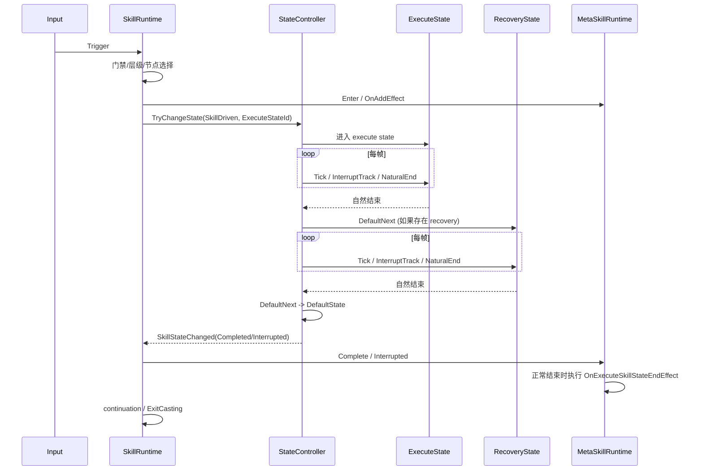

# 技能对应状态切换修改方案

## 1. 问题定义

本次审查确认，当前 `MetaSkillRuntime` 的职责已经明显越界，和现行设计目标不一致。

现状中的核心问题不是某一个判断条件写错，而是“状态控制权被重复实现了两次”：

1. `SkillPlayerController.BuildStateController -> NormalizeMetaSkillStateBindings(...)` 已经在构建阶段把技能状态当作普通状态装入 `StateController`，并且已经补了一部分 `DefaultNextStateId` 约束。
2. 但 `MetaSkillRuntime` 在运行时又重新维护了一套 execute/recovery 阶段机，并自行处理：
   - execute/recovery 时间推进
   - 自然结束判断
   - 中断判断
   - recovery 特殊逻辑
   - 外部 `ForceChangeState`
3. 结果就是：
   - `StateController` 不是唯一状态生命周期所有者。
   - `MetaSkillRuntime` 在绕开约定，自己决定什么时候切状态。
   - recovery state 被当成“特殊机制”，而不是普通状态。
   - 旧的打断窗口机制没有被真正废弃。

这和目标设计相违背：

- `MetaSkillRuntime` 应该是最小技能单元运行时，而不是状态机控制器。
- 状态系统只由 `StateController` 负责推进、自然结束、默认后继和打断轨道切换。
- execute/recovery state 本质上都只是运行时动态注册进去的普通状态。

## 2. 改造目标

本次改造要落到以下几条硬约束上：

1. `StateController` 成为状态生命周期的唯一控制者。
2. `SkillRuntime` 不再在技能开始后直接干预状态推进，只保留：
   - 技能门禁检查
   - 选择 layer / node / metaskill
   - 创建并启动当前 `MetaSkillRuntime`
   - 请求切入 execute state
   - 接收状态系统回调并更新技能流程上下文
3. 废弃打断窗口机制，不再以 `InterruptWindow` 驱动技能状态切换。
4. recovery state 不再拥有任何特殊运行时机制。
5. execute/recovery 的默认流转关系在 build 阶段完成约束，而不是在 `MetaSkillRuntime` 里临时判断。
6. 对于“配置了技能状态”的 MetaSkill，`MetaSkillRuntime` 只记录 execute state 的运行结果，不再控制 execute/recovery 状态切换。

## 3. 目标架构

### 3.1 控制边界

**SkillRuntime 的职责：**

1. 匹配输入和技能图事件。
2. 选择 layer / node / metaskill。
3. 创建并持有当前 `MetaSkillRuntime`。
4. 生成 `SkillTransitionContext`。
5. 向 `StateController` 发起一次 `TryChangeState(SkillDriven)` 请求，目标为 execute state。
6. 接收 `StateController.SkillStateChanged` 回调，更新 `SkillFlowContext`，决定当前 metaskill 正常结束、中断结束、是否进入 continuation。

**StateController 的职责：**

1. 维护当前 active state。
2. 推进状态时间线和状态动画。
3. 根据 interrupt track 做状态切换。
4. 根据 `DefaultNextStateId` 做自然结束后的状态流转。
5. 向技能系统回发技能相关状态通知。

**MetaSkillRuntime 的职责：**

1. 作为“最小技能单元”的运行时载体，负责维护当前 metaskill 的上下文。
2. 在 `Enter` 时执行 `OnAddEffect`。
3. 记录当前 execute state 属于哪个 metaskill，并为状态时间线上的攻击盒、子弹、效果树提供技能上下文。
4. 接收状态系统的完成/中断结果。
5. 当 execute state 正常结束时，执行 `OnExecuteSkillStateEndEffect`。
6. 如果 execute state 被打断，则不执行该结束效果。

它**不负责**：

1. 推进 execute/recovery 状态时间。
2. 判断自然结束。
3. 判断中断。
4. 决定切到 recovery 或 default state。
5. 维护任何 recovery 特殊机制。

### 3.2 状态流转规则

对配置了技能状态的 MetaSkill，运行时统一视为两类普通状态：

1. execute state
2. recovery state（可选）

构建阶段约束：

1. execute state：
   - 如果配置了 recovery state，则 `execute.DefaultNextStateId = recovery.StateId`
   - 如果未配置 recovery state，则 `execute.DefaultNextStateId = unit default state`
2. recovery state：
   - `recovery.DefaultNextStateId = unit default state`
3. 这两类状态与普通状态共享同一套中断轨道、自然结束规则、默认后继逻辑。
4. 不再允许 `MetaSkillRuntime` 在 Tick 里决定“进入 recovery”或“跳到 default state”。

### 3.3 目标时序

## 4. 现状代码中的越权点

### 4.1 MetaSkillRuntime 当前越权内容

`MetaSkillRuntime` 里以下内容应视为本次改造的主要删除目标：

1. 内部 execute/recovery 阶段机：
   - `MetaSkillPhase`
   - `_phase`
   - `_recoveryElapsedTime`
2. 内部状态推进：
   - `_executeStateRuntime`
   - `_recoveryStateRuntime`
   - `Tick(...)` 中对它们的推进
3. 内部时间线推进与重置：
   - `_executeTimelineRuntime`
   - `_recoveryTimelineRuntime`
   - `Reset()` / `Tick()` / `ExitExecutionPhase(...)`
4. 内部自然结束判断：
   - `HasPhaseReachedNaturalEnd(...)`
   - `HandleExecuteNaturalEnd()`
   - `HandleRecoveryNaturalEnd()`
5. 内部中断判断：
   - `TryResolvePhaseInterrupt(...)`
   - `EvaluateInterrupts(...)`
   - 相关 interrupt helper
6. recovery 特殊机制：
   - `RecoveryInterruptArgs`
   - `UpdateRecoveryInterruptWindow()`
   - `EndRecoveryInterruptWindow(...)`
   - `_recoveryCarryoverEvents`
   - carryover append/tick/cleanup
7. 直接外部切状态：
   - `TryCompleteByExternalStateTransition(...)`

这些逻辑本质上都在重复 `StateController` 已有职责，也遮蔽了 `MetaSkillRuntime` 原本应有的最小技能单元语义。

### 4.2 SkillRuntime 当前需要收口的地方

`SkillRuntime` 当前已经有一条正确方向的状态驱动路径，但仍然夹杂旧逻辑：

1. `TryStartStateDrivenMetaSkill(...)` 的入口方向基本是对的。
2. `OnSkillStateChanged(...) / HandleSkillStateCompleted(...) / HandleSkillStateInterrupted(...)` 的消费方向也是对的。
3. 但 `Tick(...)` 里仍在推进 `_currentMetaSkillRuntime`。
4. `CompleteCurrentMetaSkill(...)` 仍兼容“运行时驱动 MetaSkill”和“状态驱动 MetaSkill”两套收尾模式。
5. `ShouldBlockSelfInterrupt(...)` 仍依赖 `_currentMetaSkillRuntime.IsInRecoveryPhase` 这种旧阶段概念。

结论：`SkillRuntime` 需要把“启动 metaskill”和“消费状态回调”保留下来，但把所有状态控制权彻底剥离出去。

### 4.3 BuildStateController 当前已有的正确基础

`SkillPlayerController.AppendSkillRuntimeStates(...)` 和 `NormalizeMetaSkillStateBindings(...)` 已经接近目标设计：

1. 技能状态被并入统一状态表。
2. execute/recovery state 会被统一注册到 `StateController`。
3. execute 默认后继已经会补到 recovery 或 default state。
4. recovery 默认后继已经会补到 default state。

这部分不是推倒重来，而是继续强化，成为唯一生效的技能状态装配规则。

## 5. 具体修改方案

## 5.1 第一阶段：先切断状态驱动路径对 MetaSkillRuntime 的依赖

目标：保留 `MetaSkillRuntime` 作为最小技能单元运行时，但保证它不再驱动状态切换。

### 修改点 A：SkillRuntime

1. `TryStartStateDrivenMetaSkill(...)`
   - 保留现有主流程：
     - 创建并进入 `MetaSkillRuntime`
     - `BeginStateDrivenFlow(...)`
     - `StateController.TryChangeState(SkillDriven)`
   - 但 `MetaSkillRuntime.Enter()` 里只允许做 metaskill 上下文初始化与 `OnAddEffect`
2. `Tick(...)`
   - 对状态驱动路径，不再调用任何会推进状态阶段的 `MetaSkillRuntime.Tick(...)`
   - 仅保留 continuation 超时检查、黑板更新时间、调试快照发布
3. `GetActiveTimelineTime()`
   - 状态驱动路径统一读取 `StateController.StateElapsedTime`
   - `MetaSkillRuntime` 只作为当前 metaskill 的上下文持有者，不再提供 execute/recovery 阶段时间基准
4. `ShouldBlockSelfInterrupt(...)`
   - 删除 `_currentMetaSkillRuntime.IsInRecoveryPhase` 语义
   - 改为简单规则：`SkillFlowContext.IsStateDriven && IsAwaitingStateCompletion` 时，阻止技能自打断
5. `CompleteCurrentMetaSkill(...)`
   - 把“execute state 正常结束”和“execute state 被打断”这两种结果显式交给 `MetaSkillRuntime` 收口
   - 正常结束分支：执行 `OnExecuteSkillStateEndEffect`
   - 中断分支：不执行该效果
   - 其余只处理：
     - trace
     - continuation
     - `ExitCasting(...)`

### 修改点 B：MetaSkillRuntime

在第一阶段，不要求立刻大删类，但要求它退出 state-driven 控制链，只保留最小技能单元职责。

处理方式：

1. 保留该类，继续作为当前 metaskill 的运行时记录器。
2. `Enter()` 只做：
   - 设置 `CurrentMetaSkillConfig`
   - 挂载标签
   - 执行 `OnAddEffect`
   - 建立与当前 execute state 的上下文关联
3. 增加显式收口接口，例如：
   - `CompleteExecuteStateNormally()`
   - `InterruptExecuteState()`
4. 这两个接口只负责：
   - 正常结束时执行 `OnExecuteSkillStateEndEffect`
   - 清理标签和上下文
   - 记录完成状态
5. 明确移除它对 execute/recovery 状态推进和切换的任何控制。

这一阶段的目标不是代码最少，而是先恢复正确控制边界，同时保住 `MetaSkillRuntime` 作为元技能最小单元的语义。

## 5.2 第二阶段：收缩 MetaSkillRuntime，只保留最小技能单元语义

当第一阶段跑通后，再做结构收缩。

保留内容：

1. `OnAddEffect`
2. `OnExecuteSkillStateEndEffect`
3. tags 挂载与移除
4. metaskill 完成态、打断态记录
5. 与 `SkillContext` / `CurrentMetaSkillConfig` 的关联维护

删除内容：

1. `MetaSkillPhase`
2. execute/recovery 双阶段推进
3. `TryResolvePhaseInterrupt(...)`
4. `TryCompleteByExternalStateTransition(...)`
5. 所有 recovery 特殊机制
6. 所有打断窗口逻辑
7. 所有依赖 execute/recovery state config 主动驱动状态切换的逻辑

最终目标不是删除 `MetaSkillRuntime`，而是把它收缩成一个真正语义稳定的“元技能运行时壳”。

## 5.3 第三阶段：强化 BuildState 规则，取代一切运行时兜底

这里是本次改造的关键落点，特别是 recovery state 的“普通状态化”。

### 修改点 A：NormalizeMetaSkillStateBindings(...)

需要把它提升为唯一合法入口，并明确以下规则：

1. execute state 必须有合法 `StateId`
2. execute state 的 `DefaultNextStateId` 在 build 阶段强制写死：
   - recovery 存在 -> recovery
   - recovery 不存在 -> default state
3. recovery state 的 `DefaultNextStateId` 在 build 阶段强制写死为 default state
4. build 阶段统一补齐 timeline / animation / tags 容器
5. 不再在运行时通过 fallback 规则二次推导 default next
6. 后续如果要给 recovery state 增加默认打断轨道等机制，也只能在 build 规则里做，而不是在 `MetaSkillRuntime` 里做

### 修改点 B：配置合法性校验

建议在 build 阶段加入日志或校验：

1. `MetaSkill.HasSkillState == true` 但 execute state 缺失 -> 直接报错
2. recovery state 配了但 `StateId` 为空 -> 报错
3. execute/recovery state 与已有状态冲突 -> 报错或警告
4. 无 default state 可回退 -> 报错

目标是“构建失败早暴露”，而不是在运行时兜底。

## 5.4 第四阶段：清理 StateController 中和旧保护逻辑相关的赘余分支

当前 `StateController.Tick(...)` 里的 default-next 处理已经基本正确，但还有几处偏保护性的 fallback，需要复核是否保留：

1. skill state 没写 defaultNext 时，自动兜到底层 `_defaultStateId`
2. default-next 切换失败时，再次兜底强切 `_defaultStateId`
3. 无 next state 的循环动画状态如何处理

建议处理策略：

1. 对于技能注入状态，不再依赖这些运行时兜底，因为 build 阶段必须已经写好 `DefaultNextStateId`
2. 对于普通状态，可视为 `StateController` 的通用保护机制，暂时保留
3. 后续如果状态配置体系已稳定，再考虑进一步收紧

也就是说，这里不是本次改造的主战场，但要避免让它继续成为技能状态设计缺陷的掩盖层。

## 6. 文件级改动清单

### 必改文件

1. `Assets/SkillEditor/Runtime/Runtime/Skill/SkillRuntime.cs`
   - 切断 state-driven path 中 `MetaSkillRuntime` 的状态控制权
   - 简化 `Tick(...)`
   - 简化 `ShouldBlockSelfInterrupt(...)`
   - 收口 `CompleteCurrentMetaSkill(...)`
2. `Assets/SkillEditor/Runtime/Runtime/MetaSkill/MetaSkillRuntime.cs`
   - 保留 metaskill 最小单元职责
   - 删除越权状态控制逻辑
3. `Assets/SkillEditor/Runtime/Runtime/Skill/SkillPlayerController.cs`
   - 强化 `NormalizeMetaSkillStateBindings(...)`
   - 增加 build 阶段配置校验
4. `Assets/SkillEditor/Runtime/Runtime/State/StateController.cs`
   - 复核 default-next 保护逻辑，确保不再替技能系统背锅

### 可能联动文件

1. `SkillContext.cs`
   - 若当前 `SkillFlowContext` 字段仍带有 execute/recovery 特殊语义，可适当收缩
2. `SkillCharacterActionBridge.cs`
   - 若仍依赖旧打断窗口或 recovery 特殊回调，需要同步清理
3. 任何和 `InterruptWindow` 相关的桥接接口或调用点

## 7. 推荐实施顺序

### 第一步

先改 `SkillRuntime` 和 `MetaSkillRuntime` 的职责边界，让 `MetaSkillRuntime` 保留，但不再控制状态流转。

预期结果：

1. execute/recovery 状态切换完全由 `StateController` 负责
2. `MetaSkillRuntime` 仍存在，但只负责元技能上下文和 execute state 结束收口
3. 风险最低，最容易验证

### 第二步

强化 `BuildStateController` 的 build 规则和配置校验。

预期结果：

1. execute/recovery 普通状态化彻底落地
2. 运行时不再需要猜测默认后继

### 第三步

删除 `MetaSkillRuntime` 中所有越权逻辑，只保留最小技能单元语义。

预期结果：

1. 代码结构和设计语义完全一致
2. 新人阅读时不会再误解“状态到底归谁管”
3. `MetaSkillRuntime` 的类语义也重新稳定下来

### 第四步

复核 `StateController` 的保护性 fallback，决定保留范围。

## 8. 验证方案

改造后至少验证以下场景：

1. execute + recovery 完整链路
   - 技能触发后进入 execute
   - execute 自然结束后自动进入 recovery
   - recovery 自然结束后自动回 default state
2. execute 无 recovery
   - execute 自然结束后直接回 default state
3. 状态打断轨道
   - execute 被 interrupt track 打断时，技能收到 interrupted 回调
   - recovery 被 interrupt track 打断时，技能收到 interrupted 回调
4. continuation
   - 正常结束后能进入 continuation 窗口
   - 中断结束后不会错误开启 continuation
5. 同技能重复输入阻断
   - skill state 未结束时不能再次打断自己
6. 无 legacy fallback 依赖
   - 即使 `MetaSkillRuntime` 不再推进 state-driven path，核心技能链路仍完整工作

## 9. 结论

这次不是“修一下 `MetaSkillRuntime` 的几个函数”就够了，而是要明确恢复控制边界：

1. `SkillRuntime` 负责选择 metaskill、启动 metaskill、请求 execute state
2. `MetaSkillRuntime` 负责最小技能单元上下文、`OnAddEffect`、以及 execute state 正常结束时的结束效果收口
3. state 只由 `StateController` 管
4. recovery 只是普通状态
5. default-next 规则全部前置到 build 阶段
6. 打断统一走 state interrupt track

从现有代码看，`BuildStateController` 已经有正确方向，真正要做的是把 `MetaSkillRuntime` 从“状态控制器”纠正回“元技能最小运行时单元”。

因此建议的最小正确改法是：**保留 `MetaSkillRuntime`，但先切断它对状态流转的控制权，再把它内部的 execute/recovery 状态机逻辑收缩成单纯的 metaskill 上下文与结果收口逻辑。**
