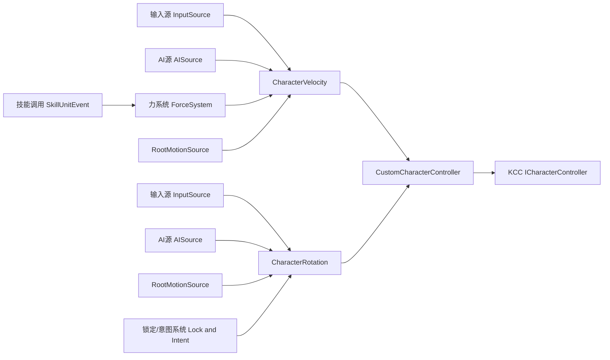

# 角色运动控制接入蓝图

## 1. 当前目标

本阶段不是做完整角色物理，而是做一套可被技能系统调用的基础运动物理框架。

目标：

1. KCC 优先可用。
2. 能被技能系统稳定调用。
3. 后续可扩展到输入、AI、跳跃、下落、攀爬、贴墙跑。

---

## 2. 设计总原则（按你的要求固化）

1. 加什么影响，角色才受什么影响。
2. 不存在隐式基础规则。比如不加重力，就不会下落。
3. 阻断不是“覆盖别人”，而是“来源不产出影响”。
4. 技能系统不实现力学机制，只发调用命令。
5. 控制器只消费最终参数，不承担业务决策。

---

## 3. 架构分层

关键说明：

- 技能事件不直接写速度旋转。
- 技能事件只调用 ForceSystem 或 RotationIntentSystem。
- 最终由 `CustomCharacterController` 在 `UpdateVelocity`、`UpdateRotation` 输出给 KCC。

---

## 4. 必须实现的脚本（最小可用）

## 4.1 控制器层

1. `CustomCharacterController`
- 实现 `KinematicCharacterController.ICharacterController`
- 在 `UpdateVelocity` 读取 `CharacterVelocity`
- 在 `UpdateRotation` 读取 `CharacterRotation`

## 4.2 参数容器层

2. `CharacterVelocity`
- 统一管理速度贡献与最终速度

3. `CharacterRotation`
- 统一管理旋转贡献与最终旋转

## 4.3 数据源层

4. `InputMotionSource`
- 仅在“输入允许”状态产出影响

5. `AIMotionSource`
- 仅在“AI接管”状态产出影响

6. `RootMotionSource`
- 在 `OnAnimatorMove` 收集动画位移与旋转增量并产出影响

## 4.4 力系统层

7. `ForceSystem`
- 统一管理重力、冲量、持续力、方向力
- 提供标准接口给技能系统调用

8. `ForceHandle` 或 `ForceInstance`
- 表示一条力效果（类型、方向、强度、时长、衰减）

## 4.5 技能桥接层

9. `SkillMotionBridge`
- 技能单位事件调用入口
- 负责把技能参数转成 ForceSystem 或 RotationIntentSystem 的调用
- 不直接改 transform

---

## 5. CharacterVelocity 设计

## 5.1 职责

- 汇总各来源本帧速度影响。
- 输出最终 `Vector3` 给控制器。

## 5.2 核心方法

- `ResetFrame()`
- `AddSourceVelocity(Vector3 value, string sourceTag)`
- `AddForceVelocity(Vector3 value, string sourceTag)`
- `SetAbsoluteVelocity(Vector3 value, string sourceTag)`
- `GetFinalVelocity()`

## 5.3 合成规则（非优先级裁决版）

采用“来源显式产出 + 固定顺序合成”：

1. Absolute（若存在）
2. SourceVelocity 累加
3. ForceVelocity 累加

说明：

- 不做复杂优先级抢占。
- 谁能生效由来源开关决定，不由后续覆盖决定。

---

## 6. CharacterRotation 设计

## 6.1 职责

- 汇总各来源旋转影响。
- 输出最终 `Quaternion` 给控制器。

## 6.2 核心方法

- `ResetFrame()`
- `AddLookDirection(Vector3 dir, float sharpness, string sourceTag)`
- `AddRotationDelta(Quaternion delta, string sourceTag)`
- `SetAbsoluteRotation(Quaternion rot, string sourceTag)`
- `GetFinalRotation(Quaternion current, float deltaTime)`

## 6.3 合成规则

1. Absolute（若存在）
2. LookDirection 插值
3. RotationDelta 叠乘

---

## 7. ForceSystem 设计（重点）

这是你要求的关键系统：技能只调用，不实现。

## 7.1 职责

- 管理所有力效果生命周期。
- 每帧输出 `ForceVelocityDelta` 到 `CharacterVelocity`。

## 7.2 力类型

1. ConstantForce
- 持续固定力（重力可由此实现）

2. ImpulseForce
- 瞬时冲量（击退、受击弹开）

3. DirectionalForce
- 按方向持续力（冲刺、牵引）

4. CurveForce
- 随时间曲线变化（抛物、阶段加速）

## 7.3 建议接口

- `EnableGravity(bool enabled)`
- `SetGravity(Vector3 gravity)`
- `AddImpulse(Vector3 impulse)`
- `AddForce(ForceConfig config)`
- `RemoveForce(int forceId)`
- `ClearForcesByTag(string tag)`
- `Tick(float deltaTime)`
- `GetVelocityDelta(float deltaTime)`

## 7.4 技能调用方式

技能单位事件不写力学逻辑，只做：

- 解析技能参数
- 调用 `ForceSystem.AddForce` 或 `AddImpulse`

---

## 8. 输入与 AI 的关系（无优先级阻断版）

核心不是比较优先级，而是控制“来源是否产出”。

建议状态开关：

1. `AllowInputMove`
2. `AllowInputRotate`
3. `AllowAIMove`
4. `AllowAIRotate`
5. `AllowRootMotionMove`
6. `AllowRootMotionRotate`

示例：

- 释放技能硬直时：`AllowInputMove = false`, `AllowInputRotate = false`
- 不是“输入被覆盖”，而是“输入源不产出任何影响”

---

## 9. KCC 接口落点

`CustomCharacterController` 只在两个关键接口接入：

1. `UpdateVelocity(ref Vector3 currentVelocity, float deltaTime)`
- 从 `CharacterVelocity.GetFinalVelocity()` 取结果
- 写入 `currentVelocity`

2. `UpdateRotation(ref Quaternion currentRotation, float deltaTime)`
- 从 `CharacterRotation.GetFinalRotation(currentRotation, deltaTime)` 取结果
- 写入 `currentRotation`

这保证控制器是纯执行层。

---

## 10. 帧时序建议

1. `BeforeCharacterUpdate`
- `CharacterVelocity.ResetFrame()`
- `CharacterRotation.ResetFrame()`

2. 采集来源
- InputSource
- AISource
- RootMotionSource
- SkillMotionBridge 调用 ForceSystem 或 RotationIntent

3. ForceSystem.Tick
- 更新所有力实例
- 输出速度增量

4. 合成
- 写入 CharacterVelocity 或 CharacterRotation

5. `UpdateVelocity` 和 `UpdateRotation`
- 输出给 KCC

6. `AfterCharacterUpdate`
- 清理一次性冲量和临时标记

---

## 11. 与技能系统的边界

技能系统负责：

- 何时施加影响
- 影响参数是多少

技能系统不负责：

- 重力怎么积分
- 冲量怎么衰减
- 空中控制怎么计算

这些都归 ForceSystem 和运动控制层。

---

## 12. 本阶段不做的内容

暂不实现：

1. 台阶自动攀爬
2. 贴墙跑
3. 攀爬
4. 复杂地形特殊移动

这些后续作为新来源或力类型扩展。

---

## 13. 实施顺序（可直接开工）

1. 先落 `CharacterVelocity` 与 `CharacterRotation`。
2. 落 `ForceSystem`（先支持重力 + impulse）。
3. 落 `CustomCharacterController`，打通 `UpdateVelocity` 和 `UpdateRotation`。
4. 接 `RootMotionSource`（`OnAnimatorMove` 重写）。
5. 接 `SkillMotionBridge`，让技能事件能施加力。
6. 最后接输入和 AI 来源开关。

---

## 14. 最终结论

你的设想可行，并且适合作为技能系统接入前的基础运动物理层。

这套方案的关键不是“谁优先级更高”，而是“谁在当前状态下允许产出影响”。

---

## 15. 编译校验约定

为避免被编辑器状态或环境问题误导，本项目当前采用以下协作约定：

1. 先按静态代码逻辑实现与修复。
2. 不依赖“模拟运行”判断正确性。
3. 若你本地仍有编译错误，直接贴错误信息继续修复。
4. 错误优先按你提供的实时报错文本为准。
